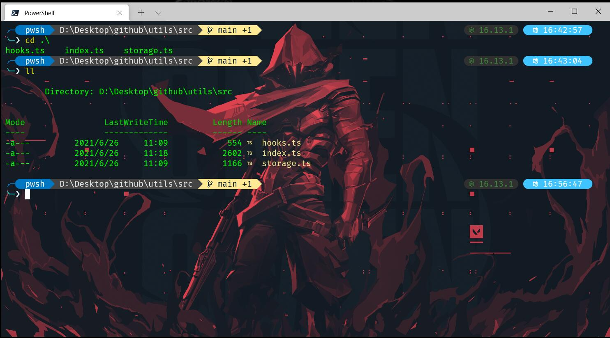

# windows terminal 美化教程

效果：



环境和前提：

- windows 系统版本要求：
- 应用商店安装 windows terminal
- 应用商店安装 powershell

## 安装字体 NerdFonts

- [nerd-fonts 官网字体下载](https://www.nerdfonts.com/font-downloads)
- [github/nerd-fonts](https://github.com/ryanoasis/nerd-fonts)

在 [Release](https://github.com/ryanoasis/nerd-fonts/releases) 中搜索下载 [hack.zip](https://github.com/ryanoasis/nerd-fonts/releases/download/v2.1.0/Hack.zip)

下载后安装：`Hack Bold Italic Nerd Font Complete Mono Windows Compatible`

## 配置 windows terminal

> 设置-显示

- 字体：
  - 颜色主题：One Half Dark
  - 字体：Hack NF
- 亚克力效果：开启
- 透明度：50%；

更多 windows terminal 美化方法，参考:

- [Color schemes in Windows Terminal](https://docs.microsoft.com/en-us/windows/terminal/customize-settings/color-schemes)
- [windowsterminalthemes](https://windowsterminalthemes.dev/) copy 字体配色后拷贝至 `配置json文件` 中即可；
- [Install custom themes in Windows Terminal](https://zimmergren.net/install-custom-themes-in-windows-terminal/)

## 安装 powershell

打开应用商店，安装 powershell 

下载完成后，在 windows terminal 中配置默认的 命令行为 powershell 

## 安装 Scoop

- [scoop.sh](https://scoop.sh/) 
- [github/Scoop](https://github.com/ScoopInstaller/Scoop)
- 安装命令：

```bash
iwr -useb get.scoop.sh | iex
```

若此命令报错，参考解决方式：

```bash
Set-ExecutionPolicy RemoteSigned -scope CurrentUser
```

成功后，可以使用 scoop 安装自己想要的工具：

```bash
scoop install sudo
scoop install curl

scoop install nvm
scoop install nvim
scoop install yarn
```

## 安装 git

- [git for windows](https://gitforwindows.org/)
- 命令：

```bash
winget install -e --id Git.Git
```

## 使用 scoop 安装 neovim、gcc

执行命令：

```bash
scoop install neovim gcc
```

## 创建/配置 powershell 配置文件

```bash
cd ~/

mkdir .config/powershell

cd .config/powershell

# 使用 neovim 打开
nvim user_profile.ps1
# 或者也可以使用 vs code 打开
code $PROFILE
```

> 关于 `$PROFILE` 可参考： [$PROFILE](https://docs.microsoft.com/en-us/powershell/module/microsoft.powershell.core/about/about_profiles?view=powershell-7.2)

配置相关命令，类似 Linux 中的 `.bashrc` 文件：

```bash
# Alias


Set-Alias -Name vim -Value nvim
Set-Alias touch ni
# windows 默认支持 start 命令
# Set-Alias open explorer.exe
Set-Alias c cls
Set-Alias vi nvim
Set-Alias ll ls
Set-Alias g git
Set-Alias grep findstr
Set-Alias tig 'C:\Program Files\Git\usr\bin\tig.exe'
Set-Alias less 'C:Program Files\Git\usr\bin\less.exe'
```

配置完成以上命令后，新开一个 powershell 内核的 terminal，测试 `ll` 等 `alias` 命令已经生效；

## Oh-My-Posh & posh-git

### Oh-My-Posh

- [Oh-My-Posh](https://ohmyposh.dev/docs/)
- [安装命令](https://ohmyposh.dev/docs/windows)

```bash
# powershell 安装依赖的方式 Install-Module，也可使用 Scoop 安装
Install-Module oh-my-posh -Scope CurrentUser -Force
```

### posh-git

- [posh-git](https://github.com/dahlbyk/posh-git#installation)
- 安装命令：

```bash
Install-Module posh-git -Scope CurrentUser -Force
```

安装完成以后，在 `alias` 中配置一下，执行以下命令打开配置文件：

```bash
code $PROFILE
```

新增如下：

```bash
# Prompt
Import-Module posh-git
Import-Module oh-my-posh
# 主题可以自选，选配参考：https://ohmyposh.dev/docs/themes，主题任选
Set-PoshPrompt takuya
```

新开一个 powershell 内核的 terminal，可以看到 命令行已经有了对应的样式；

### 自定义 oh-my-posh 主题

接下来，[配置 oh-my-posh](https://ohmyposh.dev/docs/customize) 的主题样式：

>  可以参考这个作者的样式：[craftzdog/dotfiles-public](https://github.com/craftzdog/dotfiles-public/blob/master/.config/powershell/takuya.omp.json)

当然，也可以选择默认的主题自带的样式；这里我配置的默认的主题：`takuya`

若新增配置样式，配置完成执行如下命令重置主题配置，用你定义的文件名 替换掉 `yourconfig` 文件名：

```bash
oh-my-posh prompt init pwsh --config ~/.yourconfig.omp.json | Invoke-Expression
```

同样，配置完成主题后，可以在 `$PROFILE` 配置默认主题路径：

```bash
# 以下命令仅供参考
$omp_config = Join-Path $Home "Documents\PowerShell\takuya.omp.json"
$omp_config = "C:\\Users\\dell\\Documents\\PowerShell\\takuya.omp.json"
oh-my-posh --init --shell pwsh --config $omp_config | Invoke-Expression
```

## Terminal Icons

- [Terminal-Icons](https://github.com/devblackops/Terminal-Icons)
- 安装命令：

```bash
Install-Module -Name Terminal-Icons -Repository PSGallery -Force
```

此时，执行 `ll` 命令，可以看到列表文件夹内各个文件类型有了图标；

配置 `$PROFILE` ，新增 关于 Terminal Icons 配置：

```bash
Import-Module -Name Terminal-Icons
```


## z

- [github/z](https://github.com/rupa/z/) 主要用于文件夹快速跳转
- 安装 z：

```bash
Install-Module -Name z -Force
```

安装完成后，执行 命令验证是否生效；

```bash
z desktop 
```


## PSReadLine

- [github/PSReadLine](https://github.com/PowerShell/PSReadLine) 主要用于记忆命令历史、展示命令列表等，参考 readme
- 安装：

```bash
# 前置安装
Install-Module -Name PowerShellGet -Force

# github 文档
Install-Module PSReadLine -AllowPrerelease -Force

# 视频作者的命令
Install-Module -Name PSReadLine -AllowPrerelease -Scope CurrentUser -Force -SkipPublishercheck
```

配置 `$PROFILE` ，新增 关于 PSReadline 配置：

```bash
# PSReadLine
Set-PSReadLineOption -EditMode Emacs
Set-PSReadLineOption -BellStyle None
Set-PSReadLineKeyHandler -Chord 'Ctrl+d' -Function DeleteChar
Set-PSReadLineOption -PredictionSource History
```

配置完成后，命令行输入：`cd ` 命令，应该会有提示 历史输入过的命令

还有更多配置，后续可以查阅 PSReadLine 文档看看；

## Fzf，PSFzf

- 使用 `scoop` 安装 fzf

```bash
scoop install fzf
```

- 安装 PSFzf

```bash
Install-Module -Name PSFzf -Scope CurrentUser -Force
```

配置 `$PROFILE` 命令，在 命令行中使用 fzf 查找文件：

```bash
# Fzf
Import-Module PSFzf
Set-PsFzfOption -PSReadlineChordProvider 'Ctrl+f' -PSReadlineChordReverseHistory 'Ctrl+r'
```


## 配置文件综合

初步汇总为：

```bash
# set PowerShell to UTF-8
[console]::InputEncoding = [console]::OutputEncoding = New-Object System.Text.UTF8Encoding

Import-Module posh-git
Import-Module oh-my-posh
# 以下配置没有生效，为什么？
# $omp_config = Join-Path $Home "Documents\PowerShell\takuya.omp.json"
# $omp_config = "C:\\Users\\dell\\Documents\\PowerShell\\takuya.omp.json"
# oh-my-posh --init --shell pwsh --config $omp_config | Invoke-Expression

Import-Module -Name Terminal-Icons

# PSReadLine
Set-PSReadLineOption -EditMode Emacs
Set-PSReadLineOption -BellStyle None
Set-PSReadLineKeyHandler -Chord 'Ctrl+d' -Function DeleteChar
Set-PSReadLineOption -PredictionSource History

# Fzf
Import-Module PSFzf
Set-PsFzfOption -PSReadlineChordProvider 'Ctrl+f' -PSReadlineChordReverseHistory 'Ctrl+r'

# Env
# $env:GIT_SSH = "C:\Windows\system32\OpenSSH\ssh.exe"

# Alias
Import-Module posh-git
Import-Module oh-my-posh
Set-PoshPrompt takuya
# Set-PoshPrompt Parado

Set-Alias -Name vim -Value nvim
Set-Alias j z
Set-Alias touch ni
# windows 默认支持 start 命令
# Set-Alias open explorer.exe
Set-Alias c cls
Set-Alias vi nvim
Set-Alias ll ls
Set-Alias g git
Set-Alias grep findstr
# Set-Alias tig 'C:\Program Files\Git\usr\bin\tig.exe'
# Set-Alias less 'C:Program Files\Git\usr\bin\less.exe'


# Utilities
function which ($command) {
  Get-Command -Name $command -ErrorAction SilentlyContinue |
    Select-Object -ExpandProperty Path -ErrorAction SilentlyContinue
}
```

更多内容，参考作者的配置文件：[craftzdog/dotfiles-public](https://github.com/craftzdog/dotfiles-public/tree/master/.config/powershell)

## 相关资料：

- 视频：[How to set up PowerShell prompt with Oh My Posh on Windows 11](https://www.youtube.com/watch?v=5-aK2_WwrmM)
- 微软相关文档：
  - [custom-prompt-setup](https://docs.microsoft.com/en-us/windows/terminal/tutorials/custom-prompt-setup)
  - [about_profiles](https://docs.microsoft.com/en-us/powershell/module/microsoft.powershell.core/about/about_profiles?view=powershell-7.2)

