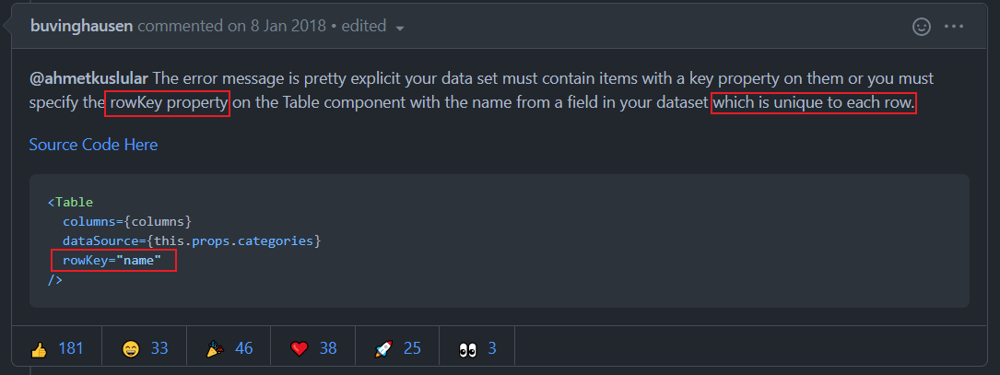

# 0513

## 工作

- 开始 `Umijs + AntD` 后台开发，记录一下 `AntD` 使用的问题

- 问题1：使用 `Table` 组件：`Each child in a list should have a unique "key" prop.`

  - 思考：记录下我的思考路径

    - 当前页面中我一共使用了 `Select, Table` 两个组件，通过注释代码的方式排除 `Select` 组件 ，确定在 `Table` 组件中
    - 在 `Table` 组件中，搜索 `key` 关键词，有 2 个地方：`columns 里面的 dataIndex, key` 和 `rowKey` ，前者在官网看到答案排除问题，后者我已开始没有设置
    - 复制警告内容，谷歌搜索关键词：`AntD Each child in a list should have a unique "key" prop.`  找到[答案](https://github.com/ant-design/ant-design/issues/7623)，自己少设置了 `rowKey` 属性

    

- 问题2：`Select 属性 defaultValue` 问题，数据刷新后依然拿不到最新数据，导致默认值是空
  - 猜测可能是缓存了值，之前遇到过 `Drawer` 组件表单值（输入框等组件）不更新问题，当时设置 弹框属性 `<Modal destroyOnClose: true />` 和 `<Form preserve={false}/>` 解决了，本次问题可能类似
  - 看了下 AndD 官网，没有找到关于这种类似的属性，无解
  - 谷歌搜索了关键词 `AndD Select defaultValue 缓存` ，找到了答案 [踩坑-Antd中Select组件中的defaultValue问题](https://blog.csdn.net/u010856177/article/details/104242498)，解决方法给 `Select` 组件（不是 `Option`） 添加一个属性 `key` 即可

## 好文推荐

- [iloveyou11/learning-blog](https://github.com/iloveyou11/learning-blog) github 动态看到的一个写的很好的博客，里面记录了 `webpack, vue, react` 等源码和高阶知识，值得阅读
- [两年半，50W的offer，三本，普通前端如何打好自己的牌](https://juejin.cn/post/6960892566921281543) 一篇焦虑的面试文章，参考别人如何做到这么~~优秀~~ 有钱 的。
- [eruda-pixel 前端用了这工具，再也不怕 UI 验收了](https://juejin.cn/post/6961220834073509895) 同事写的一个 UI 检查工具，方便 UI 验收。感觉对视觉要求很高的产品才需要，例如移动端，门户主页。

## 项目推荐

- [Michael-lzg/vue-cli4-vant](https://github.com/Michael-lzg/vue-cli4-vant) 使用 `Vue+Vant` 搭建的移动端项目框架，**移动端适配，权限处理，工具函数** 等方面的知识值得学习。
- [au1996/vue3-element-admin](https://github.com/au1996/vue3-element-admin) 使用 `Vue3+vite+element-plus` 搭建的后台，最大的特点应该是 **使用 `vite` 开发** 带来的体验感提升。

## 好用的工具：

- [一纸简历](https://cv.devtool.tech/app) markdown 格式实时生成简历，支持多种模板，面试前准备简历的刚需。介绍参考：[一纸简历：如何使用 Markdown 写出美观简洁的简历](https://juejin.cn/post/6961634914613592078)
- 上面的在线简历，附上以前看到过的相似的工具：[木及简历](https://resume.mdedit.online/#/) ，介绍参考：[只用 Markdown 就写出好看的简历，在线简历应用闪亮登场！](https://juejin.cn/post/6939698263524605965)

## 反思

- 每天阅读别人的优秀项目和博客，自己需要动手写一写，总结和整理自己的知识体系才行。
- 公司的项目主要为2种，后台产品和移动端（H5）产品，自己是否可以整理下这两种产品的项目模板，常见的业务场景，复杂度，有价值点的东西？

## 明日计划

- 工作：活动详情页开发。
- 学习：思考下自己的目标，上半年达成度，算法完成度？

## TODOS

- 图片问题整理总结：水印，相机唤醒，图片压缩等
- 图片压缩资料整理