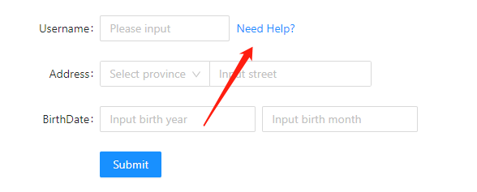
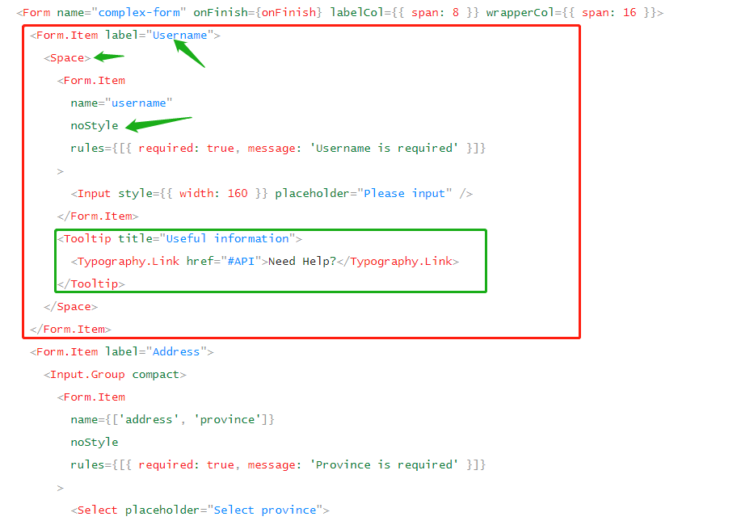

# 0514

## 工作

- 后台开发：详情页，记录个 **问题**：

  - `Form.Item`  里面只能放一个子组件，如果里面多包裹了其他组件（例如 `Tooltip`），此时使用 `form.validateFields().then(values => {})` 就拿不到表单的值，包裹在外面的话，只能使用 `css` 处理位置偏差问题。
  - 实际上，文档上是有这种场景的解决办法的，只是我没注意看：[Form表单](https://ant.design/components/form-cn/)

  

  

  - 主要几个点(绿色箭头部分)：
    - 使用 `Form.Item` 进行包裹，`label` 移到外层的 `Form.Item` 里
    - 使用 `Space` 控制间距（非必须）
    - 使用 `noStyle` 控制 `Form.Item` 的样式为**无样式**

  具体做法如上图：使用 `Form.Item` 包裹 `Form.Item` 即可实现。但是会带来个问题，因为嵌套了 `Form.Item` ，高度会变大，还要处理样式问题？实际上容易忽略一个细节：`noStyle` ，具体看引入官网描述：

  > 这里演示 `Form.Item` 内有多个元素的使用方式。`<Form.Item name="field" />` 只会对它的直接子元素绑定表单功能，例如直接包裹了 `Input/Select`。如果控件前后还有一些文案或样式装点，或者一个表单项内有多个控件，你可以使用内嵌的 `Form.Item` 完成。你可以给 `Form.Item` 自定义 `style` 进行内联布局，或者添加 `noStyle` 作为纯粹的无样式绑定组件（类似 3.x 中的 `getFieldDecorator`）

- **迭代反思**：水印需求上线了，虽然验收，但还是有不足。
  - 第一次做这种实现，**技术研究和讨论不够**（和大佬讨论，以及可能要实现的细节），不能盲目自信，承认别人比你优秀！
  - 对于这种第一次做的/自己没有把握的需求，**需要进行阶段性确认**，每做出一定效果和 UI 和产品对一下是否满意，边做边改，而不是到上线了再改。
  - 注意**边界问题**：例如 字体最小值，水印最小的大小（宽高）
  - 跟着规范走：前端需要详细**阅读了解 UI 的设计规范原则**，什么样的页面长什么样，避免返工
  - **需求评审阶段需要特别细心，勇敢的和产品撕逼（提出不合理地方）**，把问题确认在前面，最好不要做到了某个地方再找产品说这里那里的实现方式不合适等。

## 好文推荐

- [浏览器对get请求缓存问题](https://blog.csdn.net/weixin_41723305/article/details/109589659) 同事问关于代码中请求拦截器，看到关于 `get` 请求加时间戳的代码。主要是为了处理在 `IE` 才有的缓存请求问题，现阶段谷歌和火狐没有这种问题。
- [解决IE浏览器get请求缓存的问题](https://zhuanlan.zhihu.com/p/348506627) 这里介绍了3种方式处理请求缓存问题，除了上面 时间戳方式，还有后端设置 `cache-control` ，设置 `<meta http-equiv="">` 禁用缓存的方式解决。

## TODOS

- 图片问题整理总结：水印，相机唤醒，图片压缩等
- 图片压缩资料整理
- 水印图2（高密度的水印），尝试动手实现