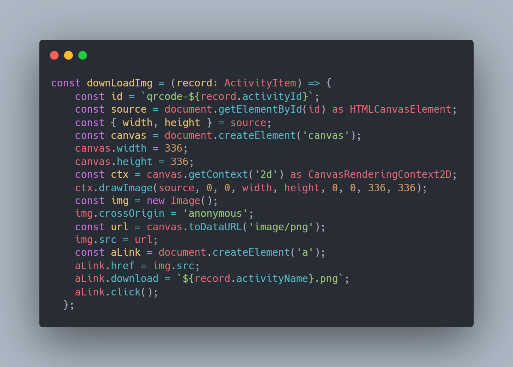
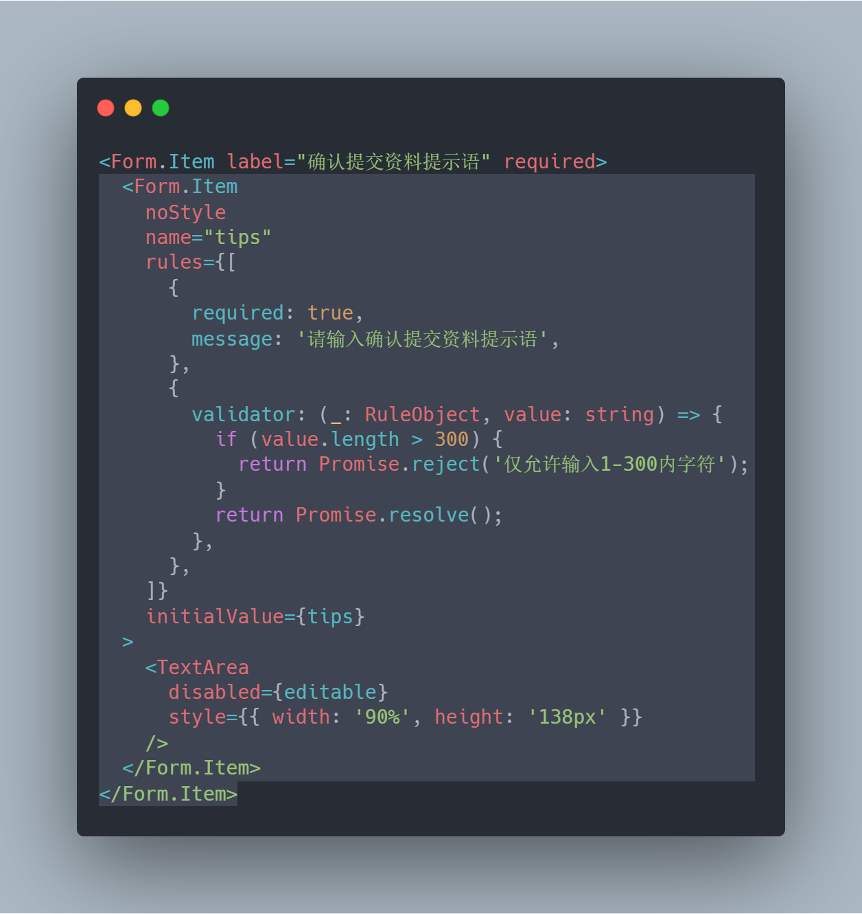

# 0517

## 工作

- 重构开发：后台页面

  - 链接转二维码，下载成图片，要求转换成固定大小的图片：

  

  - 结合了工具库 [qrcode.react](https://github.com/zpao/qrcode.react) 的使用，将链接转换成 `canvas` 进行展示
  - 继续踩坑 `AntD` ，关于自定义表单校验，主要是 `validator: () => { return Promise.resolve()}`，很久没用过了，现在又熟悉下

  

  

## 学习

- 今天比较忙，没怎么学习和阅读好文章

## 反思

- 做的不好的
- 做的好的

## 好用的工具：

- [代码展示](https://blog.csdn.net/qq_36538012/article/details/108656491) 上面的图片就是博客记录的一个网站 [carbon.now.sh](https://carbon.now.sh/) ，需要科学上网使用

