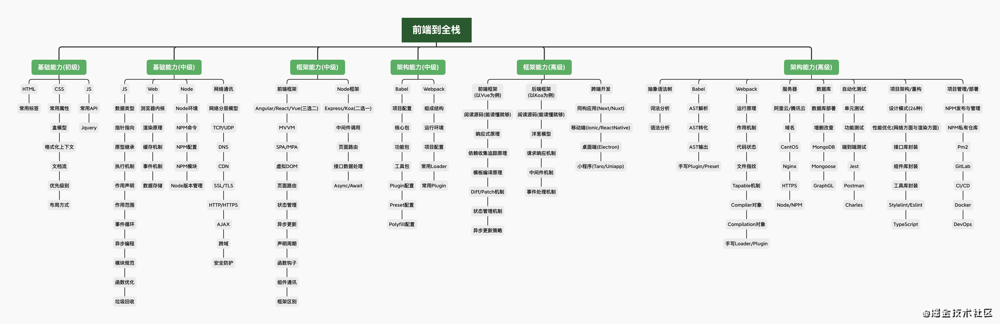

# 0520

> 图片来源：[CSS入门后，我从前端到全栈 | JTalk大前端](https://juejin.cn/post/6955776857316786183) 优秀作者的成长路径和总结

## 工作

- 后台开发。

## 好文推荐

- [徒手撸了个markdown笔记平台](https://mp.weixin.qq.com/s/Js54rIJ7dRo9A-hDUmWZzA) 一个全栈的笔记项目，值得学习
- [前端新工具--vite从入门到实战（一）](https://juejin.cn/post/6844904176988897293) vite 原理实现
- [VueConf 开发者大会](https://juejin.cn/post/6964664022541008932#heading-12) 了解些前置知识，Vue3，vite，jsx，编译原理等
- [CSS入门后，我从前端到全栈 | JTalk大前端](https://juejin.cn/post/6955776857316786183) 优秀作者的成长路径和总结

## 项目推荐

- [Antd4+umi3新版教程安排](https://juejin.cn/post/6897493546169794574) 关于 umi 和 antD-v4.x 的教程，正好工作中需要，多看看
- [早起读书笔记《知行-技术人的管理之路》](https://juejin.cn/post/6844904144944234503) 大圣老师关于技术转管理的读书笔记
- [shengxinjing/vue3-vs-vue2](https://github.com/shengxinjing/vue3-vs-vue2) 大圣老师关于 vue2， vue3的各种知识点总结的代码

## 反思

- 忙碌起来确实会偷懒，不想记录不想坚持。
- 算法学习已经中断 2 周多了，再不捡起来又又又烂尾了，flag 不能倒！

## TODOS

