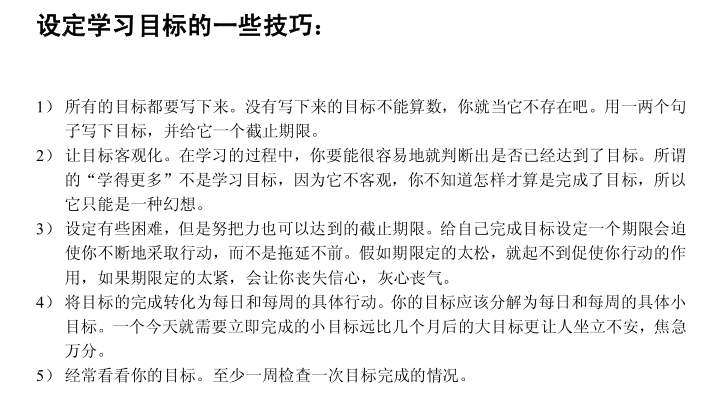

# 0603

## 工作

- 后台开发：遇到个 bug
- loading 态错误：使用 `umi` 搭建的项目，一般都会封装一下 `axios` ，同时会在 `global` 层处理 `loading`，原理就是拦截请求，请求发送了，`loading` 态为 `true`，请求结束了，`loading` 就为 `false`。
- bug 还原：一个列表页，有多个查询条件，其中 2个是需要发请求去查询列表作为下拉框数据的。也就是说，初始化界面，会发 2 个下拉框数据（项目和活动） + 1个列表查询的数据。关键在于，项目 和 活动 是联动的，即，当改变 项目，那么会拿到 项目 的当前值去作为 活动 的查询条件，查询 活动 的列表数据。此时，bug 发生了：` loading` 态一直 为 `true`，卡在页面不消失。
- 问题排查：**即在每次设置 `loading` 的时候，判断条件漏了一层，补上就没问题。**
- 原理发现：
  - 为什么需要集中处理 loading？因为如果连续发送多个请求，loading 会闪，体验效果很丑。为此做优化，一次发送多个请求的时候，只展示一次 loading，展示时间为  第一次请求开始到最后一个请求结束。
  - 怎么实现？**使用一个 数组或者 map 维护一个请求 序列。每次发送请求时，将 `loading` 设置 为 true，同时将 promise 放入该请求序列中。当某个请求返回时，找到该请求并从请求序列中移出，此时 loading 态置为 false 的前提条件是，请求序列为空。** 这样就实现了多个请求只 `loading` 一次的效果。

## 好文推荐

- [我来告诉你什么是前端工程化！](https://juejin.cn/post/6847009773305462791#heading-6)

## 书籍推荐

- 《如何高效学习》—— Scott Young 【已读】
- 《暗时间》—— 刘未鹏

## 读书

阅读：《如何高效学习》

晚上下班看博客的时候，无意间看到评论中有人和作者讨论 “如何学习”，作者推荐阅读书籍《如何高效学习》。本着没看过好奇心的驱使，百度了 PDF 版本，看了 1 个多小时，大概看完了，收获感想还是有的。

学习需要建立一个整体学习的概念，学习是有方法的。

**策略部分：**

- 获取知识：将复杂的知识简单化，快速记忆
- 明白阶段：看懂知识的字面意思，含义，思考本质。若遇到不懂的问题，学会拆解成小问题，逐步击破，找出自己的思维障碍区域。
- 拓展阶段：简单的说，就是将知识用自己的话讲述给不懂的人听，让他们也通过你的通俗比喻学会。拓展有三个方向：深度（历史角度），横向（同类知识对比），纵向（比喻）
- 应用阶段：学会了就要用，实践是检验知识点唯一真理。
- 纠错阶段：用了就可能会出现错误，纠错阶段，就是要找出自己实践该知识点的误区，就是自己知识理解的盲区，加深对知识的学习和理解。
- 测试阶段：通过上面几个阶段，明白了自己再哪个环节搞不定。
  - 获取：读的慢，容易分心，不理解？
  - 明白：没看明白作者意图？
  - 拓展：能否灵活应对该知识不同场景实践的方式？够不够灵活运用？
  - 应用：实践的够不够？
  - 纠错：是不是理解错误了，导致实践犯错太多？
  - 测试：针对上面每个阶段碰到的问题，找到对应的解决方法，让每个环节不掉链，紧密相扣！

**技术部分**：

这里介绍的东西，可以帮助我们改善学习方法。

- 获取观点
  - 快速阅读：作者介绍了3种方法：指读法，练习阅读法，积极阅读法（感兴趣的内容）
  - 笔记：做笔记的方法：提炼重点，画简图
- 联系观点
  - 比喻：看到这个知识点第一时间想到了什么？建立比喻的联系
  - 内在化：多训练，形成自己的比喻系统，并练习成为内化，往后一看到类似的知识能够快速比喻和联想。
  - 简图：将抽象的东西画图具体化理解
- 随意信息的处理：重复练习。
    - 联想：联想，画图的方式学习。
    - 挂钩：相似的字，同音字，如 7 —— 妻 。
    - 压缩：抽离重点，一句话记住一段内容，一个字母表达一个单词等。
- 知识扩展
    - 实际应用
    - 模型纠错
    - 以目标为基础的学习

**超越整体的学习**：

通过下面的方式，可以更好的保证我们的学习效果。

- 能量管理：
  - 每周锻炼3次
  - 饮食重纤维，轻油脂，少脂肪
  - 多喝水
  - 保证睡眠， 7-8 小时睡眠。
  - 少吃多餐，每次 7-8 分饱
- 不要“学习”
  - 不要刻意为了学习而 “学习”
  - **在实践中学习，以练代学，在实践中无形的方式掌握学习。**
- 绝不拖延时间
  - **建立目标清单：周目标、日目标，设立 DeadLine ，严格执行。**
- 批处理：
  - 简而言之，一次做完。明白自己的精力持久度，评估好工作的时间，一次做完。一鼓作气，再而衰，三而竭。
  - **一次做完的练习，可以提高自己注意力的阈值，越做越久，越做越好。**
  - 所以，任务拆分要合理，否则越拆越拖延，越拖延越做不完。
- 有组织：事物有序。
  - 所有的物品都放在固定的位置。
  - 随身携带一个记事本
  - 坚持日历和做事清单

在书的最后，作者还教我们：

- 如何养成每日习惯：坚持 30 天，坚持下去，享受这个习惯，寻找特殊时段做（绝对安静的专注时间）
- 如何设置自己的目标：见上图

同时，作者推荐了一些书：

- 《全力以赴:高效能人士的精力管理手册》【吉姆.洛尔】（短跑—休息式工作法很值得借鉴）
- 《与时间做朋友》【李笑来】（我最早的励志启蒙书，我非常欣赏其中的一些大实话）
- 《活出最乐观的自己》【马丁.塞利格曼】（经典一，不介绍了）
- 《高效能人士的 7 个习惯》【史蒂芬·柯维】（经典三，不介绍了）
- ......

## 明日计划

- 移动端开发
- 后台上集成环境联调
- PDP 定制

## TODOS

