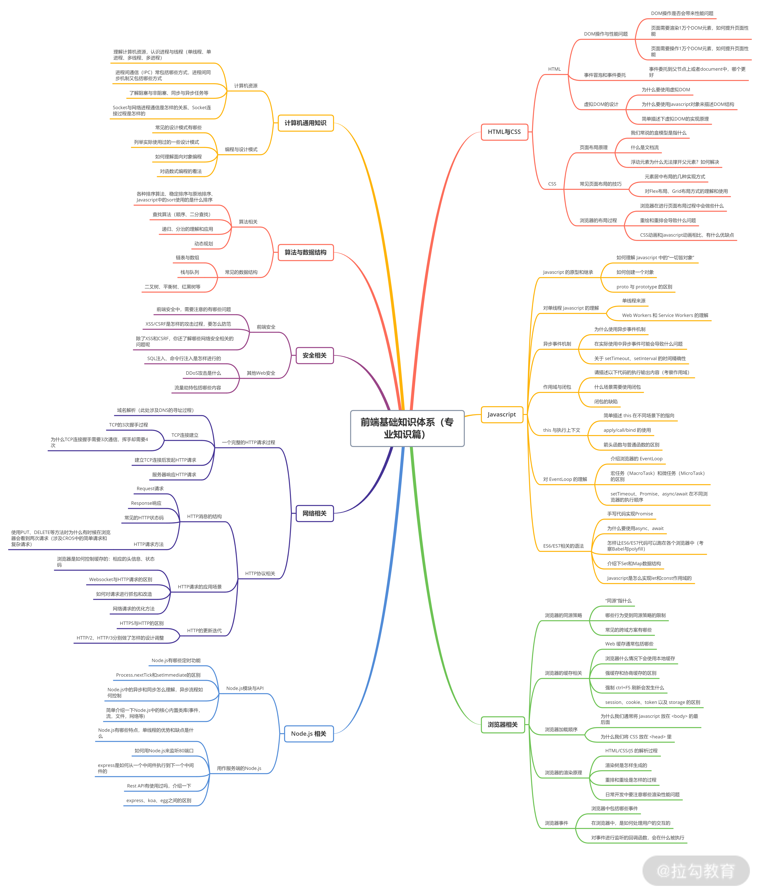

# 0702

## 工作

- BFF 升级，自测
- BFF 开发过程中，感觉很多事情都是老大帮我们做了，比如：
  - 日志、错误、登录、权限点 等中间件都被老大做了，实际上，自己也可以做一做，锻炼对中间件的理解和使用能力
  - 各种自定义装饰器，也得学习学习。[装饰器-阮一峰](https://es6.ruanyifeng.com/#docs/decorator)

- 看拉勾课程，学习 【被删】大佬 的《前端精进》

## 明日计划

 周末计划：

- 完成 vue 源码分析
- Nestjs 全栈项目
- Docker 学习
- 女票的面试题准备
- 7月月度目标制定

---

## 好文推荐

- [镜像构建篇 - 我是如何实现 docker 镜像 2 分钟构建、部署](https://juejin.cn/post/6871630496535838734) 前端和Docker 部署，向这位作者多学习
- [文件上传，搞懂这8种场景就够了](https://juejin.cn/post/6980142557066067982) 阿宝哥的新文章，学习！
- [源码浅析-Vue3中的13个全局Api](https://juejin.cn/post/6979394726927532068)
- [前端项目负责人需要具有哪些能力?](https://mp.weixin.qq.com/s/n8emA-liNlD9MNewEGoiKQ) 未来发展方向，我应该具备哪些能力
- [TypeScript高级类型入门手册：附大量代码实例（收藏！）](https://mp.weixin.qq.com/s/NwUtt4DBgRI3ygo_xhX1kQ)
- 面试系列：
  - [14万字 | 400 多道 JavaScript 面试题 🎓 有答案 🌠(第五部分 371-424题)](https://juejin.cn/post/6979860036210294797) 
  - [两个部门，六轮面试，终与字节无缘](https://mp.weixin.qq.com/s/z6rbUqrfG5TYi3GCxiVjFQ)

## 项目推荐

- [掘金-热情的刘大爷](https://juejin.cn/user/254742428391214/posts)  作者推荐，很优秀的作者
- [京城一灯的课程-2分钱](https://yd.ke.qq.com/#tab=1&category=-1) 按需购买，当前已经购买 [从0到1深度理解webpack](https://ke.qq.com/course/334441#term_id=100396918)

## TODOS

- [Bash 编程学习](https://wangdoc.com/bash/intro.html)
- 学习资料利用起来：掘金小册，极客时间，拉勾教育
- 女朋友的模拟面试准备
- H5开发文档整理

