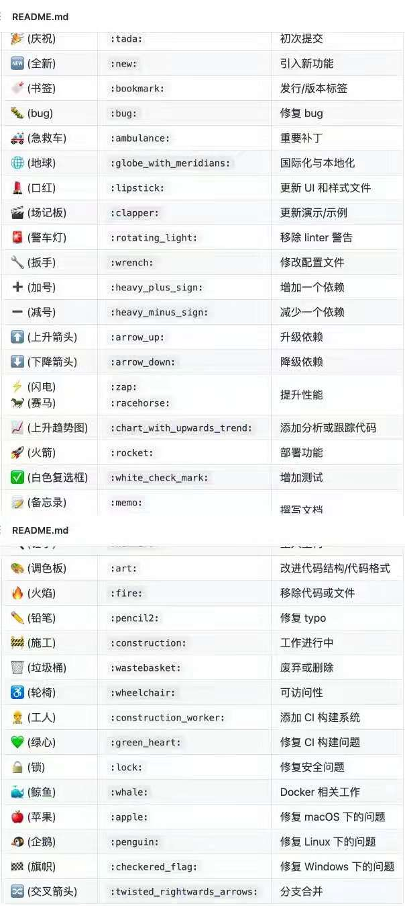

# 0703


## 工作

周末，休息。

## 任务

林子的模拟面试准备和模拟面试。

## 学习

```js
// 缓存函数
let memorizeFn = (fn) => {
    let cache = {}
    return function(...args) {
        let _args = JSON.stringify(args)
        console.log('cache', cache)
        return cache[_args] || (cache[_args] = fn.apply(fn, args))
    }
}

let add = (a, b) => a + b

let addFn = memorizeFn(add)

const r1 = addFn(10, 20)
const r2 = addFn(20, 10)
const r3 = addFn(10, 20)
const r4 = addFn(20, 10)

console.log('r2', r2)
```

- git 提交好看的表情

