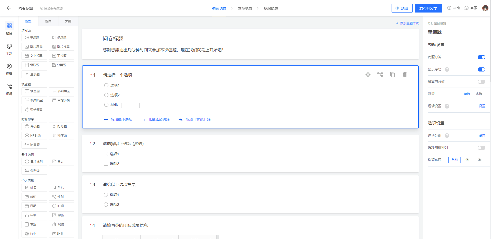

# 0708

## 工作

- [腾讯问卷](https://www.wenjuan.com/edit/survey/60e699b7660cedcd23f31d0d/?create=1#survey) 下次需求要实现的功能和这个类似，动态配置表单

感觉这种需求会更有价值一些，同时也存在一定的技术难度。

## 任务

## 反思

- 感悟：[冰雨的博客](https://bingyu123.gitee.io/blog/index/) 

关于学习方法：3W1H 指从 Why、What、Where、How 四个方面去掌握一个技能点其中
  - Why：指为什么需要该技能点或概念，可以通过生活案例或从实际需要出发理解为什么要使用该技能
  - What：该技能点或概念的具体内容
  - Where：该技能点或概念的应用场景
  - How：
    - 如何使用该技能点，注意归纳总结步骤和注意事项，便于理解记忆
    - 面对现代的互联网形式该如何破局

## 明日计划

---

## 好文推荐

- [回流重绘到底是什么？](https://juejin.cn/post/6870581606692683789) 都知道重绘回流的概念，但是怎么在浏览器看呢？
- [nodejs教程](https://github.com/wangfupeng1988/node-tutorial) 看看进程线程部分

## TODOS

- 整理学习资料，列出学习计划
  - 掘金小册
  - 拉勾教育
  - 极客时间
- 开启实战项目：
  - 前端 Umijs + React + Typescript
  - 后端 Koa + MongoDB + Typescript / Nestjs 解决方案
  - 内容包括：
    - Web：前端请求库封装，工具库，路由/菜单权限处理，按钮权限处理
    - Server：接口权限点，登录中间件鉴权，jwt，日志，图片的上传下载，excel 的导入导出，安全防范等