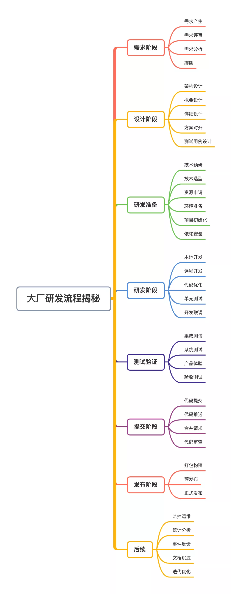

# 0712

## 工作

- 需求会议：开了一下午，足以见这次需求的复杂度了。

## 任务

- React 源码
- 算法题 [3. 无重复字符的最长子串](https://leetcode-cn.com/problems/longest-substring-without-repeating-characters/submissions/)

## 反思

## 明日计划

---

## 好文推荐

- [前端简历中的项目经历怎么突出亮点？](https://blog.csdn.net/Taobaojishu/article/details/107925479) 通过以下方式，即可发现找到自己的亮点。
  - 业务/技术思考
  - 发现问题，发现痛点
  - 产出方案
  - 拆解实现
- 这里的核心，还是要求要能够发现项目中的痛点。
- [前端 Offer 提速：如何写出有亮点的简历](https://zhuanlan.zhihu.com/p/365741271) 这篇介绍比较详细。
  - 性能提升：发现项目的问题，深入研究解决提升性能
  - 业务提效：创造工具进行提效
  - 业务推进：项目因为你的参与，业务指标提升了多少
  - 影响力：内部分享，博客输出等。
- [一首歌时间将React / Vue 应用Docker 化](https://mp.weixin.qq.com/s/bSM2sFNYzRf5dVvo7ED1Ww) Docker 相关
- [1.5万字概括ES6全部特性(已更新ES2020)](https://juejin.cn/post/6844903959283367950) ES6基础

## 学习感悟

- [前端项目负责人最基础的需要会哪些](https://mp.weixin.qq.com/s/mVlJrKe6kGkmGyzFcqt-gw) 要想成长，就要突破当前的维度，从更高的维度要求自己。
- [gRPC 基础概念详解](https://mp.weixin.qq.com/s/I2QHEBO26nGqhGwIw281Pg) 和工作中的东西相关，详细看看
- [拜托，大厂做项目可不简单！](https://mp.weixin.qq.com/s/acswqW8uL3sBSF0ggEVrDw) 项目开发的流程

## TODOS