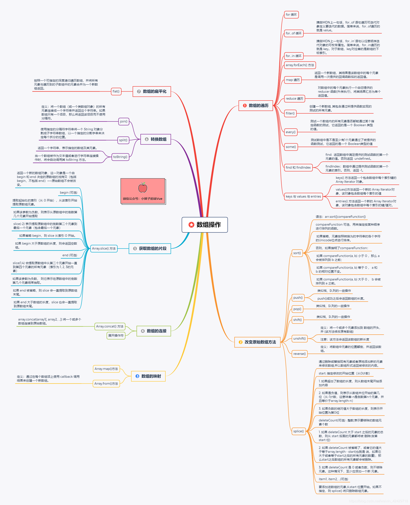

# 0714

## 工作

- 梳理前端所需的数据结构
- 梳理接口，明天 11 点前核对

## 任务

- React 源码学习：类组件实现，生命周期实现
- 算法：

## 明日计划

- 工作：
  - 接口核对和纠正
  - 准备设计方案
  - 核对需求和 UI 交互细节
- 任务
  - 源码：setState 实现原理
  - 算法，知识体系整理

---

## 好文推荐

- [Nest.js 实战系列八：使用 Redis 实现登录挤出功能](https://mp.weixin.qq.com/s/k-2fgGYfppvswtt37C-dHQ)
- [TypeScript在项目开发中的应用实践体会](https://mp.weixin.qq.com/s/2aGGVh_DGvARQDYu1xtluQ)
- [Node.js 并发能力总结](https://mp.weixin.qq.com/s/MwRqSeGfeQDDkVs-Ejpx7w)

## 项目推荐

- [React的秘密](https://github.com/neroneroffy/react-source-code-debug) 学习React 源码的调试工具

## 其他

发现个数组总结的思维导图，看了还不错。

## TODOS

- 细看：[React的秘密](https://github.com/neroneroffy/react-source-code-debug) 