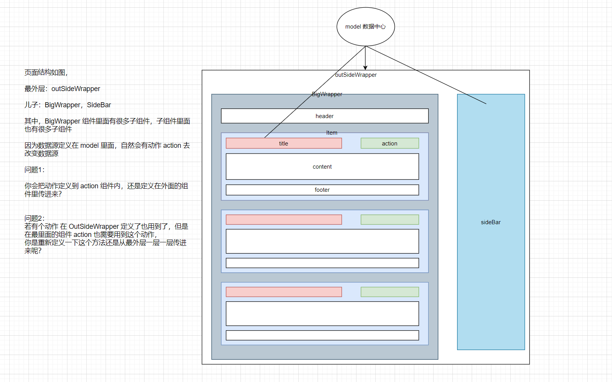

# 0729

## 工作

- 工作中涉及很多父子组件通信，某些比较深的子组件是使用 `太爷爷->爷爷->爸爸->儿子` 这种方式一直往下传值？还是直接 connect 一下使用 model 层数据呢？

业务开发中，怎么去设计，某个组件为受控组件还是非受控组件呢？最里层的为受控组件吗？还是涉及动作和数据都在比较小的范围时，那么这个组件就定义为受控组件？

- [如图如题，你会怎么样做组件设计呢](
https://juejin.cn/pin/6990361614490796046)

## 明日计划

- 拖拽需求的实现

---

## 好文推荐

- [Vue3 源码解毒 & PK React17](https://juejin.cn/post/6990028188080406558?share_token=fb138859-71f7-4839-b537-671902eebbbe)

## 面试题

- [2021年我的前端面试准备](https://juejin.cn/post/6989422484722286600?share_token=3935d8dc-443e-4c39-888d-cfaad62a415f) 参考参考

## 好用的工具

## TODOS