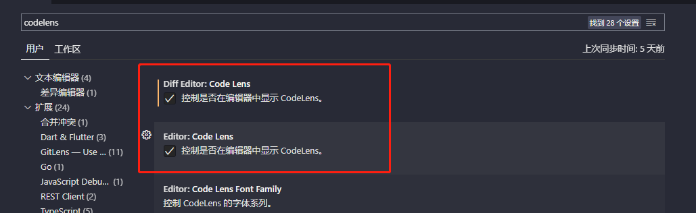

# 0812


## 工作

- safari 浏览器不支持 Flex 部分属性：`flex: 1`， 以及 `gap` 属性，使用 margin  或者 padding 处理。以及参考方案 [safari到底支不支持flex（弹性布局）](https://www.zhihu.com/question/32018114/answer/149800226)
- 无意间看到别的团队的 前端例会的文档，其中有 2 篇不错
  - [代码审核规范](https://confluence.myscrm.cn/pages/viewpage.action?pageId=16559167)
  - [前端规范](https://confluence.myscrm.cn/pages/viewpage.action?pageId=2105846)
- vs code 对比工具恢复，参考 [GitLens disables merging CodeLens ](https://github.com/eamodio/vscode-gitlens/issues/319)




## 反思

听了个前端分享，同时学习了同事的 【bff解析为接口文档】，大概使用了以下知识：

```
@babel/parser
@babel/traverse
```

可以结合 [神光的小册](https://juejin.cn/book/6946117847848321055) 进行学习和了解


## 项目推荐

优秀项目：https://zhuanlan.zhihu.com/p/338418160
评论区优秀项目：https://github.com/buqiyuan/vite-vue3-lowcode
带你入门前端工程 https://woai3c.gitee.io/introduction-to-front-end-engineering

## 好用的工具

## TODOS