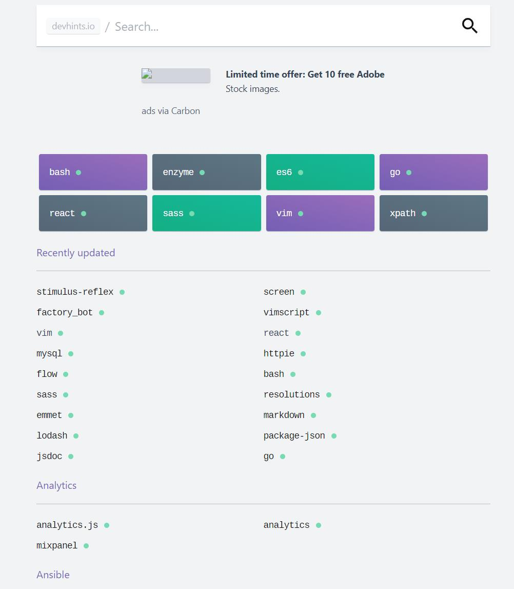

# 0825

## 工作
- coding...
- 发现个问题：Typescript 的枚举，到底是类型还是类型值？为什么引用的时候需要使用 `import type { enumValue } from 'xxx'`它和对象的区别到底是什么？

## 反思

## 明日计划

---

## 好文推荐

- [前端基础 个人博客 学习笔记](https://github.com/WindrunnerMax/EveryDay)
- [带你入门前端工程](https://woai3c.gitee.io/introduction-to-front-end-engineering)
- [浮之静](https://lencx.tech/) 优秀的博客，云谦大佬点赞的博客
- [精读Nextjs](https://github.com/ascoders/weekly/blob/master/%E5%89%8D%E6%B2%BF%E6%8A%80%E6%9C%AF/20.%E7%B2%BE%E8%AF%BB%E3%80%8ANestjs%E3%80%8B%E6%96%87%E6%A1%A3.md)

## 好物推荐

- [Rico's cheatsheets](https://devhints.io/) 很多代码片段，方便快速熟悉和记忆。包括各种语言，React，Vim 等

