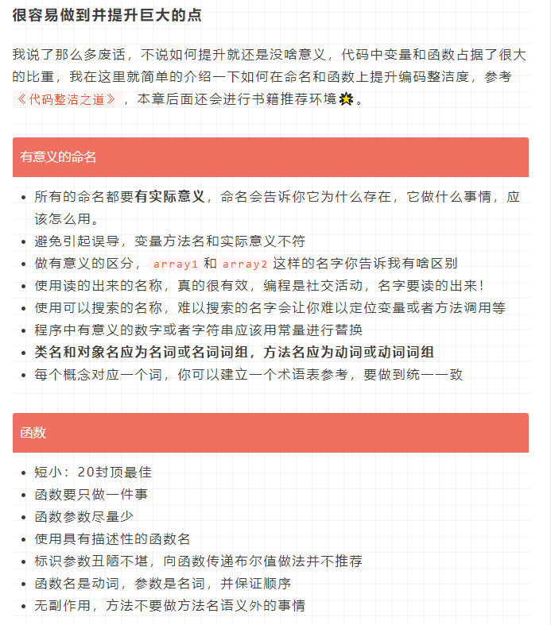

# 1008

## 工作

- [前端工程化之强大的glob语法](https://juejin.cn/post/6876363718578405384) Glob 语法学习
- [7关！setTimeout+Promise+Async输出顺序？你能过几关！](https://juejin.cn/post/7016298598883131423#heading-2)
- [KISS 原则](https://juejin.cn/post/7011296508377038861)
- [工作一周年经验总结](https://juejin.cn/post/6987910809657540644)

## 好文推荐

- [微前端入门（译文）](https://juejin.cn/post/6844903953734336525) 系统全面的微前端入门
- [详解 Node.js 中的子进程](https://juejin.cn/post/7015860859662499854)
- [两个 Node.js 进程如何通信？](https://juejin.cn/post/7016233869565231135)
- [前端工程化之强大的glob语法](https://juejin.cn/post/6876363718578405384)

## 项目推荐

## 好用的工具

## TODOS