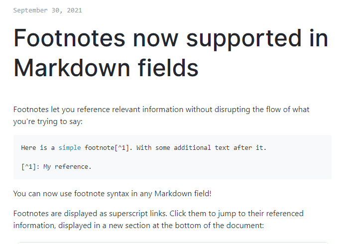

# 1102

## 今日算法

> 发现自己的薄弱点之一就是回溯算法，没有掌握方法和模板

回溯算法：

- 电话号码的字母组合
- 括号生成
- 全排列
- 子集
- 单词搜索

其他：

- 最长公共前缀

## 好文推荐

- https://github.com/fltenwall/Code-for-JavaScript 各种手写 js
- [semi desgin F/A 模式](https://semi.design/zh-CN/start/introduction) 当前 ui 组件中比较独特的 UI 组件架构方式

## 有趣的项目

- [github 支持脚注了](https://github.blog/changelog/2021-09-30-footnotes-now-supported-in-markdown-fields)

- [在线生成头像，很有趣](https://notion-avatar.vercel.app/zh)

- [云谦的B站内容](https://space.bilibili.com/27472034) umi 作者的b站内容，关于如何写 umi 插件，umi-ui 等信息可以看到
- [好用的前端库](https://github.com/sorrycc/awesome-f2e-libs) 也是上面作者整理的仓库
