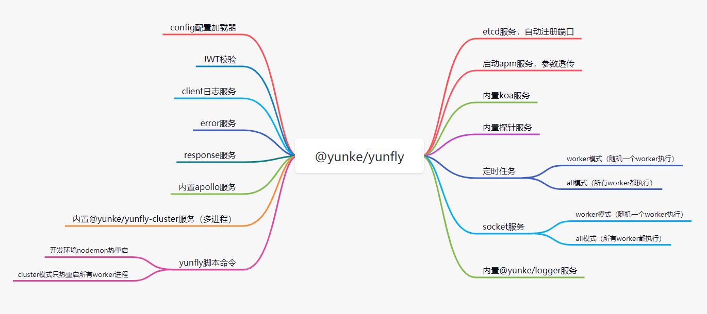
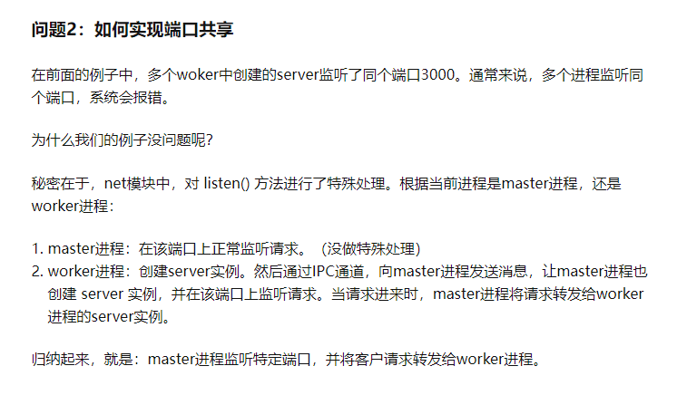

# 1108


## 工作

- 再次学习一下公司的 BFF 特点：



bff 除了具有 koa 的基本特性如：

- controller/router
- params/body 解析
- jwt 鉴权处理
- cors/helmet/安全等处理

主要升级了：

- apm 
- applo
- cluster
- logger
- 探针
- [etcd 是什么？用来做什么？](https://blog.csdn.net/shukebai/article/details/53464887) 它是一个键值存储仓库，却没有重视官方定义的后半句，用于配置共享和服务发现。

等等


## 今日学习——Cluster




```js
// master.js
const cluster = require('cluster');
const cpusLen = require('os').cpus().length;
const path = require('path');

console.log(`主进程：${process.pid}`);
cluster.setupMaster({
  exec: path.resolve(__dirname, './worker.js'),
});

for (let i = 0; i < cpusLen; i++) {
  cluster.fork();
}

// worker.js
const http = require('http');

console.log(`工作进程：${process.pid}`);
http.createServer((req, res) => {
  res.end('hello');
}).listen(8080);
```

**核心知识点**

> 参考：[NodeJS 之 cluster 模块](https://blog.csdn.net/u012060033/article/details/102766342)

- 为什么要开启多个子进程：充分利用 多核 CPU 资源——主进程监听端口和转发，子进程负责处理业务；

- 主进程和子进程端口占用问题：实际上只会主进程占用端口，worker 进程的 listen 被特殊化处理了，并不会真正的监听端口；

- 进程间通信问题：使用 `eventEmitter` IPC 通信

- 集群如何管理：

  - ~~多个 Node 实例，多个端口~~，虽然各个实例各自独立稳定，但是占用了多余的端口而且不利于进程通信；
  - 主进程向子进程转发请求：由 master 进程创建多个 worker 进程，根据 cpu 数目来创建对应的实例；监听的都是同一个端口；

- 如何实现端口共享？主进程监听端口，接受信息后通过 ipc 通信转发给子进程；

- 主进程转发给子进程，该转发给谁？转发的策略是什么？

  - 默认的转发策略是轮询。当有客户请求到达，master会轮询一遍worker列表，找到第一个空闲的worker，然后将该请求转发给该worker。

  > 调度策略，包括循环计数的 cluster.SCHED_RR，以及由操作系统决定的cluster.SCHED_NONE。 这是一个全局设置，当第一个工作进程被衍生或者调动cluster.setupMaster()时，都将第一时间生效。除Windows外的所有操作系统中，SCHED_RR都是默认设置。只要libuv可以有效地分发IOCP handle，而不会导致严重的性能冲击的话，Windows系统也会更改为SCHED_RR。cluster.schedulingPolicy 可以通过设置NODE_CLUSTER_SCHED_POLICY环境变量来实现。这个环境变量的有效值包括"rr" 和 "none"。
  >
  > RR 即 Round-Robin 轮询调度，即每个子进程的获取的事件的机会是均等的，这是除 windows以外默认的。而 windows 下的调度策略很诡异，见下图。目前并没有相关 API 可以设置调度策略的算法，node 只为我们提供了两个值

  来源：[node中cluster集群的作用是什么](https://www.yisu.com/zixun/179127.html)

- worker 进程？身份标识？

  - 创建子进程后会返回 `pid` 即子进程的身份标识；

- 子进程管理？挂了怎么办？

  - 监听 `online, exit` 事件
  - 代码：

```js
var cluster = require('cluster');
if(cluster.isMaster) {
  var numWorkers = require('os').cpus().length;
  console.log('Master cluster setting up ' + numWorkers + ' workers...');
  for(var i = 0; i < numWorkers; i++) {
    cluster.fork();
  }
 cluster.on('online', function(worker) {
    console.log('Worker ' + worker.process.pid + ' is online');
  });
cluster.on('exit', function(worker, code, signal) {
    console.log('Worker ' + worker.process.pid + ' died with code: ' + code + ', and signal: ' + signal);
    console.log('Starting a new worker');
    cluster.fork();
  });
}
```

- 常用 API

```js

// ---- cluster-----
cluster.isMaster
cluster.isWorker
cluster.fork()
cluster.kill()
cluster.on('listening', function(worker, address) {})

// cluster: 与 worker.send() 之对应的
process.on("message", function(message) {})
// 主进程的所有子进程数组
cluster.workers


// ---- woker ------
worker.id
// 所有的worker进程都是用child_process.fork()生成的。child_process.fork()返回的对象，就被保存在worker.process之中。
// 通过这个属性，可以获取 worker 所在的进程对象
worker.process

// 该方法用于在主进程中，向子进程发送信息。
worker.send("message")
```

- 不中断的重启 node 服务

重启服务需要关闭后再启动，利用`cluster模块`，可以做到先启动一个`worker进程`，再把原有的所有`work进程关闭`。这样就能实现不中断地重启 Node 服务。
首先，主进程向`worker`进程发出重启信号。

```js
workers[wid].send({type: 'shutdown', from: 'master'});
```

worker 进程监听 message 事件，一旦发现内容是 shutdown，就退出。

```js
process.on('message', function(message) {
  if(message.type === 'shutdown') {
    process.exit(0);
  }
});
```

下面是一个关闭所有 worker 进程的函数

```js
function restartWorkers() {
  var wid, workerIds = [];
  for(wid in cluster.workers) {
    workerIds.push(wid);
  }
  workerIds.forEach(function(wid) {
    cluster.workers[wid].send({
      text: 'shutdown',
      from: 'master'
     });
    setTimeout(function() {
      if(cluster.workers[wid]) {
        cluster.workers[wid].kill('SIGKILL');
      }
    }, 5000);
  });
};
```

更多参考：https://blog.csdn.net/u012060033/article/details/102766342

相关资料：

- [cluster 集群](http://nodejs.cn/api/cluster.html)
- [Nodejs cluster 主要功能解惑](https://www.jianshu.com/p/68e54b6ded4e)
- [node中cluster集群的作用是什么](https://www.yisu.com/zixun/179127.html)
-  [nodejs 中 cluster 使用](https://blog.csdn.net/baby97/article/details/50675352)  充分利用多核cpu，开启多进程，处理主进程和多个 worker 子进程之间的通信和状态监控
- [cluster 相关代码和例子](https://www.jianshu.com/p/c90dc4adcaf4)
- [cluster 的主要 API 详解和使用以及 pm2 原理](https://blog.csdn.net/u012060033/article/details/102766342)
- [node集群（cluster）](https://www.cnblogs.com/helloxiaoduan/p/14345825.html) 
- [Node.js：cluster原理简析](https://zhuanlan.zhihu.com/p/157987519 )

推荐笔记： [Nodejs学习笔记以及经验总结](https://github.com/chyingp/nodejs-learning-guide)

拓展知识：

- node 定时任务：
  - [node-cron](https://www.npmjs.com/package/node-cron)
  - [node-schedule](https://www.npmjs.com/package/node-schedule)


## 今日算法

今日学习：


今日复习：


## 温故知新
> 防抖节流，http 握手，缓存，各种手写


## 好文推荐
> 有感好文

- [nest 实战教程](https://juejin.cn/collection/6845244185432293389)，对应仓库 [nest-zero-to-one](https://github.com/SephirothKid/nest-zero-to-one)
- [car-assembly](https://github.com/Lewage59/car-assembly) nest 实战


## 项目推荐
> 值得学习的项目


- [elastic-apm-node](https://www.npmjs.com/package/elastic-apm-node) apm 是什么？ 主要是用来收集系统性能信息和错误信息的工具
- [elastic APM 简单使用](https://blog.csdn.net/qq_20906903/article/details/109329951)
- [微图 - 极速图片压缩工具](https://devtool.tech/tiny-image)，附带其他面试题笔记等等
- [download/github](https://www.npmjs.com/package/download) 一个下载库，一般用于爬虫下载图片之类的

## 面经相关
> 八股文相关

## 明日计划


## TODOS

工作 TODO

1-通读 bff 文档，看看公司的 bff 做了什么事情，特点和不一样的地方（价值点）在哪里？
2-你感兴趣的点再哪里？猜想对应的实现和 gitlab 仓库代码的具体实现，总结你的成长；
3-自己是否能够贡献一些代码？