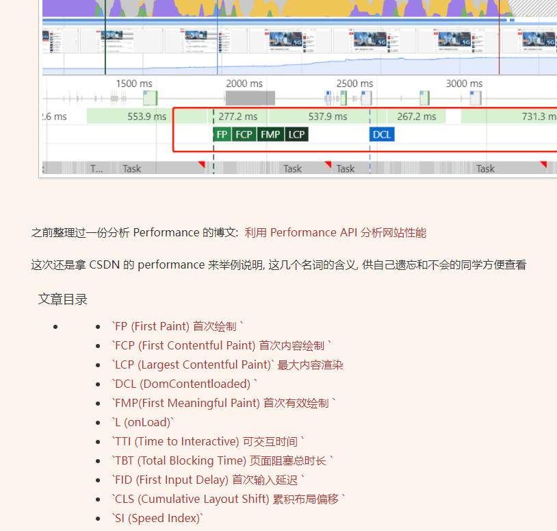

# 1112

## 工作

- 如何分析页面的性能？有哪些性能指标？如何做性能优化？

什么是 `FCP, FP, LCP, DCP, TTI, TBT...` ??? 

今天刷网页偶现这个问题，自己对这方面是不了解的，不过隐约知道可以使用浏览器工具 performance, lighthouse 分析；

**查阅相关资料：**

- [Chrome Performance 常见名词解释 (FP, FCP, LCP, DCL, FMP, TTI, TBT, FID, CLS)](https://blog.csdn.net/c_kite/article/details/104237256)
- [前端性能优化之Lighthouse实战 “点对点”优化](https://juejin.cn/post/7016922364185149477)
- [使用 Performance API 获取页面性能](https://juejin.cn/post/6973567030528065573)
- [【1w字】浏览器的V8引擎到底是什么？](https://juejin.cn/post/6963620408742379533)

**拓展知识：**

- [浅析 Chrome 浏览器的多进程架构](https://blog.csdn.net/weixin_42071117/article/details/104595132)
- [Chrome架构：仅仅打开一个页面，为什么会有 5 个进程？](https://juejin.cn/post/6844904090439254030)

1.浏览器进程：主要负责界面显示、用户交互、子进程管理，同时提供存储等功能。

2.网络进程：主要负责页面的网络资源加载，之前是作为一个模块运行在浏览器进程里面的，后来成为一个单独的进程。

3.渲染进程：核心任务是将 HTML、CSS 和 JavaScript 转换为用户可以与之交互的网页，排版引擎 Blink 和 JavaScript 引擎 V8 都运行在该进程中，默认情况下，Chrome 会为每个 Tab 标签创建一个渲染进程（浏览上下文组和同一站点对此有影响，后续会介绍）。出于安全考虑，渲染进程都是运行在安全沙箱模式下。

4.插件进程：在沙箱模式中进行，将插件单独放在一个进程中，是为了保证插件的崩溃不会对浏览器和页面造成影响。

5.GPU进程：GPU 的使用初始是为了实现 3D CSS 的效果。随后网页、Chrome 的 UI 界面都选择采用 GPU 来绘制，这使得 GPU 成为浏览器普遍的需求。最后 Chrome 在其多进程架构上也引入了 GPU 进程。

## 今日算法

今日学习：

今日复习：

## 温故知新
> 防抖节流等各种手写，http和网络，浏览器原理，性能优化，Webpack

## 好文推荐
> 有感好文

- [极客时间的专栏在线免费](https://doc.vercel.app/frontend/) 涉及 数据结构、重学前端，Java 虚拟机等
- [libuv中文教程](https://github.com/luohaha/Chinese-uvbook)
- [天猫前端博客](https://github.com/tmallfe/tmallfe.github.io) 看看 issue 博客内容，还是能学到不少知识的

## 项目推荐
> 值得学习的项目

- [Gantt Component for React 类似 tapd 的甘特图](https://github.com/ahwgs/react-gantt) 甘特图组件，对应[文档](https://ahwgs.github.io/react-gantt/#/component)
- [Fast-nest-temp](https://github.com/ahwgs/fast_nest_temp) Nest 实战

## 面经相关
> 八股文相关

- [极客时间的专栏在线免费](https://doc.vercel.app/frontend/) 涉及 数据结构、重学前端，Java 虚拟机、前端面经等
- [最强前端面试资源](https://github.com/whylisa/front-end-interview)

