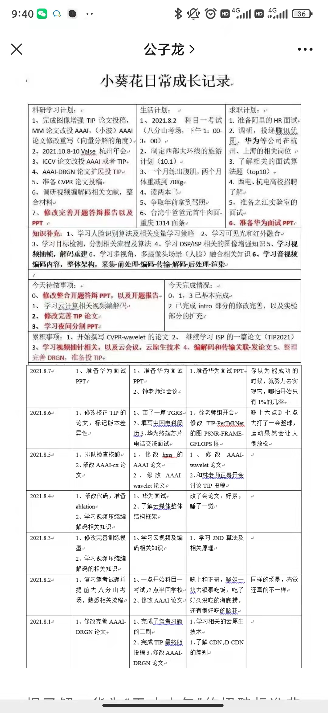

# 1115

## 工作

- 下一期需求分析，分析代码
- 需要好好看看 h5 端的代码，很久没有写了

## 今日算法

今日学习：

今日复习：

## 温故知新
> 防抖节流等各种手写，http和网络，浏览器原理，性能优化，Webpack

## 好文推荐
> 有感好文

来源：[武大94年博士年薪201万入职华为！学霸日程表曝光，简直降维打击！](https://mp.weixin.qq.com/s/DMfytFG4PwwwaWLRIva9kA)

> 优秀的人，都有有优秀的学习和生活方式的，以及强大的自律能力，才能练就这种无敌优秀的能力。

其他文章： 

- [密码强度效果最佳实现一定是HTML meter元素](https://www.zhangxinxu.com/wordpress/2021/11/html-meter-password/)，看看 [demo](https://www.zhangxinxu.com/study/202111/form-password-strong-demo.php)
- [密码强度计算的开源库](https://github.com/dropbox/zxcvbn)
- [写给新手前端的各种文件上传攻略，从小图片到大文件断点续传](https://juejin.cn/post/6844903968338870285 )

## 项目推荐
> 值得学习的项目

- [密码强度计算的开源库](https://github.com/dropbox/zxcvbn)
