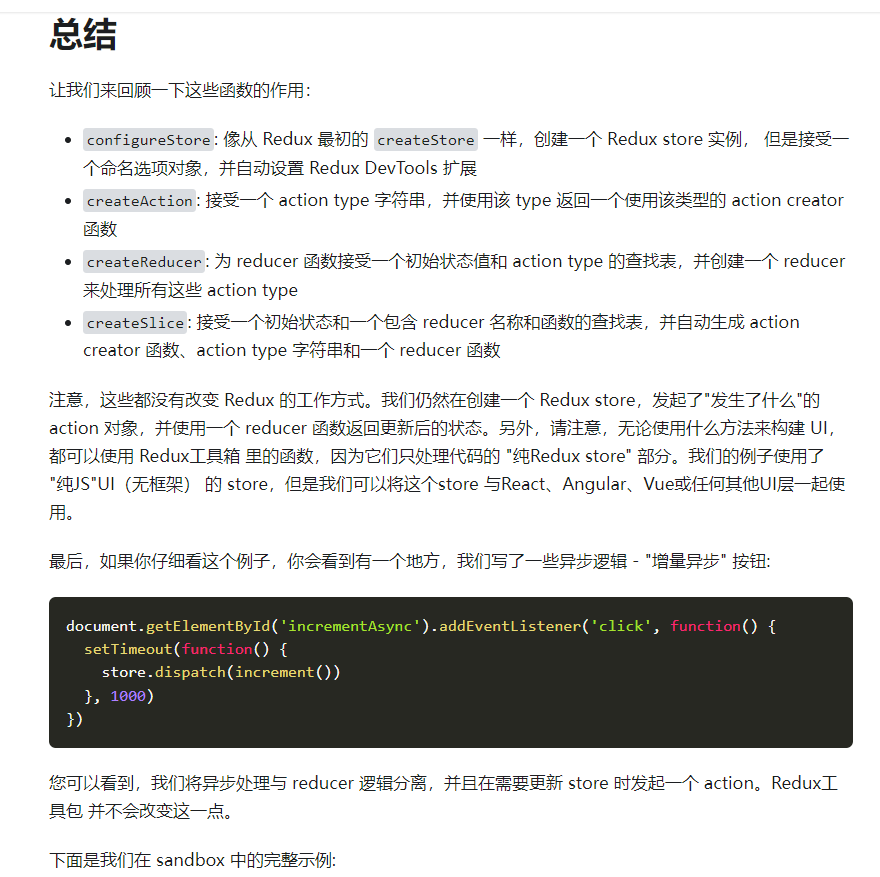
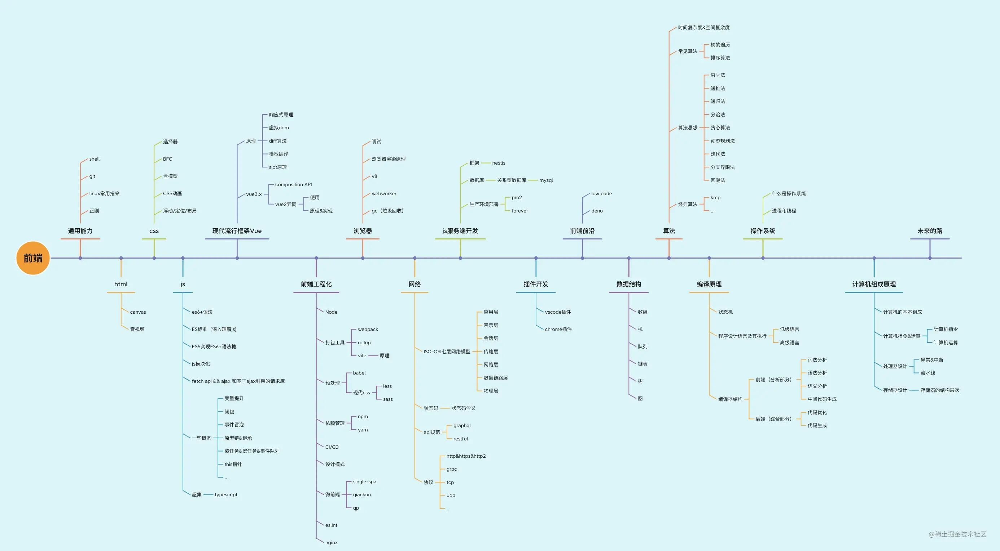

# 1125


## 工作



- 技术栈转型：`Redux Toolkit`，相关文档：[Redux Toolkit中文文档](https://redux-toolkit-cn.netlify.app/introduction/quick-start)
- review 代码学习提升：

需求：输入框查询搜索

常用思路：

```js
function App() {
    
    const onSearch = (keyword: string) => {
        const params = { keyword }
        dispatch({ type: 'xxx/searchList', payload: { params }})
    }
    
    return (
    <div>
    	<Input.Search onSearch={() => onSearch(keyword)} />
    </div>
    )
}
```

新思路：

```js
function App() {
    const [keyword, setKeyword] = useState('')
    const getData =  useCallback(() => {
        // 发送请求
        dispatch({ type: 'xxx/searchList', payload: { params }})
    }, [keyword])
    
    useEffect(() => {
        getData();
    }, [getData])
    
    const onSearch = (keyword: string) => {
        setKeyword(keyword)
    }
    
    return (
    <div>
    	<Input.Search onSearch={() => onSearch(keyword)} />
    </div>
    )
}
```

刚开始我还奇怪，keywod 改变后居然没有调用 发送请求的方法，但是页面能够正常发送请求 ；而且 keyword 并没有直接作为 useEffect 发送请求的依赖；

原来，这里的**调用链**是这样：

```
Input.onSearch --> change keyword --> change method getData --> trigger useEffect --> getData() --> ajax --> getList
```

这里，参数不止有 keyword, 还有其他如分页信息等；

**使用这种写法，代码量少，看着也【高级感 满满】，后续也方便拓展——直接加在依赖上即可~~**


## 反思

- [一个前端失败者的自我剖析与反思](https://juejin.cn/post/6944286031990489101) 发现**我身上也有作者类似的问题：能干活，但是不深入，三年经验，一年的能力。所以要改变观念，跳出舒适圈提升自己，为自己以后的职业发展铺路**。
- [面试题：如何实现一个拖拽插件](https://juejin.cn/post/6944901422789951496) 也是上面作者的面试学习文章，**这种问题我也遇到过**，记录一下，后续可能需要；
- [程序员一定会有35岁危机吗](https://juejin.cn/post/7012542827204706318) 听一听黄奕老师对于程序员如何长期稳定在这个行业发展的看法和职业规划路；


## 好文推荐
> 有感好文



- [重学前端，知识体系构建](https://juejin.cn/post/7033207826646466574) 为了避免 **三年经验，一年水平** 的问题，一条好的出路就是**【建立自己的知识体系】**
- [常用的前端JavaScript方法封装](https://juejin.cn/post/7031829689261883405) 这些内容可以封装成自己项目中常用的 npm 库
- [【Vue3官方教程】万字笔记 | 同步导学视频](https://juejin.cn/post/6909247394904702984)


## 项目推荐
> 值得学习的项目

- [Vue、Node全栈项目~面向小白的博客系统~](https://juejin.cn/post/6890757905352491021)
- [博客项目地址-github](https://github.com/qiheizhiya/myBlog)
- [前端进阶：细数2年内我做的15个开源项目](https://juejin.cn/post/6962897454781956133) 大佬 徐小夕 的开源作品


## 面经相关
> 八股文相关

- [后端一次给你10万条数据，如何优雅展示，到底考察我什么](https://juejin.cn/post/7031923575044964389) 如何处理性能问题？setTimeout, requestAnimationFrame, 懒加载，虚拟列表...
- [10个常见的前端手写功能](https://juejin.cn/post/7031322059414175774)
