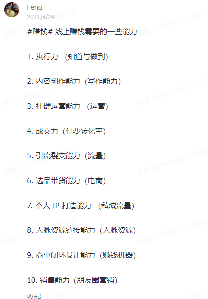

# 1206 今日总结


## 今日工作

- ui 走查项目合并包

## 今日心情
> 所见所想，有感而发



总结了 **线上赚钱需要的能力！**


## 今日算法

今日学习：

- [算法与数据结构基础 - 数组(Array)](https://zhuanlan.zhihu.com/p/86344332) 
- [算法与数据结构基础](https://www.zhihu.com/column/leetcodefun)

今日复习：


## 手撕代码
> 防抖节流等各种手写，http和网络，浏览器原理，性能优化，Webpack

数组扁平化：

```js
// 方法一： reduce,  Array.isArray, ...拓展运算符/concat, 递归 flattern

const flattern = (arr = []) => arr.reduce((pre, cur) => Array.isArray(cur) ? [...pre, ...flattern(cur)] : [...pre, cur], [])

const source = [
  1,
  2,
  [ 3,4, 
  [ 5, 6 ]]
]
const result = flattern(source)
console.log('result', result)

// 方法二：while 循环，Array.some, Array.isArray

const flattern = (arr = []) => {
  while(arr.some(item => Array.isArray(item))) {
      arr = [].concat(...arr)
  }
  return arr;
}

const source = [1,2,[3,4, [5, 6]]]
const result = flattern(source)
console.log('result', result)


// 方法3：Array.flat(Infinity)

[1,2,[3,4, [5, 6]]].flat(Infinity)

// 方法4：toString, split, map
// eg:
[1,2,[3,4, [5, 6]]].toString()
// '1,2,3,4,5,6'

const flattern = (arr = [] ) => {
  return arr.toString().split(",").map(Number)
}

const source = [1,2,[3,4, [5, 6]]]
const result = flattern(source)
console.log('result', result)
```


## 好文推荐
> 有感好文

- [那个一年前找不到工作的男人，2021年怎么样了？](https://juejin.cn/post/7038395860505329694#heading-12)
- [Websocket百万长连接技术实践](https://mp.weixin.qq.com/s?__biz=MzAwMDU1MTE1OQ==&mid=2653558136&idx=1&sn=0ac293d724b022d0f860d87d87460cbd&scene=21#wechat_redirect)

## 项目/博客推荐
> 值得学习的项目/作者

- [Vite2 + Vue3 + TypeScript + Pinia 搭建一套企业级的开发脚手架【值得收藏】](https://juejin.cn/post/7036745610954801166) 
- [【实战】基于SpringBoot+Vue开发的前后端分离博客项目完整教学](https://www.bilibili.com/video/BV1PQ4y1P7hZ/)
- [怎么吃透一个java项目？](https://www.zhihu.com/question/422346147/answer/2251334040)


## 面经相关
> 八股文相关

- [字节跳动面试题](https://bytedance.feishu.cn/base/app8Ok6k9qafpMkgyRbfgxeEnet?table=tblzZHf2Ix3YtxPM&view=vew9iquA45)
- [vue 源码解析](https://juejin.cn/user/3755587449389911/posts)
- [vue 源码解析专栏](https://juejin.cn/column/6968485473295532062)
- [jsliang 求职系列 - 49 - 2020 求职系列汇总【完结】](https://juejin.cn/post/6908493793213808647)
- [React 原理](https://elegant-citipati-392.notion.site/React-28159c89442f4176846fa7f4d9bc1f76)
