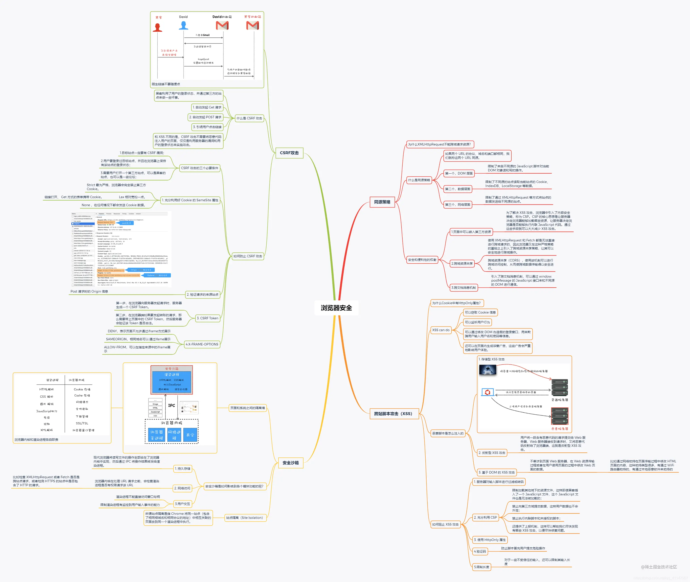

# 1208 今日总结


## 今日工作

- 迭代开发

潜在的技术难点：

- 弹框的拖拽和缩放；
- 弹框内的图片放大和缩放；
- 弹框内的图片拖拽移动；

可能的坑：

`z-index` 问题，可能被其他 组件遮盖；

相关资料：

- [gihub/react-rnd](https://github.com/bokuweb/react-rnd)
- [doc/react-rnd](https://bokuweb.github.io/react-rnd/stories/?path=/story/bare--bare)
- [react-rnd中文资料](https://www.jianshu.com/p/0c9884bf9059)

## 今日心情
> 所见所想，有感而发


## 今日算法

今日学习：


今日复习：


## 手撕代码
> 防抖节流等各种手写，http和网络，浏览器原理，性能优化，Webpack

实现 compose

compose 接受多个 函数作为参数，返回一个新函数；

执行新函数 传入参数，执行顺序是和传入顺序相反；

即：`compose(f1,f2,f3) ==> f3(param) => f2(param) => f1(param)`

每次函数的执行参数都是上一个函数的执行结果；

```js
function compose() {
    const fns = [...arguments]
    return function(args) {
        return fns.reduceRight((pre, curFn) => pre = curFn(pre), args)
    }
}

const  fn1 = (param1) => { return "fn1-" + param1 }
const  fn2 = (param2) => { return "fn2-" + param2 }
const  fn3 = (param3) => { return "fn3-" + param3 }

const Fn = compose(fn1, fn2, fn3)
console.log('res', Fn('hello'))
// res fn1-fn2-fn3-hello


// 写成一行代码为：

const compose = (...fns) => (...args) => fns.reduceRight((res, fn) => [fn.call(null, ...res)], args)[0];
```

与之执行顺序相反的，叫 pipe 函数：

即：`compose(f1,f2,f3) ==> f1(param) => f2(param) => f3(param)`

代码：

```js
function compose() {
  const fns = [...arguments]
  return function(args) {
    return fns.reduce((pre, curFn) => pre = curFn(pre), args)
  }
}

const  fn1 = (param1) => { return "fn1-" + param1 }
const  fn2 = (param2) => { return "fn2-" + param2 }
const  fn3 = (param3) => { return "fn3-" + param3 }

const Fn = compose(fn1, fn2, fn3)
console.log('res', Fn('hello'))
// res fn3-fn2-fn1-hello
```


## 面经相关
> 八股文相关



某个好看的程序媛的优秀总结：

- [你可能需要的一份浏览器安全的总结](https://juejin.cn/post/6900916440845516814)
- [你真的知道从输入URL到页面展示发生了什么吗](https://juejin.cn/post/6902032954034225159)
- [计算机网络-传输层协议专项复习--01](https://juejin.cn/post/6915362842212302862) 很系统很全面
- [前端必备知识，看到就是赚到系列--02](https://juejin.cn/post/6916318564966203400)

其他：

- [两份面试题，一个是14K，一个是25K](https://juejin.cn/post/7037325039749824519)

## 明日计划

- 算法：
  - 学习：
  - 复习：
- 手写：
- 面经复习：

## TODOS
> 短期内要做的事情