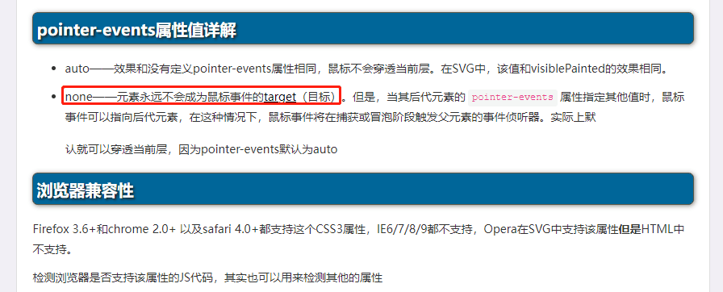
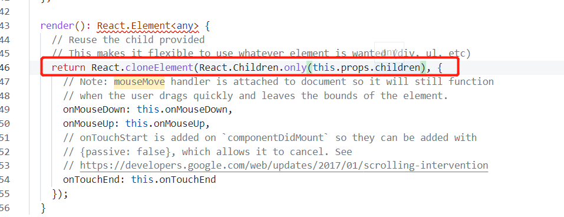

# 1215 今日总结


## 今日工作
> 问题，原因，解决方式，优化，巧妙实现


**问题**

- 问题1：拖拽边界控制模糊：参考微信和QQ图片查看器的实现原理；
- 问题2：导致拖拽不丝滑：

**原因**

- 问题1：待研究#TODO
- 问题2：拖拽区域小，快速拖动时候，拖拽元素跟不上鼠标，鼠标移出拖拽区域触发其他元素事件时导致拖拽状态错乱；


**解决**



- 使用 `pointer-events: none;` 暂时将影响的元素的事件干掉，后续使用 `pointer-events: auto` 还原；

```
pointer-events 属性值: auto | none | visiblepainted | visiblefill | visiblestroke | visible | painted | fill | stroke | all;

最常用：以下2种

- auto：可以使用指针事件。
- none：禁用指针事件，需要注意的是，当禁用指针的的元素有子/父元素时，在事件冒泡/捕获阶段，事件将在其子/父元素触发。
```


**参考资料**

- [非常有用的pointer-events属性](https://www.cnblogs.com/kunmomo/p/11752669.html)
- [原生JS图片拖动、缩放、边界等问题总结](https://juejin.cn/post/6938439210453958692)
- [代码/github-原生JS图片拖动、缩放、边界等问题总结](https://github.com/ysx-hidden/DOMStudy/blob/master/drag.html) 待研究#TODO

**新知识**



- [什么是 React.Children.only](https://www.jianshu.com/p/d1975493b5ea)
- [灵感来源-react-draggable源码](https://github.com/react-grid-layout/react-draggable) 无意间看到 

作用：

- 只会返回一个 child。如果不止一个 child，程序报错，终止执行，避免开发者错传组件；

其他：

- `React.Children.map` 循环
- `React.Children.forEach` 循环
- `React.Children.count`  检查一个组件有多少个 children
- `React.Children.toArray` 转换为数组
- `React.cloneElement` 克隆元素


## 项目/博客推荐
> 值得学习的项目/作者

- [LeBronChao 的博客](https://www.lebronchao.com/about/) 优秀的应届生，字节就职
- [前端LeBron-掘金](https://juejin.cn/user/3913917127467805/posts)


