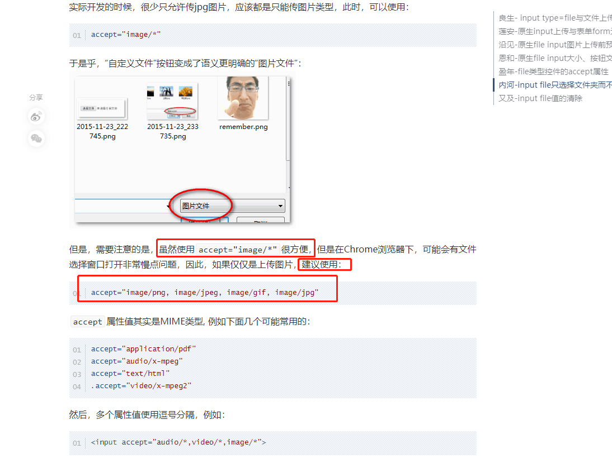
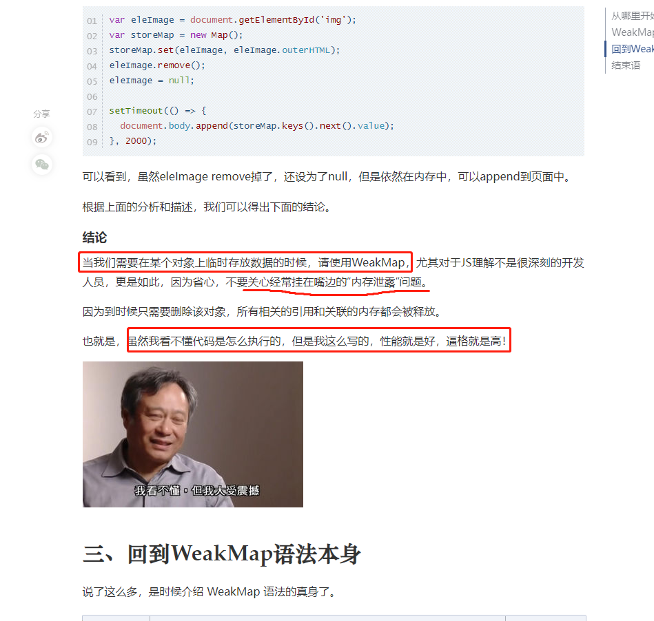
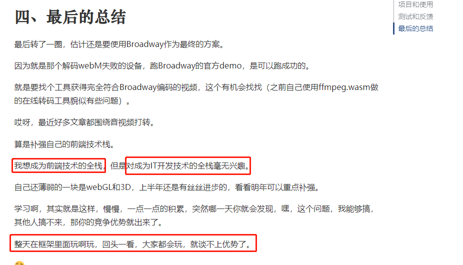

# 1217 今日总结


## 今日工作
> 问题，原因，解决方式，优化，巧妙实现，新知识

**新知识**

张鑫旭博客阅读总结：

- [一行 css 代码实现暗黑模式](https://www.zhangxinxu.com/wordpress/2020/11/css-mix-blend-mode-filter-dark-theme/)

```css
html {
  filter: invert(1) hue-rotate(.5turn);
}
```

- [web端 文件保存](https://github.com/eligrey/FileSaver.js/) 手动保存想要保存的文件
- [不使用file类型input也能触发文件上传](https://www.zhangxinxu.com/wordpress/2021/08/file-system-access-api/)
- [File System Access API](https://developer.mozilla.org/en-US/docs/Web/API/File_System_Access_API)



来源：[HTML input type=file文件选择表单元素二三事](https://www.zhangxinxu.com/wordpress/2015/11/html-input-type-file/)

-  [ JS WeakMap应该什么时候使用](https://www.zhangxinxu.com/wordpress/2021/08/js-weakmap-es6/) 看看作者举例
  - 如果是手动垃圾回收，这么做：一般的变量，我们用完后不需要了，设置成 null，可以理解为清楚了这个垃圾
  - 但是，如果存在闭包，清除就麻烦一些，需要去一个个找；
  - 为了避免手动自己一个个找未清除的无效变量，还不如交给系统自动垃圾回收；
  - 这个时候，就可以使用 weakmap 了。因为其 key 是一个弱引用，一旦没有被引用后，就会自动垃圾回收了。
  - 注意事项：使用 weakMap 的 key 是对象，且无法遍历，**可以用来模拟 私有属性实现**

使用场景：



摘录一句职业规划的启示：



- [利用废弃的html rel import实现页面 include 功能](https://www.zhangxinxu.com/wordpress/2021/07/html-rel-import-include/)
- [对比 proxy 和 reflect 的区别， reflect 的优势](https://www.zhangxinxu.com/wordpress/2021/07/js-proxy-reflect/)
  - 能够知道赋值是否成功；
  - 赋值失败不会报错不会阻止后续代码运行；
  - receiver-存在继承关系，receiver 表示调用主体

- [使用CSS revert全局关键字还原display显示元素](https://www.zhangxinxu.com/wordpress/2021/05/css-revert-display/)

```css
display: none;
// display: block;
display: revert; 可以考虑使用这个属性还原 display 的默认值
```

---

- [Promise.all、race和any方法都是什么意思？](https://www.zhangxinxu.com/wordpress/2021/05/promise-all-race-any/)

使用场景：

- loading 效果
- 可取消的 promise
- 长时间请求执行的批处理

拓展：[细细研究一下 promise.cancel 取消请求的实现](https://gist.github.com/Mahdhir/1f6609ea75f45c07801168c18cdb3812/revisions)

- [告别JS keyCode](https://www.zhangxinxu.com/wordpress/2021/01/js-keycode-deprecated/)

换成使用 event.code 和 event.key，区别：

- 具体哪个物理键 event.code
- 输入的字符内容 event.key

---

- [几个常见功能重合DOM API的细节差异](https://www.zhangxinxu.com/wordpress/2020/12/dom-api-diff/)


推荐使用 【包裹的属性】

- 【innerText】 对比 textContent ：前者性能差，前者保留换行符，前者无法获取隐藏文字
- 【getAttribute 】对比 dataset对象：后者大小写敏感
- 【getElementById 】对比 querySelector： 后者容错性差，找不到会报错
- 【append】对比 appendChild 前者可以 append 多个元素，后者只能 append 一个；前者可以 append 字符串
- 【scrollIntoView】对比 scrollIntoViewIfNeeded 前者可以支持 smooth 平滑滚动；

---

- [尝试使用JS IntersectionObserver让标题和导航联动](https://www.zhangxinxu.com/wordpress/2020/12/js-intersectionobserver-nav/)

**新知识**

- 配置项目 eslint 配置：https://www.npmjs.com/package/@umijs/fabric 项目配置推荐


## 好文推荐
> 有感好文

- [JavaScript 中的位运算和权限设计]( https://juejin.cn/post/6844903988945485837)


## 项目/博客推荐
> 值得学习的项目/作者

- [ui 组件库](https://xy-ui.codelabo.cn/docs/#/README) 张鑫旭在博客提到的大佬


## 面经相关
> 八股文相关

- [面试中必考的15个html知识点](https://juejin.cn/post/7021712617274081287) 
- [不平凡的2021，末流普本生秋招上岸大厂的历程](https://juejin.cn/post/7041016766968889358 )


## TODOS
> 短期内要做的事情

- 可以列一个阅读计划，专门阅读 阮一峰，张鑫旭，或者一些其他优秀博客或者技术文档，每次阅读后写读后感
- 整理一下 意向登记图片查看器开发遇到的问题，顺便分析一下 AntD 的 Modal 实现