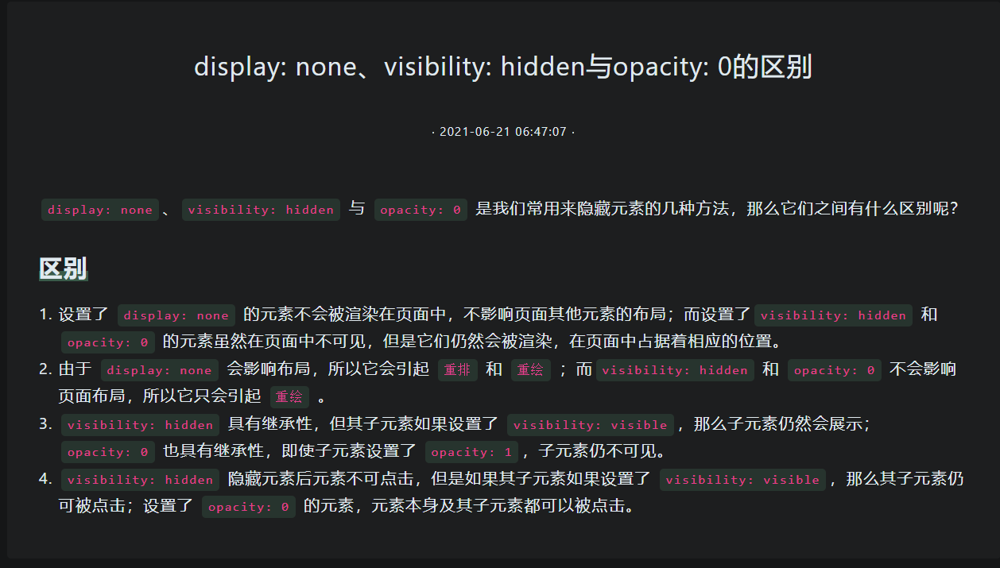

# 1218 今日总结


## 今日工作
> 问题，原因，解决方式，优化，巧妙实现，新知识


学习 封装 axios

```js
/*
 * 参考资料：https://juejin.cn/post/6968630178163458084 推荐阅读
 *
 * 
 * 封装目的：
 * 
 * - 初始化配置：
 *   - 不同环境请求地址区分
 *   - 默认请求方式 content-type
 *   - 超时参数设置：30s
 *   - 跨域访问需要携带 cookie
 *   - headers 里面添加 token
 * - 请求拦截，添加参数
 *   - 请求参数格式化
 * - 响应拦截，处理响应，拦截异常: 
 *   - 返回指定 code 做出不同动作
 *   - 返回结果格式化
 * - 权限校验：token 或 cookie 
 * - 取消请求/重复请求拦截
 * - 文件流处理
 * - loading 和 报错提示
 * 
 * 
 */


import axios from 'axios';
import { ElLoading, ElMessage } from 'element-plus';
import {getTokenAUTH} from '@/utils/auth';

const pendingMap = new Map();

const LoadingInstance = {
  _target: null,
  _count: 0
};

function myAxios(axiosConfig, customOptions, loadingOptions) {
  const service = axios.create({
    baseURL: 'http://localhost:8888', // 设置统一的请求前缀
    timeout: 10000, // 设置统一的超时时长
  });

  // 自定义配置
  let custom_options = Object.assign({
    repeat_request_cancel: true, // 是否开启取消重复请求, 默认为 true
    loading: false, // 是否开启loading层效果, 默认为false
    reduct_data_format: true, // 是否开启简洁的数据结构响应, 默认为true
    error_message_show: true, // 是否开启接口错误信息展示,默认为true
    code_message_show: false, // 是否开启code不为0时的信息提示, 默认为false
  }, customOptions);

  // 请求拦截
  service.interceptors.request.use(
    config => {
      removePending(config);
      custom_options.repeat_request_cancel && addPending(config); 
      // 创建loading实例
      if (custom_options.loading) {
        LoadingInstance._count++;
        if(LoadingInstance._count === 1) {
          LoadingInstance._target = ElLoading.service(loadingOptions);
        }
      }
      // 自动携带token
      if (getTokenAUTH() && typeof window !== "undefined") {
        config.headers.Authorization = getTokenAUTH();
      }

      return config;
    }, 
    error => {
      return Promise.reject(error);
    }
  );

  // 响应拦截
  service.interceptors.response.use(
    response => {
      removePending(response.config);
      custom_options.loading && closeLoading(custom_options); // 关闭loading

      if(custom_options.code_message_show && response.data && response.data.code !== 0) {
        ElMessage({
          type: 'error',
          message: response.data.message
        })
        return Promise.reject(response.data); // code不等于0, 页面具体逻辑就不执行了
      }

      return custom_options.reduct_data_format ? response.data : response;
    },
    error => {
      error.config && removePending(error.config);
      custom_options.loading && closeLoading(custom_options); // 关闭loading
      custom_options.error_message_show && httpErrorStatusHandle(error); // 处理错误状态码
      return Promise.reject(error); // 错误继续返回给到具体页面
    }
  );

  return service(axiosConfig)
}

export default myAxios;

/**
 * 处理异常
 * @param {*} error 
 */
function httpErrorStatusHandle(error) {
  // 处理被取消的请求
  if(axios.isCancel(error)) return console.error('请求的重复请求：' + error.message);
  let message = '';
  if (error && error.response) {
    switch(error.response.status) {
      case 302: message = '接口重定向了！';break;
      case 400: message = '参数不正确！';break;
      case 401: message = '您未登录，或者登录已经超时，请先登录！';break;
      case 403: message = '您没有权限操作！'; break;
      case 404: message = `请求地址出错: ${error.response.config.url}`; break; // 在正确域名下
      case 408: message = '请求超时！'; break;
      case 409: message = '系统已存在相同数据！'; break;
      case 500: message = '服务器内部错误！'; break;
      case 501: message = '服务未实现！'; break;
      case 502: message = '网关错误！'; break;
      case 503: message = '服务不可用！'; break;
      case 504: message = '服务暂时无法访问，请稍后再试！'; break;
      case 505: message = 'HTTP版本不受支持！'; break;
      default: message = '异常问题，请联系管理员！'; break
    }
  }
  if (error.message.includes('timeout')) message = '网络请求超时！';
  if (error.message.includes('Network')) message = window.navigator.onLine ? '服务端异常！' : '您断网了！';

  ElMessage({
    type: 'error',
    message
  })
}

/**
 * 关闭Loading层实例
 * @param {*} _options 
 */
function closeLoading(_options) {
  if(_options.loading && LoadingInstance._count > 0) LoadingInstance._count--;
  if(LoadingInstance._count === 0) {
    LoadingInstance._target.close();
    LoadingInstance._target = null;
  }
}

/**
 * 储存每个请求的唯一cancel回调, 以此为标识
 * @param {*} config 
 */
function addPending(config) {
  const pendingKey = getPendingKey(config);
  config.cancelToken = config.cancelToken || new axios.CancelToken((cancel) => {
    if (!pendingMap.has(pendingKey)) {
      pendingMap.set(pendingKey, cancel);
    }
  });
}

/**
 * 删除重复的请求
 * @param {*} config 
 */
function removePending(config) {
  const pendingKey = getPendingKey(config);
  if (pendingMap.has(pendingKey)) {
     const cancelToken = pendingMap.get(pendingKey);
     // 如你不明白此处为什么需要传递pendingKey可以看文章下方的补丁解释
     cancelToken(pendingKey);
     pendingMap.delete(pendingKey);
  }
}

/**
 * 生成唯一的每个请求的唯一key
 * @param {*} config 
 * @returns 
 */
function getPendingKey(config) {
  let {url, method, params, data} = config;
  if(typeof data === 'string') data = JSON.parse(data); // response里面返回的config.data是个字符串对象
  return [url, method, JSON.stringify(params), JSON.stringify(data)].join('&');
}


```


**参考资料：**

- [完整的Axios封装-单独API管理层、参数序列化、取消重复请求、Loading、状态码](https://juejin.cn/post/6968630178163458084) 推荐阅读
- https://juejin.cn/post/7025409531496644616
- https://juejin.cn/post/6992762038082600973
- https://juejin.cn/post/7009629858993012743


## 今日心情
> 所见所想，有感而发


## 今日算法

今日学习：


今日复习：


## 手撕代码
> 防抖节流等各种手写，http和网络，浏览器原理，性能优化，Webpack


- https://github.com/gzg1023/fackAchieve 手写 es6 函数，Promise 特性，lodash 库的函数实现,模拟 vue,React 等前端框架的实现和原理的理解。


## 好文推荐
> 有感好文


## 项目/博客推荐
> 值得学习的项目/作者


## 面经相关
> 八股文相关

- [前端两年经验，历时一个月的面经和总结](https://juejin.cn/post/7013953652578582558) 面试题很经典！！同2年，面经很受益；



[display: none、visibility: hidden 与 opacity: 0 是我们常用来隐藏元素的几种方法，那么它们之间有什么区别呢？](https://hbuecx.com/post/display-nonevisibility-hidden-yu-opacity-0-de-qu-bie/)

**区别**

- 设置了 display: none 的元素不会被渲染在页面中，不影响页面其他元素的布局；而设置了visibility: hidden 和 opacity: 0 的元素虽然在页面中不可见，但是它们仍然会被渲染，在页面中占据着相应的位置。
- 由于 display: none 会影响布局，所以它会引起 重排 和 重绘 ；而visibility: hidden 和 opacity: 0 不会影响页面布局，所以它只会引起 重绘 。
- visibility: hidden 具有继承性，但其子元素如果设置了 visibility: visible，那么子元素仍然会展示； opacity: 0 也具有继承性，即使子元素设置了 opacity: 1，子元素仍不可见。
- visibility: hidden 隐藏元素后元素不可点击，但是如果其子元素如果设置了 visibility: visible，那么其子元素仍可被点击；设置了 opacity: 0 的元素，元素本身及其子元素都可以被点击。

---

- [链式调用实现原理](https://hbuecx.com/post/lian-shi-diao-yong-shi-xian-yuan-li/) 核心就是返回 this

相似的有： jQuery，promise 等

```js
class MyMath {
    constructor(num) {
        this.num = num;
    }

    add(num) {
        this.num += num;
        return this;
    }

    sub(num) {
        this.num -= num;
        return this;
    }

    mul(num) {
        this.num *= num;
        return this;
    }

    div(num) {
        this.num /= num;
        return this;
    }

   // 加一个 run ，导出结果
    run() {
       return this.num;
    }
}

const result = new MyMath(2).add(5).mul(2).sub(7);
console.log(result);   // {num: 7}

const result = new MyMath(2).add(5).mul(2).sub(7).run();
console.log(result);  // 7

```


