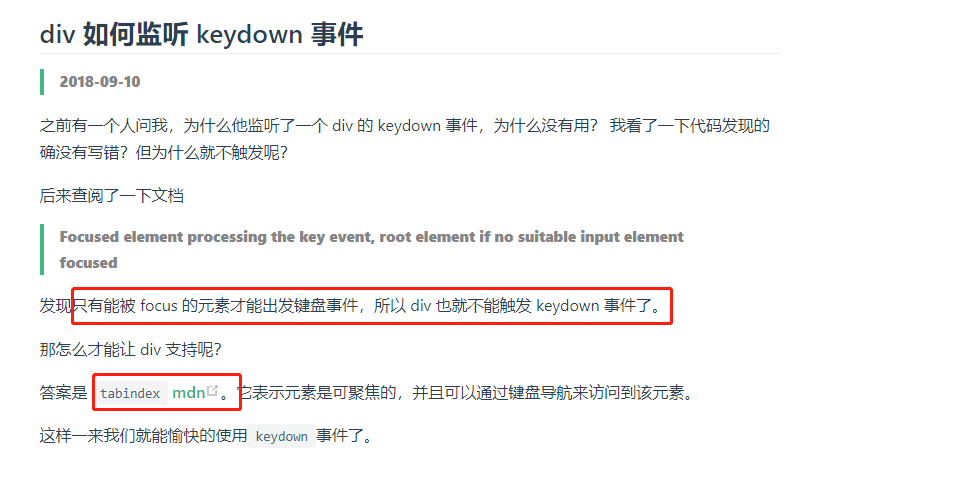
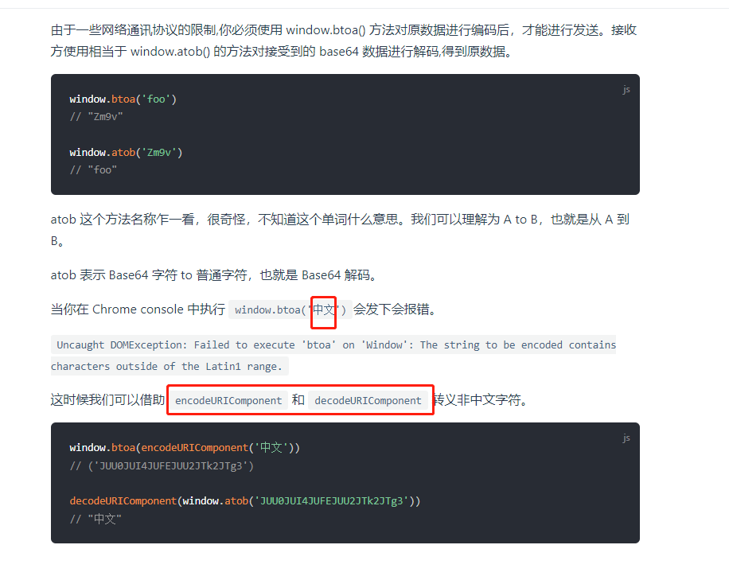

# 1221 今日总结


## 今日工作
> 问题，原因，解决方式，优化，巧妙实现，新知识


**新知识**

- div 如何 监听 keydown 事件？`设置 tabindex`



- https://panjiachen.github.io/awesome-bookmarks/blog/js.html#switch-%E4%BD%9C%E7%94%A8%E5%9F%9F
- https://developer.mozilla.org/zh-CN/docs/Web/HTML/Global_attributes/tabindex

---

- window.atob / window.btoa 无法加密中文？




使用 encodeURIComponent / decodeURIComponent 将中文转换成字符再加密；


## 今日心情
> 所见所想，有感而发


## 今日算法

今日学习：


今日复习：


## 手撕代码
> 防抖节流等各种手写，http和网络，浏览器原理，性能优化，Webpack

手写 call/apply/bind


- call


```js
Function.prototype.myCall = function(context, ...args) { // 解构context 与arguments
   if(typeof this !== 'function') { // this 必须是函数
     throw new TypeError(`It's must be a function`)
   }
   if(!context) context = window; // 没有context，或者传递的是 null undefined，则重置为window
   const fn = Symbol(); // 指定唯一属性，防止 delete 删除错误
   context[fn] = this; // 将 this 添加到 context的属性上
   const result = context[fn](...args); // 直接调用context 的 fn
   delete context[fn]; // 删除掉context新增的symbol属性
   return result; // 返回返回值
}


// 示例
const obj = {a: 1}
function foo(b) {
    console.log(this.a, b);
    return this.a + b
}
foo.myCall(obj, 2)
// 1 2 
// 3
```

拓展：[symbol 学习](https://coder.itclan.cn/fontend/js/understand-symbol) 了解 symbol 常用 API 和基本用途


- apply


```js
Function.prototype.myApply = function(context, args = []) { // 解构方式
   if(typeof this !== 'function') {
     throw new TypeError(`It's must be a function`)
   }
   if(!context) context = window;
   const fn = Symbol();
   context[fn] = this;
   const result = context[fn](...args);
   delete context[fn];
   return result;
}

// 示例
const arr = [1,2,6,4,5]
Math.min.myApply(null, arr)
Math.max.myApply(null, arr)

```


- bind

```js
Function.prototype.myBind = function (context, ...args) {
  const fn = this;
  if(typeof fn !== 'function'){
      throw new TypeError('It must be a function');
  }
  if(!context) context = window;
  return function (...otherArgs) {
    return fn.apply(context, [...args, ...otherArgs]);
  };
};


// 示例
const bar  = {a: 1}
function foo(b, c) {
    console.log(this.a, b, c)
}
const fn = foo.myBind(bar, 2)
fn(3,4)
// 1  2  3
```


## 好文推荐
> 有感好文

- [为什么前端监控要用GIF打点](https://mp.weixin.qq.com/s/v6R2w26qZkEilXY0mPUBCw)

## 项目/博客推荐
> 值得学习的项目/作者

- [awesome-bookmarks](https://panjiachen.github.io/awesome-bookmarks/) 推荐博客，里面分类汇总很多知识值得学习

## 面经相关
> 八股文相关


## 明日计划

- 算法：
  - 学习：
  - 复习：
- 手写：
- 面经复习：

## TODOS
> 短期内要做的事情