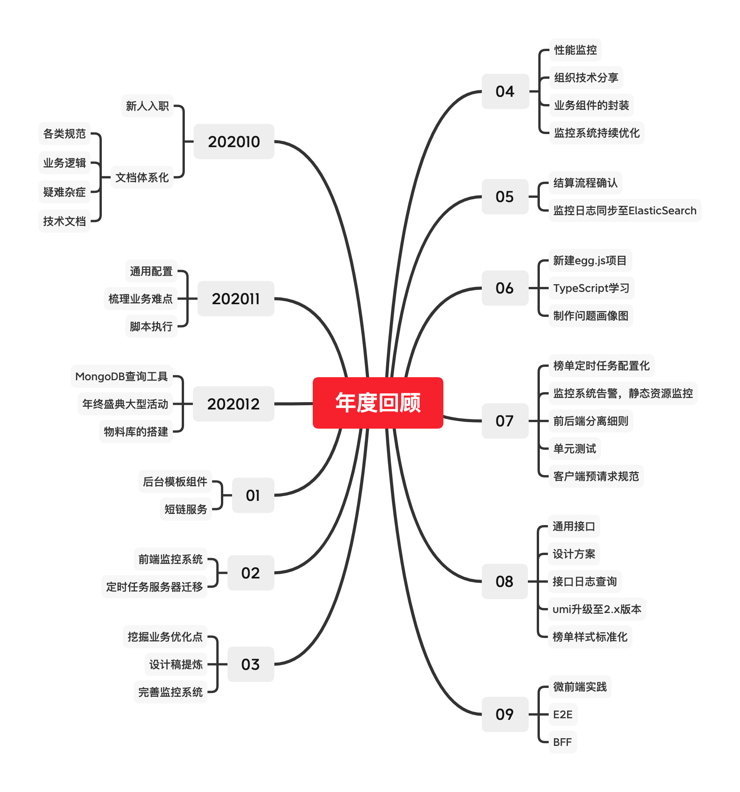

# 0104


## 0104 今日计划
> 每天工作前/前一天晚上 做好计划：重点工作、自我提升、其他，[提交地址](https://github.com/cuixiaorui/study-every-day/issues)

**重点工作**

- [x] 房源描述-上传
- [x] 页面所有接口、逻辑检查和确认；

## 今日总结
> 问题，原因，解决方式，优化，巧妙实现，新知识

看到同事写的代码用于学习

- 2 个 div 的高度不一致，导致内容上下错乱

解决方法：让 2 个div 的高度一致

我脑海里最直接的方式是：设置 `height` ，让 2 个 div 高度保持一致；

其实，还可以有多个方式：`padding, margin, line-height` 

区别在于，如果直接设置 高度，我可能会写 `style=height: 32px` 这样的代码

后者的话，利用 原子样式，加个类名即可：`clssName="pdv6"` 就可以了

- 按钮权限点不支持 `permission-code-flex` 类名进行控制

公司的按钮级权限点实际是样式控制的，加了 `permission` 类名的 行内元素，块元素，表格元素，都可以使用 `display: none !important;` 的方式隐藏；

但是，因为是很久以前的代码，因此没有 `flex` 相关的类名样式控制，但是 权限 code 已经配置好了，我也不想改变自己写好的 flex 布局样式，怎么办？

**包裹**

```html
<!-- old -->

<div className="flex"></div>

<!-- new -->

<div className="div permission-code-block">
  <div className="flex"></div>
</div>

```

根据实际业务需要，可以包裹一层或者多层空的块元素，直至满足需求；


---


## 手撕代码/算法
> 防抖节流等各种手写，http和网络，浏览器原理，性能优化，Webpack


## 好文推荐/面经相关/博客项目推荐
> 有感好文，面经，博客，项目等



- [跳槽一年后的回顾](https://www.cnblogs.com/strick/p/15223931.html) 可以学习一下 六年程序员过去的一年工作安排

```
// 学习感悟
//
// 对比我们公司
- 后台模板组件：我能想到 的比如 上传、下载、导入、导出、富文本等组件，标准布局的工具样式库
- 短链服务：对这方面不太了解
- 前端监控系统：我们公司已经有了监控和回溯系统
- 挖掘业务优化点：公司的业务优化点，直觉就是 一些查询条件的 UI 设计不好；重构的痛点；
- 性能监控：公司有主要面向后端的监控系统
- 单元测试：公司有同事已经写了 H5 端的单元测试；但是不好推广，主要因为排期时间不充足；
- 通用接口：类似每个项目都封装的 request 库，实际上大部分的请求都是相似的，基本上都是 get/post
- 设计方案：后端有标准的设计方案，但是前端还没有标准的设计方案——最直接的影响是，在评估工作量的时候不好评估，容易评不准超时；
- 接口日志查询：日志系统
- 微前端：后台系统其实是可以作为一个很好的微前端实践例子
- bff：当前在使用，主要用于 数据聚合，接口权限控制等；
```

- [self-employed-workbook](https://github.com/shengxinjing/self-employed-workbook) 大圣老师的 自由职业工作手册

拓展阅读：

- [带团队后的日常思考（七）](https://www.cnblogs.com/strick/p/15394367.html) 有一个系列，可以学习学习


## 其他/TODOS

博客阅读: 

- [puxio/notes](https://github.com/puxiao/notes)
- [aehyok/2022](https://github.com/aehyok/2022/tree/main/%E8%BF%87%E5%8E%BB%E7%9A%842021) 看看这位小伙伴的 2021 每日总结，学习和启发
- [带团队后的日常思考（七）](https://www.cnblogs.com/strick/p/15394367.html)