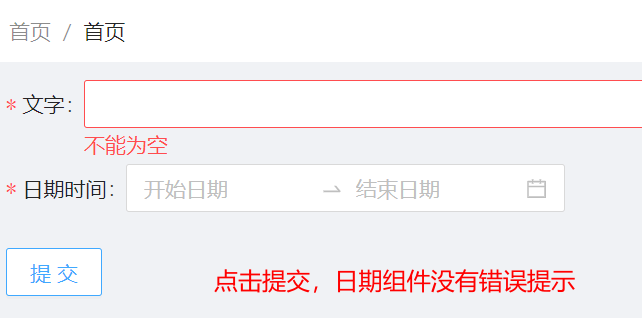
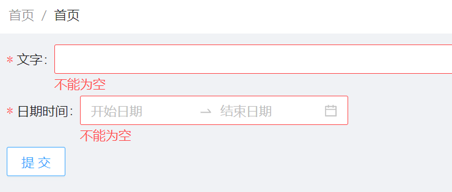

# 0112


## 0112 今日计划
> 每天工作前/前一天晚上 做好计划：重点工作、自我提升、其他，[提交地址](https://github.com/cuixiaorui/study-every-day/issues)

**重点工作**

- [x] 待提测，进行交叉测试；

## 今日总结
> 问题，原因，解决方式，优化，巧妙实现，新知识

- AntD form 表单对于 DatePicker.RangePicker 非空校验失败问题；

相关链接： [DatePicker-AntD](https://ant-design.gitee.io/components/date-picker-cn/#header)

现象：



代码：

```tsx
<Form form={form}>
  <Form.Item label="文字" name="text" rules={[{ required: true, message: '不能为空'}]}>
    <Input />
  </Form.Item>
  <Form.Item
    label="日期时间"
    name="date"
    initialValue={[undefined, undefined]}
    rules={[{ required: true, message: '不能为空'}]}
  >
    <DatePicker.RangePicker />
  </Form.Item>
  <Button onClick={() => form.validateFields()}>提交</Button>
</Form>
```

这个代码，点击按钮 校验表单的时候，日期组件不会有提示空值提示；

原因：

- 因为 DatePicker.RangePicker 的值比较特殊，是个数组， 不是 `null | undefined`；
- 猜测 `form.validateFields` 是找到这个表单控件 `name="date"`， 得到值是一个 `[undefined, undefined]`，结果不是 `null | undefined` 所以认为日期组件不是空值；

需要自定义校验：

```tsx
<Form form={form}>
  <Form.Item label="文字" name="text" rules={[{ required: true, message: '不能为空'}]}>
    <Input />
  </Form.Item>
  <Form.Item
    label="日期时间"
    name="date"
    required
    initialValue={[undefined, undefined]}
    rules={[{ validator: (rule, value) => {
      if (value?.[0] && value?.[1]) {
        return Promise.resolve();
      }
      return Promise.reject('不能为空');
    }}]}>
    <DatePicker.RangePicker />
  </Form.Item>
  <Button onClick={() => form.validateFields()}>提交</Button>
</Form>
```

此时效果为：




**拓展：** 猜想：其他形如这种数组形式的值的表单控件，是不是都会有这个问题呢？

---


## 手撕代码/算法
> 防抖节流等各种手写，http和网络，浏览器原理，性能优化，Webpack


## 好文推荐/面经相关/博客项目推荐
> 有感好文，面经，博客，项目等


## 其他/TODOS