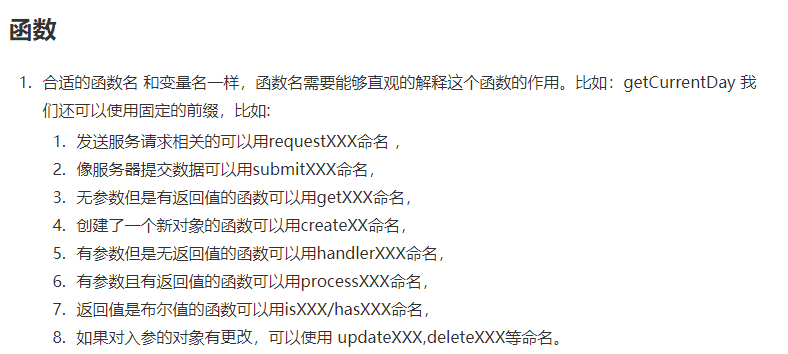

# 0118

## 0118 今日计划
> 每天工作前/前一天晚上 做好计划：重点工作、自我提升、其他，[提交地址](https://github.com/cuixiaorui/study-every-day/issues)

**重点工作**

- [x] 代码 review 事项

## 今日总结
> 问题，原因，解决方式，优化，巧妙实现，新知识

---

## 手撕代码/算法
> 防抖节流等各种手写，http和网络，浏览器原理，性能优化，Webpack

## 好文推荐/面经相关/博客项目推荐
> 有感好文，面经，博客，项目等

- [useRequest-蚂蚁中台标准请求 Hooks](https://juejin.cn/post/6844904064388431880) 为什么要做 useRequest？看看 作者的介绍；
- [JS/TS 代码整洁之道的实践指南](https://juejin.cn/post/7009313134728970254)

- [Vue 和 React 的优点分别是什么？](https://www.zhihu.com/question/301860721/answer/724759264) 看看大佬们怎么回答的
- [你会怎么做前端优化？](https://juejin.cn/post/7028028584463695879)
- [how-javascript-works](https://github.com/Troland/how-javascript-works) 作者翻译的， js 是如何工作的；

## 其他/TODOS

体系阅读：

- [how-javascript-works](https://github.com/Troland/how-javascript-works) 或者 [JS工作机制](https://juejin.cn/column/6988426665701408805) 作者翻译的， js 是如何工作的；
- [Linter上手完全指南](https://github.yanhaixiang.com/linter-guide/) 关于前端工程化中的 eslint, prettier, pre-commit, stage 等等，一系列说清楚；