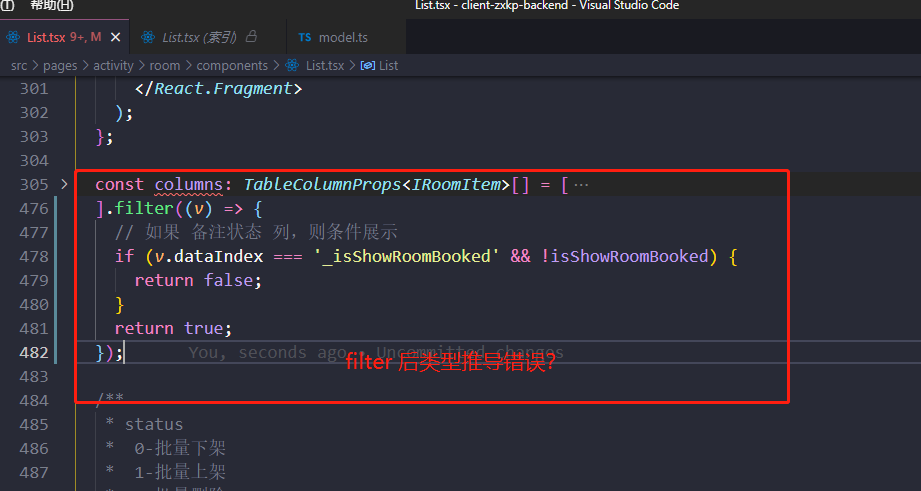

# 0124


## 今日总结
> 问题，原因，解决方式，优化，巧妙实现，新知识

- 遇到个 AntD 中 ts 推导问题：

```typescript
// 推导失败
const columns = [{a: 123, b: ''}, {a: 00123, b: ''}].filter(item => item.a === 123);

// 推导成功
const columnsBak = [{a: 123, b: ''}, {a: 00123, b: ''}];
const columns1 = columnsBak.filter(item => item.a === 123)
```



---


## 手撕代码/算法
> 防抖节流等各种手写，http和网络，浏览器原理，性能优化，Webpack


## 好文推荐/面经相关/博客项目推荐
> 有感好文，面经，博客，项目等


- [算法-硬币问题、动态规划问题：](https://juejin.cn/post/7029965326909440014) winter 老师讲解的硬币问题；
- [性能优化 专栏](https://juejin.cn/column/7001715712922222623)
- [新年创意](https://juejin.cn/post/7054385809679450119/) 很有喜气的创意页面，[来源](https://blog.ydydydq.top/webs/tiger/)
- [张鑫旭-纯CSS实现未读消息超过100自动显示为99+](https://www.zhangxinxu.com/wordpress/2022/01/css-show-diff-content-according-var/ ) 好文阅读
## 其他/TODOS