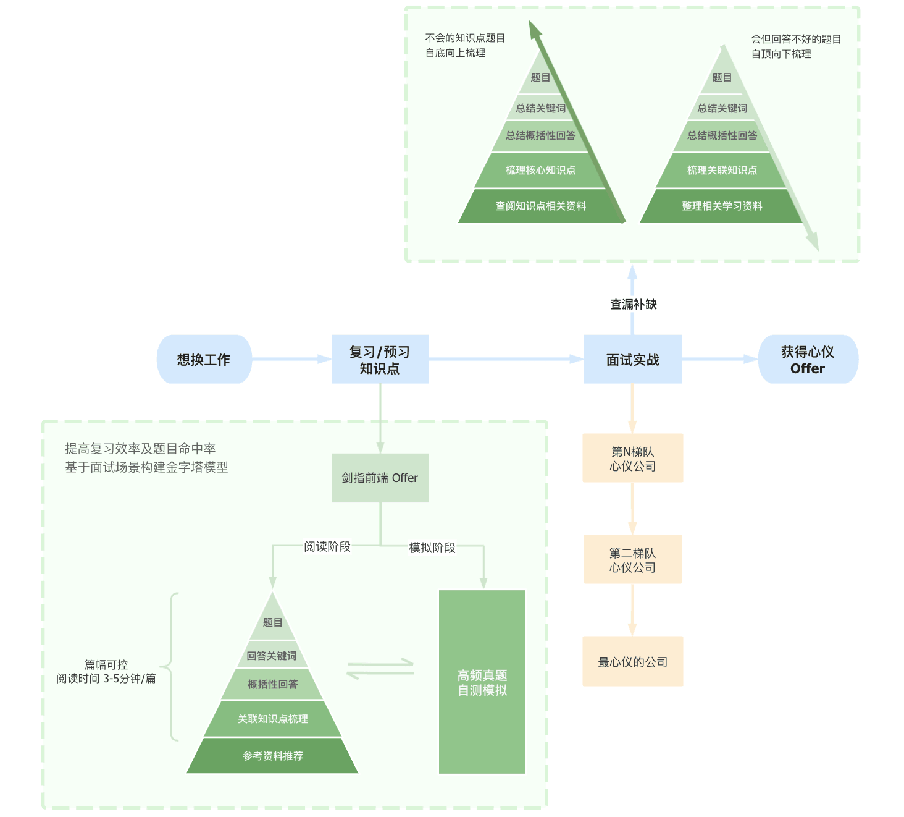

# 0214 今日总结

## 今日工作
> 问题，原因，解决方式，优化，巧妙实现，新知识

- 听取后端下一次重构的技术设计会议
  - 主要分析旧版 php 代码的逻辑，和一些冗余的业务逻辑；
  - 以及修复一些历史遗留问题；
- 自主学习

## 手撕代码
> 防抖节流等各种手写，http和网络，浏览器原理，性能优化，Webpack

## 好文推荐

**Top3**

- [2021 大前端技术回顾及未来展望](https://mp.weixin.qq.com/s/6cFbJOC-PQkN6arVqqMnXg) 桌面开发：Electron vs Tauri，Tauri 为后起之秀，必须要看看
- [2021年终总结：人类跌落梦境](https://juejin.cn/post/7044534653071556621) 生活和工作方式，值得学习；快乐而收获满满的一年；
- [Three.js 实现2022冬奥主题3D趣味页面](https://juejin.cn/post/7060292943608807460)

**有感好文**

- [什么是 WebAssembly(wasm)](https://www.zhihu.com/question/304577684/answer/1961085507)，详细看 [WebAssembly-MDN](https://developer.mozilla.org/zh-CN/docs/WebAssembly) 简而言之，它提供了一条途径，以使得以各种语言编写的代码都可以以接近原生的速度在Web中运行;
- [wasm 使用感想和一些经验](https://zhuanlan.zhihu.com/p/406082905)

## 面经相关
> 八股文相关

面试题资料整理方式：来源于 [剑指前端 Offer](https://febook.hzfe.org/awesome-interview/)

## TODOS
> 短期内要做的事情

- 今年起的大趋势:
  - JS 基础设施: Rust
  - 全栈: Go
  - Flutter: Dart
  - Future: WASM

- 写文启示:
  - 阅读外文文章，翻译，记录生僻单词；学习了最新技术文章，提升了英语词汇量；
  - 看 youtube 上技术视频（结合中英文字母），学习最新技术；
- 今年计划大致：

  - 全栈方向 Java / Go
  - 前端基建: Rust
  - 实战方向：Nest.js 实战