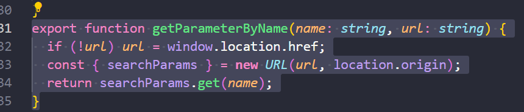
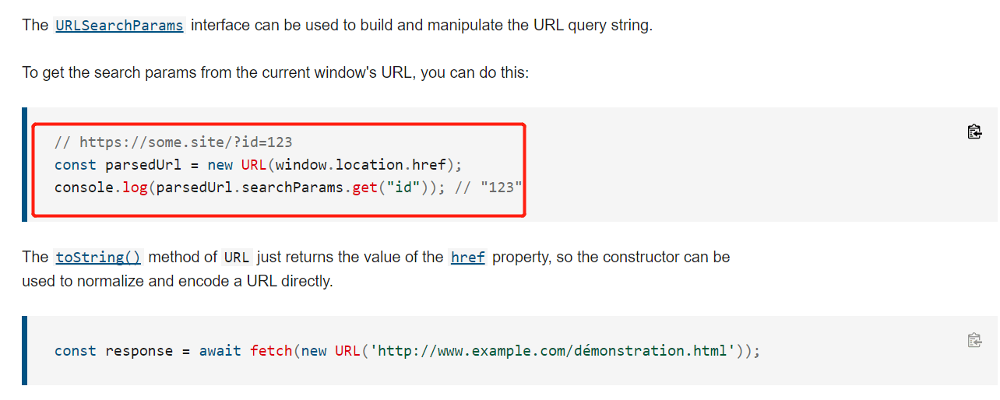
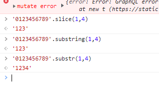
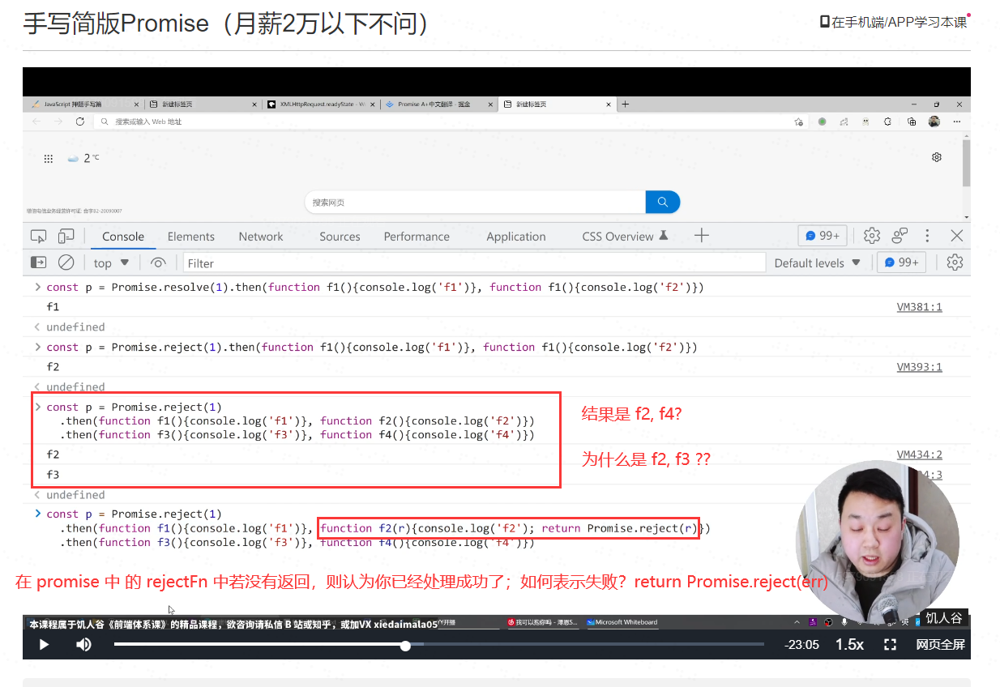

# 0223 今日总结


## 今日工作
> 问题，原因，解决方式，优化，巧妙实现，新知识

**新知识**

- 获取 queryParams 参数





使用方式：

```js
function getParameterByName(name, url) {
    if (!url) url = window.location.href

    const { searchParams } = new URL(url, location.origin)
    return searchParams.get(name)
}

getParameterByName('name', "http://www.baidu.com?id=1&name=zhangsan")
// zhangsan

// 可以优化一下：
// 如：获取 部分/所有 参数，入参为一个数组 `[name1, name2]`，返回一个对象

```


- substring, substr, slice 区别



```
slice, substring 的 API 基本一样都是 [start, stop)

substr 不同，是 [start, count]
```


## 今日心情
> 所见所想，有感而发


## 今日算法

今日学习：


今日复习：


## 手撕代码
> 防抖节流等各种手写，http和网络，浏览器原理，性能优化，Webpack


## 好文推荐

> 有感好文

**top3**

- [如何从 0 到 1 搭建性能检测系统](https://www.zoo.team/article/performance-testing-system)
- [DOM 精通了？请问 Node 和 Element 有何区别？](https://juejin.cn/post/7066778860024496165)

> 总结：
> - Element 一定是 Node，但 Node 不一定是 Element，也可能是文本、空格和换行符。
> - NodeList 里的换行符是因为原始代码中， HTML 标签与标签、内容与标签之间换行而产生的。
> - 单个的 HTML 标签算是一个单独的 Node。
> - 针对非 HTML标签（比如文本、空格等），从一个 HTML 标签的起始标签开始，到碰到的第一个 HTML 标签为止，如果中间由内容（文本、空格等），那这部分内容算是一个 Node。

- [浏览器的 5 种 Observer，你用过几种？](https://juejin.cn/post/7064557881492209678 )

> 总结：
> - MutationObserver
> - IntersectionObserver
> - PerformanceObserver
> - ResizeObserver
> - ReportingObserver

## 项目/博客推荐
> 值得学习的项目/作者

- [学习笔记-爱是与世界平行](https://gitee.com/AiShiYuShiJiePingXing/lovebetterworld/tree/master) 个人学习工作笔记总结(包含Java相关，数据库相关，运维相关，docker，Kubernetes，流媒体相关，项目管理相关，代码审查相关，安全渗透相关，开发工具，框架技术等等内容)，这里我只关注 [前端面试](https://gitee.com/AiShiYuShiJiePingXing/lovebetterworld/blob/master/1.1%20%E5%89%8D%E7%AB%AF%E7%9B%B8%E5%85%B3/1.9%20%E5%89%8D%E7%AB%AF%E9%9D%A2%E8%AF%95%E9%A2%98/5%20%E5%89%8D%E7%AB%AF%E9%9D%A2%E8%AF%95%E9%A2%98%E4%B9%8BJavaScript%E7%AF%87.md)


## 面经相关
> 八股文相关



- 看看 上图的 promise 题目，解答一些疑问点
- [this 指向](https://mp.weixin.qq.com/s/hYm0JgBI25grNG_2sCRlTA)
- [7种方法实现数组去重](https://juejin.cn/post/6844903602197102605)


## 专题-Chrome 插件开发

> 部分内容已经整理在 [Jsmond2016/openIn1s-chrome-plugin](https://github.com/Jsmond2016/openIn1s-chrome-plugin/tree/dev)

- [chrome 插件开发文档](https://github.com/facert/chrome-extension-guide)
- [chrom 插件开发教程](https://github.com/sxei/chrome-plugin-demo)
- [插件英雄榜](https://www.v2fy.com/p/readme-chromeappheroes)
- [chrome 插件案例](https://github.com/GoogleChrome/chrome-extensions-samples)
- [听音乐的插件开源代码](https://github.com/listen1/listen1_chrome_extension) 
- [darkreader 开源代码](https://github.com/darkreader/darkreader)
- [插件案例集合](https://github.com/orbitbot/chrome-extensions-examples)


## TODOS
> 短期内要做的事情