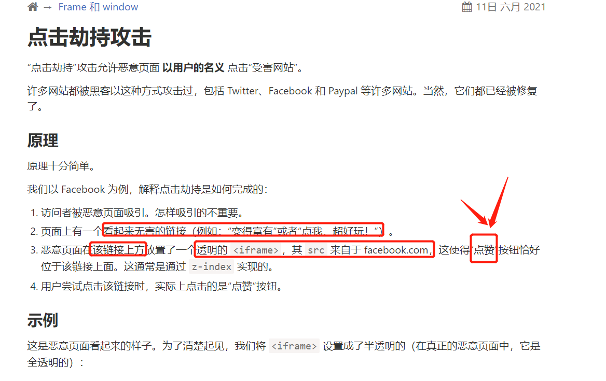
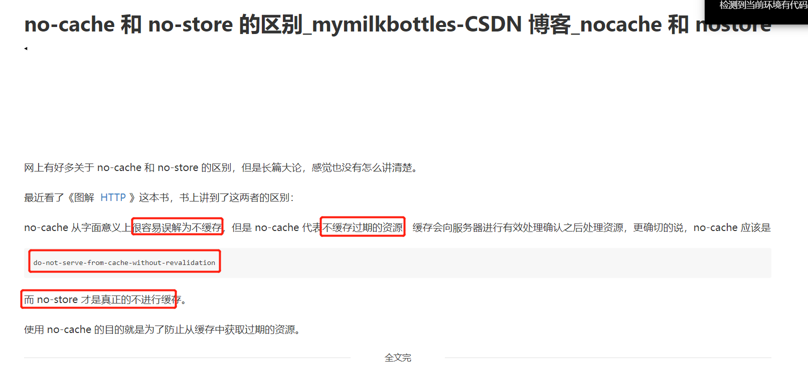
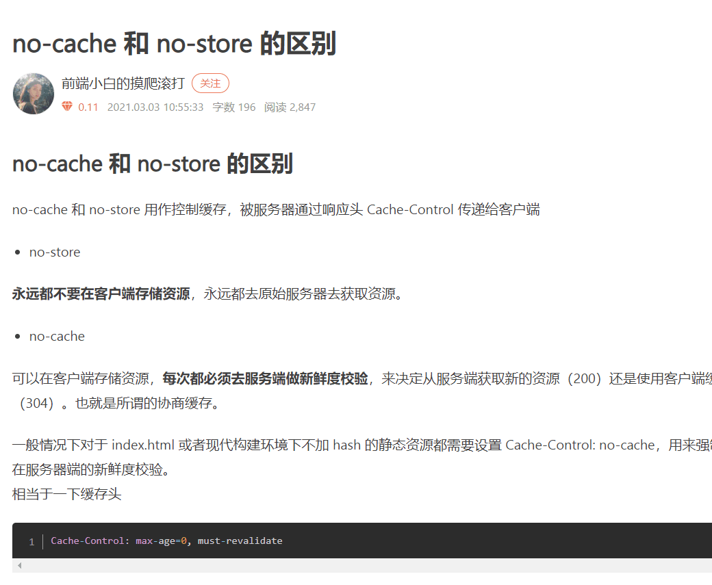
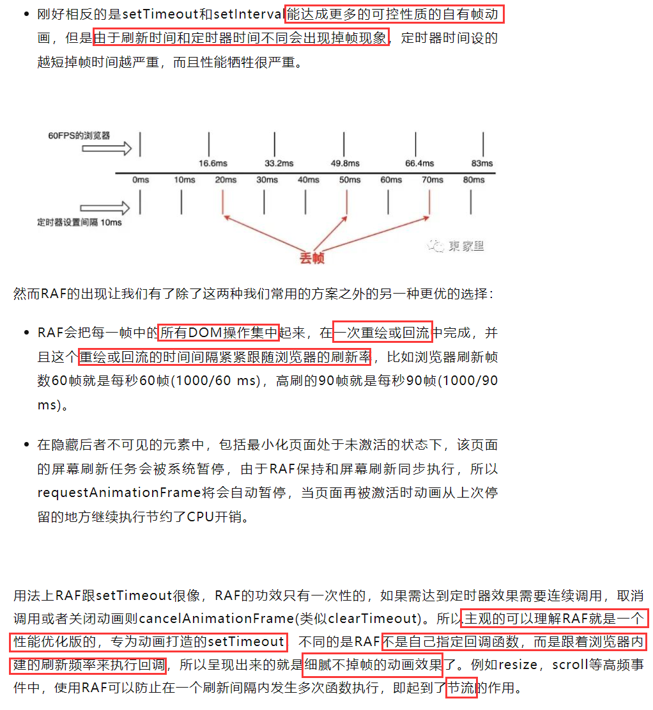

# 0314 今日总结

## 好文推荐
> 有感好文

**TOP3**

- [10分钟教你手写8个常用的自定义hooks](https://mp.weixin.qq.com/s/S9B8dnP-Lyhu9xRHOI_OEw)
- [考拉的 Nest 实战学习系列](https://github.com/koala-coding/nest-blog)

**专题：如何使用 Docker 搭建前端开发环境**

核心：

- 利用 Dockerfile 配置开发环境
  - Nodejs、Golang、Yarn、Git、Nvm 开发等配置
  - 配置 zsh、fzf、vim 等工具
  - 代码永久保存方式
  - windows、Linux、Mac 系统自由切换
- 使用 vs code 中的 dev container 功能
- 利用 wsl2 高阶功能

相关文章：

- [wsl1 升级 wsl 2](https://www.cnblogs.com/stulzq/p/13926936.html)
- [oh-my-docker](https://blog.csdn.net/weixin_54433389/article/details/120728509)
- [FrankFang/oh-my-docker](https://github/FrankFang/oh-my-docker)
- [从0到1搭建舒适的docker前端开发环境](https://yomxxx.github.io/2020/11/20/20201120-docker-web/)
- [利用docker搭建前端开发环境](https://juejin.cn/post/6932808129189150734)
- [如何用 docker 打造前端开发环境](https://juejin.cn/post/7017129520649994253)
- [docker搭建前端环境](https://www.cnblogs.com/wangmeijian/p/14279781.html)

## 面经相关
> 八股文相关

**service worker**

- [网易云课堂 Service Worker 运用与实践](https://mp.weixin.qq.com/s/3Ep5pJULvP7WHJvVJNDV-g) 整理面试相关的内容，看到这个，复习深入下 
- [一文搞懂前端service-worker 技术](https://www.lmcc.top/articles/73.html) 

**前端安全**

- xss
- csrf
- click-attack

相关文章：

- [xsrf 和 xss 攻击分别是什么？](https://www.cnblogs.com/itsuibi/p/10752868.html)
- [xss 是什么，如何攻击、如何防御](https://zhuanlan.zhihu.com/p/101300360)
- [前端安全系列（一）：如何防止XSS攻击？](https://tech.meituan.com/2018/09/27/fe-security.html)
- [前端安全系列（二）：如何防止CSRF攻击？](https://tech.meituan.com/2018/10/11/fe-security-csrf.html)
- [防御XSS的七条原则 | Web应用安全实验室](https://sking7.github.io/articles/430468050.html) 

- [点击劫持攻击](https://zh.javascript.info/clickjacking)

**HTTP网络相关**

- [no-store, no-cache 区别](https://blog.csdn.net/mymilkbottles/article/details/69060193) 
- [no-cache 和 no-store 的区别](https://www.jianshu.com/p/261b9dbb0720)
- 推荐阅读 [图解Http缓存控制之max-age=0、no-cache、no-store区别](https://zhuanlan.zhihu.com/p/55623075) 饥人谷若愚老师的文章写得很清晰

**RequestAnimationFrame / cancelAnimationFrame**

常用的实现动画的方式：

- css 方式：transform, transition, animation；优缺点是 流畅度好，但是不能所有属性参与到动画中；
- js 方式: setTimeout, setInterval；可控和自定义灵活，缺点是定时器时间设的越短掉帧时间越严重，而且性能牺牲很严重。
- RAF 方式：RAF 会把每一帧中的所有 DOM 操作集中起来，在一次重绘或回流中完成，并且这个重绘或回流的时间间隔紧紧跟随浏览器的刷新率，比如浏览器刷新帧数60帧就是每秒60帧(1000/60 ms)，高刷的90帧就是每秒90帧(1000/90 ms)。

相关资料：

- [什么是 requestAnimationFrame ，使用场景？](https://developer.mozilla.org/zh-CN/docs/Web/API/Window/requestAnimationFrame) 
- [requestAnimationFrame理解与实践](https://juejin.cn/post/6844903600557129736)
- 推荐阅读：[requestAnimationFrame浅评及场景应用分析](https://www.modb.pro/db/230648)，文中的 [例子](https://jsbin.com/lugulucoca/2/edit?html,js,output)
- 推荐阅读：[requestAnimationFrame 必知必会](https://github.com/iotale/garden/issues/11)

**WebRTC**

- [50行代码完成视频通话 (WebRTC + WebSocket)](https://github.com/shushushv/webrtc-p2p)

## TODOS
> 短期内要做的事情

- [webpack5 最新教程](https://www.bilibili.com/video/BV1YU4y1g745?p=2) 