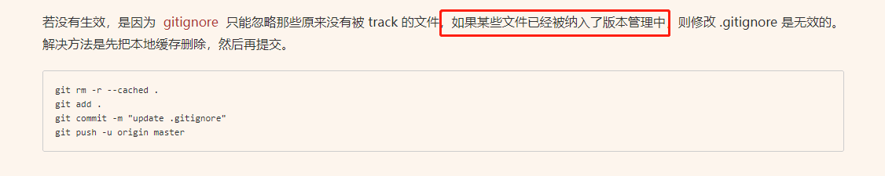
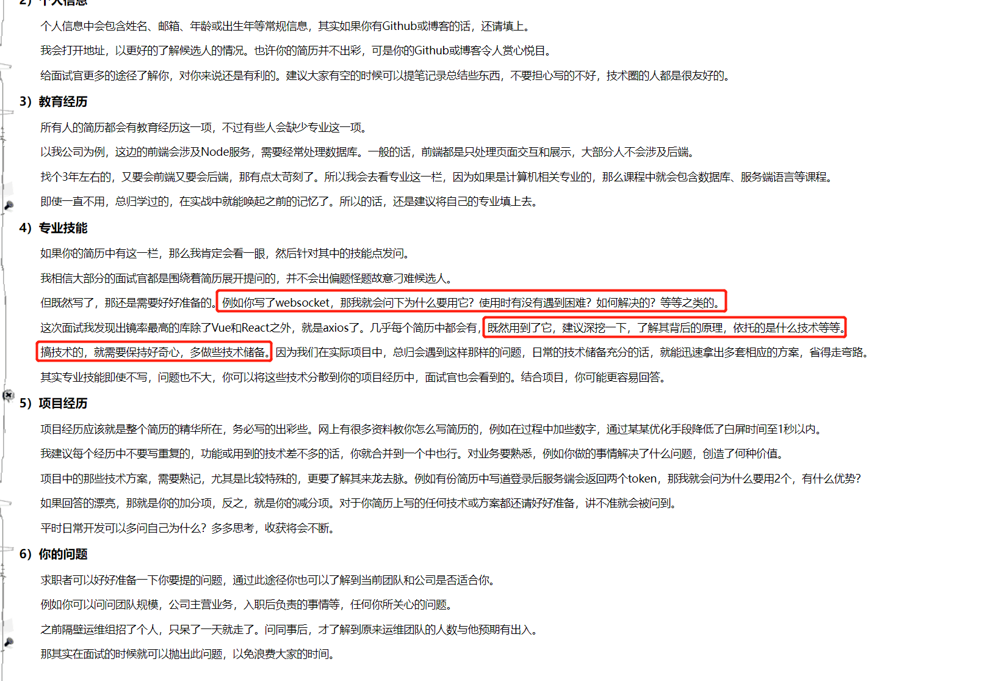
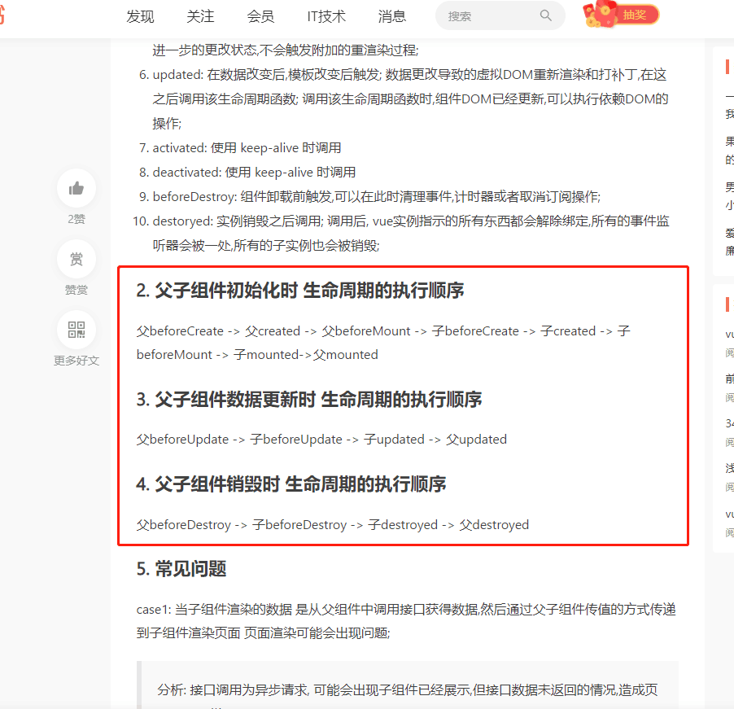

# 0331 今日总结

## 今日工作
> 问题，原因，解决方式，优化，巧妙实现，新知识

- **Taro 开发：** 近期的工作是使用 Taro 开发一个小程序，看了第一版 ui 图，其中可能涉及到这几难点：
  - 表格：折叠，冻结，滚动
  - 虚拟列表

- **相关资料:**
  - 冻结滚动：https://codepen.io/paulobrien/pen/gWoVzN
  - 折叠：https://codepen.io/so5/pen/QWwpLrz

- **问题：** git ignore 没有效果：

## 今日心情
> 所见所想，有感而发

- **学习状态下降：** 近期都没有每天记录学习状态了，果然是这样：一件事情若放下了超过一周时间，就很难再坚持下去；坚持是难受的，但是还是需要坚持！！
- **复习态度懒散：** 当前，自己的简历还没有完善好，复习题、leetcode 题目都还没沉下心来记忆；需要专心！！
- **工具不趁手了：** Typora 收费了，之前一直都是用的旧版本，最近旧版本也强制不允许使用了，只能使用 VS Code 结合 md 插件使用了，好感度差一些，也就更没有写文的欲望了；

## 文章更新

- 整合更新了一篇关于 terminal 的文章：[windows terminal 美化和配置教程](https://github.com/Jsmond2016/blog/issues/19) 配置好的目的主要也是为了学 vim，现在也买了[掘金小册](https://juejin.cn/book/7051157342770954277)在学习中

## 好文推荐
> 有感好文

**TOP3**

- [前端你文章综合](https://github.com/lefex/FE) 文章很多很全，详见里面的 readme
- [Ts高手篇：22个示例深入讲解Ts最晦涩难懂的高级类型工具](https://juejin.cn/post/6994102811218673700) 在封装请求库的时候用到很多泛型，感觉有些陌生，需要深入学习下；
- [Docker 简介和安装](https://docker.easydoc.net/doc/81170005/cCewZWoN/lTKfePfP) 知道 Docker 的原理后，对于操作，常用的就那些命令，抽个时间自己需要整理一份，同时配置一个自己的开发环境；
**有感好文**

- [electron 中 js 运行时错误如何捕获？](https://github.com/bytedance/debugtron)
- [nodejs 入门系列-redis](https://juejin.cn/post/6844903926874013704) 
- [nodejs 入门系列-数据库操作](https://juejin.cn/post/6844903926886580232)

## 项目/博客推荐
> 值得学习 作者/项目/工具等

**博客**

- [连载-对求职面试者的一点小建议](https://www.cnblogs.com/strick/p/15855336.html) 追了一阵子的作者的文章，对面试者的建议；
- [Node.js躬行记（15）——活动规则引擎](https://www.cnblogs.com/strick/p/15604092.html) 业务开发中，很多表单的校验规则都是写的 if...else，其实业务固定的情况下，主要的配置规则就那些，可以 写一个规则引擎，实现动态控制规则；
- [Node.js躬行记（9）——微前端实践 ](https://www.cnblogs.com/strick/p/15104824.html)
- [前端从😳到🚪 gRPC 框架](https://juejin.cn/post/6999182700837863454) 之前记录过，公司一个牛逼同事的文章，关于介绍 grpc 相关的知识；这个作者擅长 low-code 方面的内容，还专门出了[课程](https://www.lanqiao.cn/courses/2848)

**项目**

- [vue3 + ts + pina 搭建项目](https://www.zhihu.com/question/453332049/answer/2257645010)
- [后端系统服务：一套完整的 Node.js 后端服务解决方案](https://github.com/pwstrick/shin-server)
- [Java 全栈知识体系](https://pdai.tech/) 里面一些语言无关的理论知识对于前端也有很大的帮助
- [一个替换 storybook 的文档工具](https://www.ladle.dev/docs/)
- [抽奖相关的库](https://github.com/buuing/lucky-canvas) 
- [vue3 源码全面解读](https://github.com/hkc452/slamdunk-the-vue3 )

## 面经相关
> 八股文相关

- [vue 父子组件生命周期函数执行顺序](https://www.jianshu.com/p/144f603285dc) 总结来说，父亲前3个阶段，儿子4个阶段，父亲最后一个阶段；可以结合重绘回流和性能优化的角度去思考：vue 作者肯定不可能任何变化立刻让父组件改变，而是先汇总，然后统一挂载到父组件上，节省性能；避免多次重绘回流；
- [nodejs 的 buffer 和 stream & 管道](https://segmentfault.com/a/1190000011968267) 对于前端而言，这块知识点可能比较薄弱；但是对于后端而言，buffer、stream 是基础，因此掌握 nodejs 的基础上，nodejs 需要深入学习；
- [认识node核心模块--深入EventEmitter](https://segmentfault.com/a/1190000011851623)
- [系列-vue/react 面试题系列](https://juejin.cn/user/2330620382159325/posts)
- [面试题目大全](https://github.com/pwstrick/daily)

## TODOS
> 短期内要做的事情

- 数据库方面知识需要补强一下：
  - mongodb；
  - mysql；
  - 写个 express/koa + 数据库操作的例子 结合 docker 实战一下吧

- 作为 工程技术人员，需要有自己的 工具箱：
  - 前端项目：后台 + h5
  - 后端项目：server/redis/sql 
  - 期望效果：仅需 docker 配置一下即可运行测试
- puppeteer 海报截图：
  - [拦截页面请求](https://www.cnblogs.com/ajanuw/p/10324269.htmlpuppeteer)
  - [用 Puppeteer + Nodejs 构建高效海报 & 截图生成服务](https://segmentfault.com/a/1190000038719579) 
  - [puppeteer截图](https://juejin.cn/post/6844903758351040520) 

- vim 深入：[vscode + vim 全键盘操作高效搭配方案](https://zhuanlan.zhihu.com/p/430603620) 
