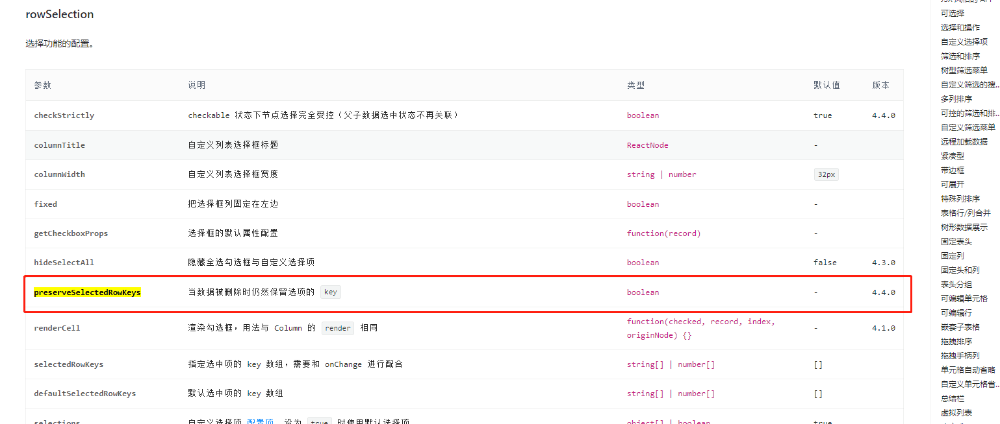

# 0405 今日总结


## 今日工作
> 问题，原因，解决方式，优化，巧妙实现，新知识

- **跨页勾选新方案**

近期发现的好东西, AntD 中的 Table 组件 [rowSelection.preserveSelectedRowKeys](https://ant.design/components/table-cn/#header)属性，看到同事有使用到用于实现跨页勾选：




有了这个字段`实现跨页勾选`应该方便多了，配置为 `true` 即可


- **使用 less 循环变量提效**

项目中有在使用 `less 循环变量` 作为提效工具，配置常用的：
  1. padding / margin
  1. font-size / font-weight
  1. width / height
  1. color / background-color
  1. flex 属性
  1. display: hidden, none;
  1. clearfix
  1. 等等

```less
// font-size: 12-28, 间隔 2
  // fz-n
// padding: 2-100
  // pd-n: 
  // pdh-n, pdv-n
  // pdt-n, pdb-n, pdl-n, pdr-n
// margin: 2-100
  // mg-n:
  // mgh-n, mgv-n
  // mgt-n, mgb-n, mgl-n, mgr-n
// width: 2-400
  // w-n
// 

// @list: red, white, black, green, yellow, blue, purple, grey, brown, pink, gold, orange;
 
// .generate-columns(length(@list));
// .generate-columns(@n, @i: 1) when (@i =< @n) {
//   @v:extract(@list, @i);
//   .g-@{v} {
//      color: @v;
//   }
//   .generate-columns(@n, (@i + 1));
// }


.spacing(@style,  @prefix, @count, @end) when (@count <= @end) {
  @d:(1px * @count);

  .@{prefix}@{count}{
    @{style}: @d;
  }

  .spacing(@style,  @prefix, @count + 2, @end);
}


.spacing(margin-left, mgl, 2, 80);
.spacing(margin-right, mgl,2, 80);
.spacing(margin-top, mgl, 2, 80);
.spacing(margin-bottom, mgl, 2, 80);

.spacing(padding-left, pdl, 2, 80);
.spacing(padding-right, pdl,2, 80);
.spacing(padding-top, pdl, 2, 80);
.spacing(padding-bottom, pdl, 2, 80);

.spacing(width, w, 2, 400);
.spacing(height, h, 2, 400);
.spacing(font-size, fz, 12, 28);

```


相关文章：

- [less 官网](https://less.bootcss.com/)
- [less学习指南第四期【进阶】| 条件语句和循环语句](https://juejin.cn/post/6993709586314166309)
- [less 循环 让公用样式变的更简单](https://www.cnblogs.com/byksj/p/14485641.html)
- [Less(三) —— 项目中使用到的函数与循环总结](https://juejin.cn/post/6902698973287907336)


