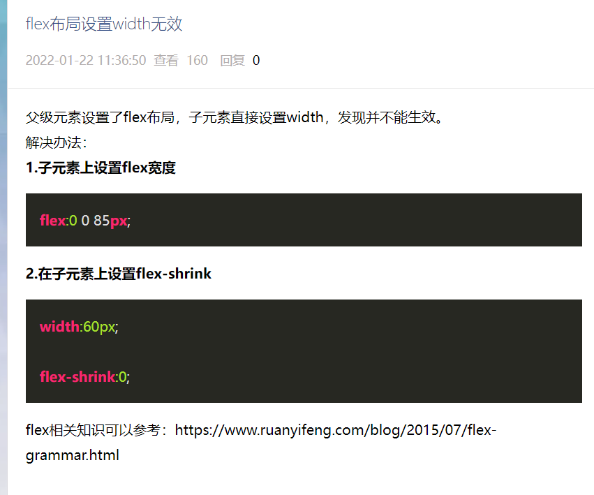

# 0412 今日总结


## 今日工作
> 问题，原因，解决方式，优化，巧妙实现，新知识


- [骨架屏技术](https://github.com/ElemeFE/page-skeleton-webpack-plugin)
- [Taro skeleton 骨架屏调研](https://www.cnblogs.com/yujiaming890321/p/15868838.html) 
- [编写插件，将 Taro 编译打包耗时缩短至三分之一](https://mp.weixin.qq.com/s/Z79QhAlP8tBQn3mXQ11byQ)

- lex 子元素 设置 width 无效问题，解决办法

```
flex 占据剩余空间：flex-grow: 1;
```




- 字体图标的原理：

```
什么是 @font-face https://developer.mozilla.org/zh-CN/docs/Web/CSS/@font-face
聊一聊字体图标的实现原理 https://zhuanlan.zhihu.com/p/22724856
```


## 今日算法

> 今日学习、今日复习

- [大家一般刷满500道LeetCode题目要花多久？ - 吴师兄学算法的回答 - 知乎](https://www.zhihu.com/question/271330075/answer/2435900265)


## 手撕代码
> 防抖节流等各种手写，http和网络，浏览器原理，性能优化，Webpack


## 好文推荐
> 有感好文

## 项目/博客推荐
> 值得学习 作者/项目/工具等


**项目 H5 pxtorem**

- [基于 umi + dva + antd-mobile 快速构建H5 APP 应用](https://github.com/hqwlkj/umi-antd-mobile/)
- [pxtorem H5端布局方案](https://www.npmjs.com/package/postcss-pxtorem)
- [umi 配置 px2rem](https://blog.csdn.net/qq_38196162/article/details/114962021)
- [npm/postcss-pxtorem](https://www.npmjs.com/package/postcss-pxtorem)


**骨架屏**

- [骨架屏动画](https://freefrontend.com/css-skeleton-loadings/)

## 面经相关
> 八股文相关

- [理解Node中的Buffer与stream](https://juejin.cn/post/6955331683499376676)
- [组件再多也不怕！Redux+Redux Toolkit概念介绍与实战使用](https://juejin.cn/post/7047525475820208164) 
- [了解下最近流行的技术栈：React + TypeScript + Redux Toolkit](https://www.jiangweishan.com/article/jishuzhan2839408230948.html)
- [使用Redux Toolkit简化Redux](https://segmentfault.com/a/1190000039806379)
- [redux-toolkit 官网](https://redux-toolkit.js.org/api/getDefaultMiddleware)

最大的作用：简化了很多 redux 中的模板代码，所有逻辑集中在一起；同时，不仅仅为 react，也为 angular 框架使用


- [看过这篇文章以后不要再提this](https://zhuanlan.zhihu.com/p/31823164)


## TODOS
> 短期内要做的事情