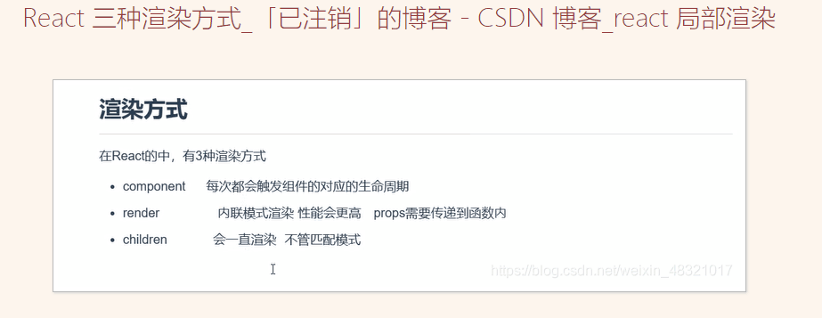
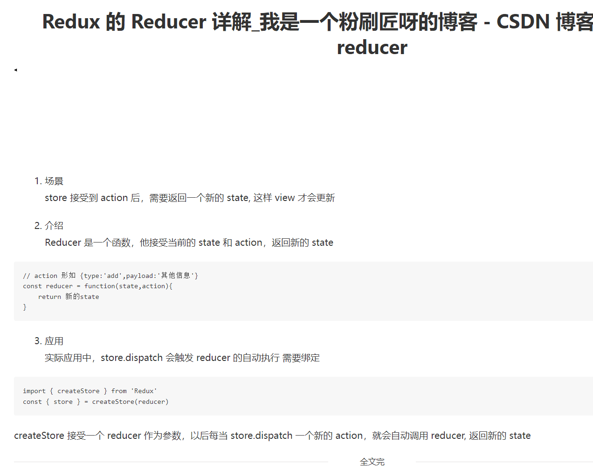
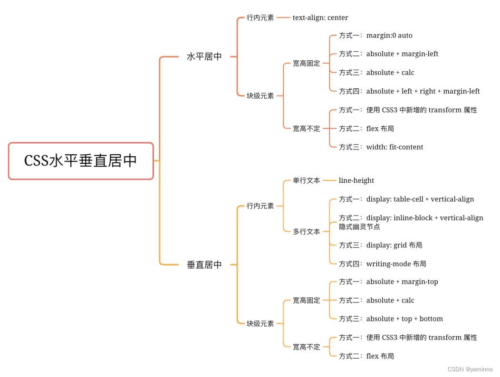
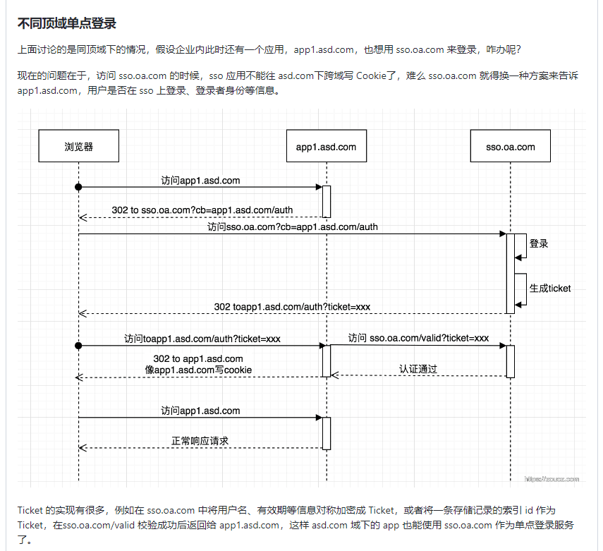

# 0603 近期总结


## 近期工作
> 问题，原因，解决方式，优化，巧妙实现，新知识

- echarts 饼图问题：[饼图设置环的宽度](https://blog.csdn.net/IT_moshang/article/details/121472763)
- 听了公司的一个分享，关于**个性化拓展点**的东西，介绍文档在这里：[扩展点文档平台](https://yued.myscrm.cn/ext-doc/#/docs/frontend/qa)

记得之前在汉得的时候，个性化配置，是使用一个高阶函数做的，封装了 `Form` 实现个性化拓展。但是限制也很多，因为是基于 `Form` 的，因此也限制于 `Form`，而这次公司的拓展点思路是使用动态执行 js 代码的方式实现拓展点，自由度很高；

## 近期心情
> 所见所想，有感而发

- 开盘助手终于接近尾声， 预计节后几天可以上线
- 其中，我负责的模块，开发难易度其实不高，相对应的，成长也不是很高，需要多学习同事的优秀实现。

## 好文推荐
> 有感好文

- 造轮子教程系列：[看源码造轮子](https://juejin.cn/column/6965512526624718856)
- [2022 前端包管理方案-pnpm 和 corepack](https://juejin.cn/post/7060448346107805732) 更细致了解一下包管理 `npm/yarn/pnpm/corepack`

## 项目/博客推荐
> 值得学习 作者/项目/工具等


**大佬推荐**

- [github/huangcheng](https://github.com/hchlq?tab=repositories) 发现一个大佬，给 `vuejs、ahooks，react` 都贡献过 pr
- [掘金/Allan91](https://juejin.cn/user/4212984287334711/posts) Allan91优秀掘金作者，看他最近在研究 `css em` 样式相关
- 一位大佬的博客：[github/pfan123](https://github.com/pfan123/Articles/issues) Node 系列的文章值得深入学习

**项目**

- [大圣老师的算法课](https://github.com/ruanyf/weekly/issues/2428)
- [gitee/go-view](https://gitee.com/MTrun/go-view) Go 语言开发的一个Vue3搭建的低代码数据可视化开发平台 


**创意工具**

- [叮咚抢菜-派送时段监听及推送工具](https://juejin.cn/post/7084886593089044493) 作者身在上海，为解决买菜难的问题，抓包进行买菜提醒
- [核心代码](https://github.com/mingjiezhou/dingdong-tools/blob/main/src/main.js) 主要学习几个东西：
  - 手机端抓包工具和使用方式
  - 如何利用工具分析请求，转化成 nodejs request
  - 使用 nodejs 写 轮训脚本
  - 使用 bark 配置消息通知
  - 服务器部署测试

## 面经相关
> 八股文相关

- [react 常见题目](https://blog.csdn.net/pengxian00007/article/details/117752084)
- [防抖节流是什么，如何实现？](https://www.cnblogs.com/yzy521/p/14184115.html) 防抖是等一等再执行，如搜索框；节流技能冷却，如一段时间内多次点击提交按钮只会执行一次；
- [防抖和节流](https://zhuanlan.zhihu.com/p/386616278)
- react 渲染方式



- [React渲染流程](https://zhuanlan.zhihu.com/p/370183031)
- [react-redux性能优化之reselect](https://www.jianshu.com/p/1fcef4c892ba)
- [JavaScript 运行机制详解：再谈Event Loop](https://www.ruanyifeng.com/blog/2014/10/event-loop.html)
- [301、302、304、400、405、415 状态码的含义](https://blog.csdn.net/wangjun5159/article/details/51239960)
  - 301-永久重定向
  - 302-临时重定向
  - 304-资源未改变（命中缓存）
  - 400-入参错误（url/body）
  - 401 Unauthorized 没有权限
  - 403 访问被拒绝
  - 404 找不到/路径不对
  - 405-method 错误，请求方法不对 
  - 415-后台不支持 content-type
- [HTTP返回码中200，302，304，404，500得意思](https://www.cnblogs.com/chaojiyingxiong/p/9766681.html)
- [Event loop 和 JS 引擎、渲染引擎的关系(精致版)](https://zhuanlan.zhihu.com/p/371786505)
- [微任务、宏任务与Event-Loop](https://juejin.cn/post/6844903657264136200)
- [备战大厂，彻底搞懂垃圾回收机制底层原理](https://cloud.tencent.com/developer/article/1977989)
- [eventLoop 代码题](https://jsbin.com/livolofuqa/2/edit?js,console)
- [NodeJS 进阶：源码分析与实战应用](https://github.com/wengzhisong-hz/learning-nodejs)
- [flex:1 到底代表什么?](https://zhuanlan.zhihu.com/p/136223806)
- [使用 Next.js、LeanCloud 和 Tailwind CSS 创建全栈应用](https://www.zehao.me/full-stack-app-nextjs-leancloud-tailwind/)


上面这个作者的博客也很漂亮 [gatsbyjs/gatsby-starter-blog](https://github.com/gatsbyjs/gatsby-starter-blog)

- [前端赏金猎人 付费答题-面经](https://github.com/BetaSu/fe-hunter/issues)
- 复习一下 Redux 的 reducer


- [浏览器进程与线程](https://juejin.cn/post/6906462594001960974)
- [浏览器的进程与线程详解](https://segmentfault.com/a/1190000017048240)
- [React 面试题 & 回答](https://github.com/semlinker/reactjs-interview-questions)
- [CSS 居中问题](https://blog.csdn.net/yaminne/article/details/123799107)


- [SSO、OAuth2.0、JWT 登录与授权理解](https://github.com/pfan123/Articles/issues/106) 主要了解这个点：**不同域名的 sso 是如何实现用户权限的**



- [nest 依赖注入的原理，以及 express 原理手写](https://juejin.cn/post/7077372768378945573)
- [leetcode最常见的150道前端面试题](https://juejin.cn/post/6992775762491211783)
- [面试题总结：要努力](https://www.kancloud.cn/cookies_fzx/cookie/1619846) 内容细致全面，值得深入学习
- [2年前端暑期面试打怪升级（收获多份offer）](https://juejin.cn/post/6876327630212169735)


## 近期学习

> 学习单元测试相关的内容

- [前端自动化测试TDD与单元测试学习记录](https://www.jianshu.com/p/2d91ffe73922)
- [jest快速入门及实践教程](https://zhuanlan.zhihu.com/p/282835230)
- [前端如何做测试驱动开发-vue版](https://www.jianshu.com/p/3fdf9bdfb276)
- [TDD 的原理和使用场景](https://zhuanlan.zhihu.com/p/510121303)
- [写了一本开源小书《Jest 实践指南》 - 写代码的海怪的文章 - 知乎](https://zhuanlan.zhihu.com/p/517221089)

**社区文章：**

- [单元测试 - Jest 入门知识全覆盖!](https://juejin.cn/post/7080342960390275086)
- [Jest单元测试中的常用方法和技巧](https://juejin.cn/post/6997581158670630948)
- [jest 初识 与react + ts + jest 项目实践](https://juejin.cn/post/7036388766801461255) 
- [一篇文章搞定前端单元测试框架jest](https://juejin.cn/post/7092188990471667749)

**TDD项目实战参考：**

- [mini-vue3 源码学习，测试学习](https://github.com/qinran0423/mick-vue)
- [其他 mini-vue3](https://github.com/yaolong1/mini-vue3)
- [催效瑞 老师的作品：实现最简 vue3 模型](https://github.com/cuixiaorui/mini-vue)
- [hook 的单元测试怎么写的？看看 ahooks](https://github.com/alibaba/hooks)
- 研究 antdsign 的 单测 代码

```bash
git clone https://gitee.com/ant-design/ant-design.git --depth=1
```


**Node 高阶：**

- [高级Node知识点！Node性能监控指标获取方法](https://juejin.cn/post/7087924763275821063) 非常值得推荐阅读！！！！！！！！
- [Node服务性能监控](https://github.com/pfan123/Articles/issues/102)

**React 相关：**

- [React 18 新特性之 useId 详细解读](https://cloud.tencent.com/developer/article/1977997)
- [为了生成唯一id，React18专门引入了新Hook：useId](https://zhuanlan.zhihu.com/p/437913203)
- [redux 中文网](https://cn.redux.js.org/)

**工具：**

- [博客搜索引擎](https://blogsurf.io/)
- [新型文档搭建平台](https://www.docusaurus.cn/docs) 建站文档
- [选择js 库的筛选工具](https://openbase.com/)

**windows 好用的软件工具：**

> 来源 饥人谷 方应杭老师的 B 站直播
- powertoys 多个工具集成，综合好用；可以看 微软官网的介绍，搜 powertoys 即可
- utools 工具集成
- everythins
- wsl 
- windows terminal
- ditto
- quicklook
- 7zip 免费无广告，速度快
- Edge 兼容 chrome 所有插件、同步数据不需要外网、支持全平台 windows，macos，安卓和ios


## TODOS
> 短期内要做的事情

- [副业项目指南](https://github.com/timqian/sideproject.guide)