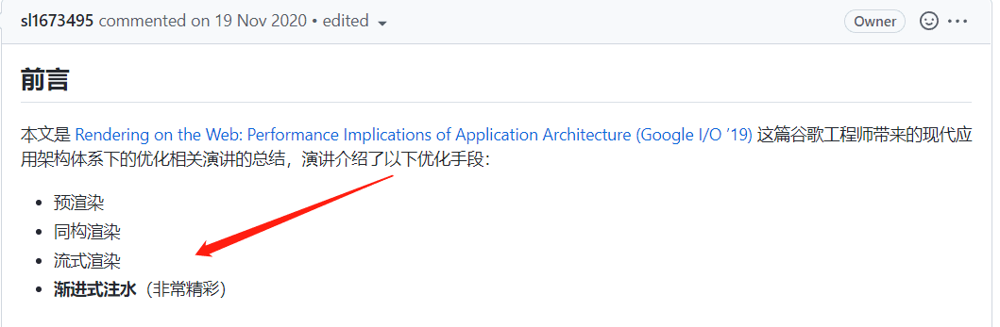
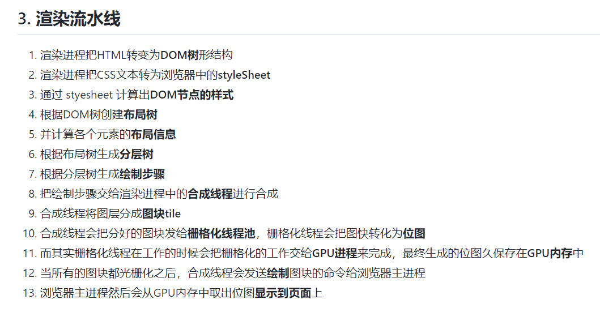

# 0618 近期总结


## 近期工作
> 问题，原因，解决方式，优化，巧妙实现，新知识

- 之前的小助手重构已经基本完成。主要是工期拖延的时间确实比较久，先收个尾，后续未完成内容则通过迭代逐步完成；
- 近期面试拿到了 EPAM 的 offer，薪资待遇符合预期，先接了；
- 接下来主要是写交接文档，以及总结自己这两年在云客的收获，可以开个专题连载总结自己在云客的收获吧；


## 好文推荐
> 有感好文

- [使用File slice + 封装XMLHttpRequest + fs-extra + xhr 的 abort、onprogress 等api进行大文件的分片上传、断点续传](https://github.com/miracle90/big-file-upload)
- [前端常见问题和技术解决方案](https://juejin.cn/post/7088144745788080142) 
- [前端常见问题和技术解决方案](https://juejin.cn/post/7088144745788080142#heading-37)
- [使用位运算实现枚举](https://juejin.cn/post/7056963864943919134)
- [3款比 `fs` 更强的文件操弄者](https://juejin.cn/post/7101832050587467784)
- [Redux 最佳实践 Redux Toolkit](https://juejin.cn/post/7101688098781659172)
- [SVG动画从入门到实战，提升你的网站表现力](https://juejin.cn/post/7083262239569870856)
- [如何美化你的图表，关于SVG渐变你需要了解的一切!](https://juejin.cn/post/7098637240825282591)
- [【nodejs】手写简易版 koa 及常用中间件](https://juejin.cn/post/7077717684518912031)

**关于 TDD：**

- [【架构师（第三十一篇）】前端测试之 TDD 的开发方式](https://juejin.cn/post/7106663494455394340)


## 项目/博客推荐
> 值得学习 作者/项目/工具等

**博客**
- [优秀博客：ssh 的博客](https://github.com/sl1673495/blogs)，详情见 [ssh-blog](https://ssh-blog.vercel.app/)
- [追踪国外最流行的周刊](https://weekly.fedarling.com/)

**项目**

LowCode 系列：

- [视频-lowcode](https://www.bilibili.com/video/BV1q44y137es/?spm_id_from=333.788&vd_source=97ca2403e645c8e1787c35d7a06f7d45) 作者通过专题视频写了个简单的 low-code 项目案例，下面链接是项目地址。当前市面上对于 lowcode 的视频教程还是比较少的，这个视频看看可以找到 lowcode 开发的思路和痛点；
- [Low Code Editor](https://github.com/minjs1cn/low-code-editor)


其他：

- [一键自动化部署](https://github.com/xiaojiahao/deploy-tool) 思路主要是利用 Node API 操作命令行，做成配置化，自动化方式
- [谁是炮仗王🧨？春哥手把手带你炸掘金！](https://juejin.cn/post/7054558786983313421) 爆炸效果特效
- [强话一波Taro3，盘点H5项目复刻小程序全历程，并附上项目源码](https://juejin.cn/post/7102539165765468167)
- [前端工程化：保姆级教学 Jenkins 部署前端项目](https://juejin.cn/post/7102360505313918983)
- [Vue、Nuxt服务端渲染、NodeJS全栈项目~面向小白的完美系统~](https://juejin.cn/post/6845166890436788232)
- [优秀的 Nodejs 项目](https://github.com/wsydxiangwang/Mood#%E9%A1%B9%E7%9B%AE%E9%83%A8%E7%BD%B2)


## 专题-前端监控，错误捕获

- [我的前端性能优化体系总结](https://juejin.cn/post/7108376192767983623)
- [前端监控体系搭建（错误、异常、白屏、性能监控、卡顿、pv等，接入日志、告警系统）](https://github.com/miracle90/monitor)
- [rrweb 带你还原问题现场](https://musicfe.com/rrweb/) 错误回放技术
- [应用性能前端监控，字节跳动这些年经验都在这了](https://github.com/sl1673495/blogs/issues/92)
- [Web 现代应用程序架构下的性能优化，渐进式的极致艺术](https://github.com/sl1673495/blogs/issues/65)


## 面经相关
> 八股文相关

- [webpack深入浅出，手写flow、hmr、tapable、loader-runner等源码](https://github.com/miracle90/head-first-webpack)
- [用js模拟浏览器渲染流程](https://github.com/miracle90/browser-render) 作者详细讲述和实战，讲清楚了 浏览器渲染的各种内部细节，推荐阅读！！！！！

- [如何高性能的渲染十万条数据(虚拟列表)](https://github.com/chenqf/frontEndBlog/issues/16)
- [react 源码解析](https://github.com/7kms/react-illustration-series)
- [你需要的2019春招前端面经。字节跳动、网易、美团 offer](https://juejin.cn/post/6844903797437759496)
- [面试题网站](https://fe.ecool.fun/topic-answer/0e7888d9-d8a4-41f8-a052-f94350ee0c15?orderBy=updateTime&order=desc)
- [面试经常提到的重排和重绘，你真的了解吗？](https://mp.weixin.qq.com/s/BTwD5wgFkGzuRYvr83IoQg)

## 工具、拓展

- [我的第一个 NFT](https://myfirstnft.info/) 区块链知识
- [区块链之新](https://www.bilibili.com/bangumi/play/ep290332?from=search&seid=4820733908948631673)
- [VS Code超级实用的快捷键，收藏好写代码事半功倍](https://juejin.cn/post/7107566849457389582) 新的东西：Ctrl + d，选中同名单词；Alt + Shift + 鼠标 快速编辑某个区块
- [和老外自由交流](https://www.free4talk.com/)


## 其他：如何幽默的介绍自己
> 近期快到2周年了，HR 让我给同事写个简单的评价；奈何才疏学浅，肚子没墨水，在网上查一查有意思的自我/他人介绍

- [幽默风趣的自我介绍：如何写出幽默的自我介绍短句？ - 李昊的回答 - 知乎](https://www.zhihu.com/question/396761530/answer/1625577870)
- [如何写出幽默的自我介绍短句？ - 刘广大呀大的回答 - 知乎](https://www.zhihu.com/question/396761530/answer/1242345807)

```
- 著名奶茶鉴定家。
- 彩虹屁国家‌级选手
- 尼那拉力量的化身
- 特级退堂鼓表演艺术家
- 赖床锦标赛冠军得军
- 重度耳机依赖患者
- 屁大点事分享者
- 食困症患者
- 发呆业务爱好者
- 德智体美劳全面不发展代表
- 九年义务教育编外人员
- 国家一级抬杠运动员
- 迪士尼在逃公主
- 快乐星球持证驾驶员
- 集美貌与才华于一身的女子
- xxx 内部的快乐源泉

```

还有一个介绍很棒，文采斐然：

```
北方有佳人，绝世而独立
陌上人如玉，xx世无双
说春雨温柔的人
一定没见过xx的眼神
说夏夜深邃的人
一定没见过xx的双眸
说秋月明朗的人
一定没见过xx的关容
说冬幅坚强的人
一定没见过xx本人
她,
是初见玉软且花柔，
海常可醉日的佳人相处久了又见性格豪爽
即所谓 "心中有丘壑,眉目作山河"
工作上，对产品需求有审大小而图，
酌缓急而布连上下而通，衡内外而施的拍板魄力
又有偏毫厘不敢安的一丝不苟。
祝好看,能干又靠谱的xx2周年快乐!!!

```


## TODOS
> 短期内要做的事情

- 确定一下冲刺的公司，简历适当优化;
- 当前公司资料整理和存档;
- 开个专题，总结自己再云客的成长和收获；
- 列个计划，在新公司的目标，以及自己下半年的目标；