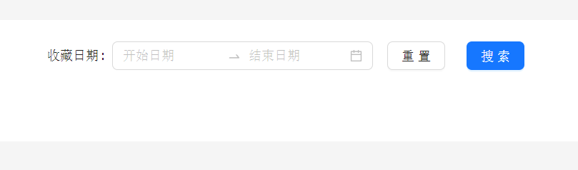

# 0904 今日总结


## 今日工作
> 问题，原因，解决方式，优化，巧妙实现，新知识

今天开了一天的会，接口评审，测试用例评审；

然而，下班的时候还是遇到 2 个小问题；

### 问题1 css 样式 `flex: 1` 剩余宽度被内容撑开问题

大致如下的 HTML 结构：

```html

<div class="aa flex">
  <div class="bb fixed-width">固定宽度</div>
  <div class="cc flex-1">
    默认占据剩余宽度
    <div class="dd very-long-width-child">内容很宽的子元素，占满剩余宽度后换行了</div>
  </div>
</div>

```

原本以为 `dd` 元素的宽度会默认占父级的 100%，即剩余宽度；实际上会换行到第二行，超出宽度部分它还会往外扩；

理论上是 弹性盒，总宽度应该占剩余宽度 100% 的；然而实际却不是；

解决办法：

```css
.cc {
  display: flex;
  /* 方式1 */
  width: 0;
  /* 方式2 */
  /* overflow: hidden; */
}
```


参考解决方案：

- [解决flex布局内容超出盒子宽度问题 - 知乎](https://zhuanlan.zhihu.com/p/130459378)
- [flex布局设置flex=1的时候宽度被内部元素撑开的问题_大大大颖er的博客-CSDN博客](https://blog.csdn.net/ddyy2695734664/article/details/112761966)
- [父元素设置flex：1；子元素内容过程导致被撑开_flex:1 撑开_MINO吖的博客-CSDN博客](https://blog.csdn.net/qq_36157085/article/details/116519413)


### 问题2 Immutable 包裹了 moment 日期后，丢失原型方法；



一个很简单的日期查询条件，形如上图；

因为这个筛选条件是暂存在 store 层，store 对数据做了 `Immutable` 处理，重新取到的值没有 `clone` 方法，导致页面报错；

下班前尚未找到解决方案，只是分析后发现极大概率是由于 `Immutable` 导致的；明天继续分析下是什么原因；


相关参考资料：

- [<DatePicker /> date.clone is not a function #35437](https://github.com/ant-design/ant-design/discussions/35437)
- [.clone is not a function](https://stackoverflow.com/questions/33638160/clone-is-not-a-function)


## 好文推荐
> 有感好文

**TOP3**


- [两万字Web Workers终极指南🔥🔥🔥 - 掘金](https://juejin.cn/post/7262615042189934653#comment)
- [⛳前端进阶：SEO 全方位解决方案 - 掘金](https://juejin.cn/post/7241813423460581435#heading-7)
- [NestJS小技巧24-每个Nest.js开发人员都应该知道的10件事 - 掘金](https://juejin.cn/post/7264532077575716879#heading-2)
- [使用 Docker 实现前端应用的标准化构建、部署和运行 - 掘金](https://juejin.cn/post/7269668219488354361)


**其他好文：**

周末给 《每日笔记》搭建了评论系统，使用了 [gitalk/gitalk](https://github.com/gitalk/gitalk/issues?q=%E5%88%B7%E6%96%B0) 这个工具，参考了一些 github action 的文档，终于搭建并测试完成；

其中，遇到一些问题：

- gitalk 的坑不少，常见的几个问题：
  - 请求路径 404；
  - 重定向配置错误；
  - 不同博客页面的评论重复；
  - 不知道如何对评论初始化等等；
- github action 配置环境变量，主要是没有打开思路，可以使用命令在工作流中创建 `.env` 文件；

相关资料：

- [使用 GitHub Actions 来构建你的应用程序吧～ - 掘金](https://juejin.cn/post/7059385316427169805)
- [How to set environment variable in node.js process when deploying with github action](https://stackoverflow.com/questions/61117865/how-to-set-environment-variable-in-node-js-process-when-deploying-with-github-ac)

## 项目/博客推荐
> 值得学习 作者/项目/工具等

图床工具：

写博客，经常会有配图，这个配图一般有几种使用方式，一种是 本地引用图片，一种是 使用图床，以下是几个社区比较推荐的图床；

- [如何利用 Github 搭建自己的免费图床？ - 知乎](https://zhuanlan.zhihu.com/p/353775844)
- [PicGo is Here | PicGo](https://picgo.github.io/PicGo-Doc/zh/guide/)
- [XPoet/picx: 🏞️ PicX 是一款基于 GitHub API 开发的图床工具，提供图片上传托管、生成图片链接和常用图片工具箱服务。](https://github.com/XPoet/picx)

