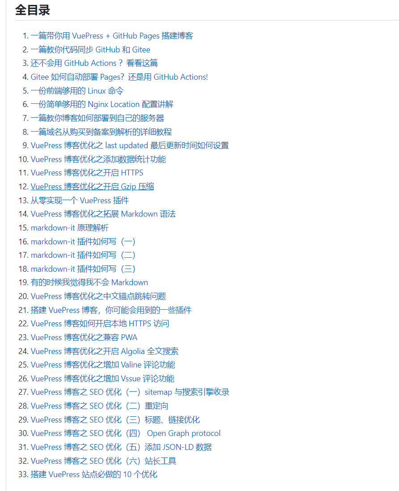
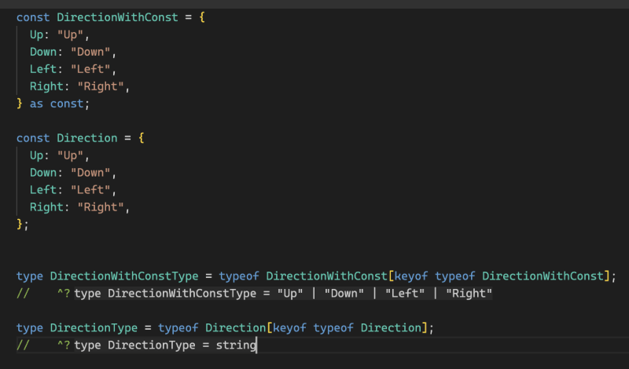

# 0908 今日总结


## 今日工作
> 问题，原因，解决方式，优化，巧妙实现，新知识

### 问题1 “xxxx”不能用作 JSX 组件问题之版本依赖问题

今天遇到一个 ts 类型错误：“xxxx”不能用作 JSX 组件 问题；

本质上是，不同库使用的 react 版本不一致，导致其 `types` 类型版本也不一致；

比如 `react-router-dom@5.x.x` 引用了 `Link` 组件，其依赖的 `react type` 是 `16.x.x`，

但是项目使用的 `react` 是 `17.x | 18.x`，若没有做版本限制，往里面设置属性的时候，react 的类型校验不过；

本质原因是 `react-router-dom` 和 `react` 各自的 `@types` 不一致导致；

为了约束两者的 `@types` 版本一致，可以使用：`resolutions` 进行约束；

相关细节可以参考以下资料：

- [解决React中遇到的 “xxxx”不能用作 JSX 组件 问题 - 掘金](https://juejin.cn/post/7089463577634930718)
- [配置package.json 文件里的 resolutions 按需下载依赖包版本_package.json resolutions](https://blog.csdn.net/H_carrot/article/details/126548821)
- [一文帮你解决版本依赖冲突 - 知乎](https://zhuanlan.zhihu.com/p/529545239)

拓展：`package.json` 其他属性，可以参考如下；

- [文件 package.json 的说明文档 - 掘金](https://juejin.cn/post/6844903894099689485)


## 今日心情
> 所见所想，有感而发

心情：:upside_down_face: :angry:

今天深圳暴雨，罗湖市区停工，我们公司也居家了；

不爽的是，公司同时通知这件事的时候，发的不是群通知，而是群消息，消息被顶上去了，导致我昨天晚上没看到，早上我去公司的时候，公司空空如也，原来大家都居家了。

好吧，以后注意；不过暴雨以后还是别来了；

## 好文推荐
> 有感好文

### TOP3


- [VuePress 博客搭建系列 33 篇正式完结！](https://github.com/mqyqingfeng/Blog/issues/279) 一个系列 33 篇文章，详细教授如何搭建博客，并且各种配置；
- [深圳买二手车的一次经历和大家分享下 - V2EX](https://www.v2ex.com/t/972007#reply6) 以后买车特别是二手车，可以参考这个博主的分享；
- [工作三年后的胡思乱想 - 知乎](https://zhuanlan.zhihu.com/p/640990591) 一个非常厉害的大佬，通过他的文章，真的可以感受到，天道酬勤；写了很多文章，非常优秀！！看了此文我的感受：
  - 赚钱：要做复利的事情：比如知识付费（小册、课程、书籍等），一次撰写，N 次收费；
  - 饮食和健康：坚持跑步和控制碳水，少吃饭，多吃蛋白质和蔬菜；作者的坚持锻炼成功减去了脂肪肝；我感觉我也需要拾起锻炼的习惯重视自己的健康；


### unocss 原子样式的使用

- [重磅更新，unocss终于可以完美使用px单位了 - 掘金](https://juejin.cn/post/7262975395620618298)
- [保熟的UnoCSS使用指北，优雅使用antfu大佬的原子化CSS - 掘金](https://juejin.cn/post/7142466784971456548)


### 有感好文-英文

- [Building a Minimalist Docker Image with Node, TypeScript - DEV Community](https://dev.to/jacobsamro/building-a-minimalist-docker-images-with-node-typescript-and-pnpm-109j) 作者讲述如何搭建一个 docker node 镜像，最后有 仓库链接可以参考；
- [You might not need TypeScript Enum - DEV Community](https://dev.to/maafaishal/you-might-not-need-typescript-enum-1f4n) 
  - 作者讲述，日常 ts 开发中我们可能并不需要使用 Enum，因为其转译后的代码体积会大很多，作者的例子体积比例 `153 : 65`
  - 也讲述了 `Enum` 的缺点；

```ts
walk("Left");
// This shows an error ❌
// (Argument of type '"Left"' is not assignable to parameter of type 'EDirection')

walk(EDirection.Left);
// This works well ✅

```

但是也有其他大佬给出了更多不同；




## 项目/博客推荐
> 值得学习 作者/项目/工具等


### AI 工具

下图为 AI 生成的图片，好酷 :boom:


- [AI 生成图片-Stable Diffusion AI Generator Online | Stable Diffusion XL Powered](https://www.stablediffusionai.ai/)
- [AIHub – 免费齐全的AI工具箱 | 精选800+AI工具集合网站导航](https://www.aihub.cn/)


### 其他工具

- [cfour-hi/gitstars: Github Starred Repositories Manager](https://github.com/cfour-hi/gitstars) 一个在线工具，用来管理你打过星的 GitHub 项目。