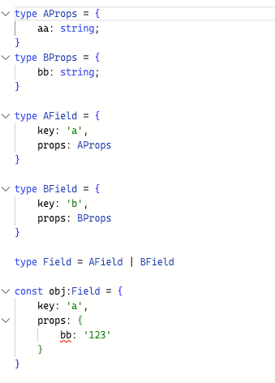
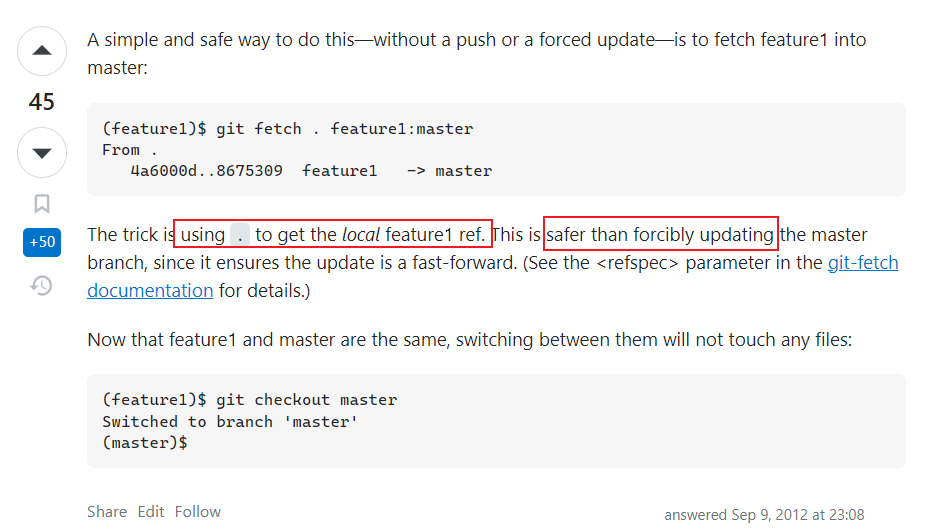
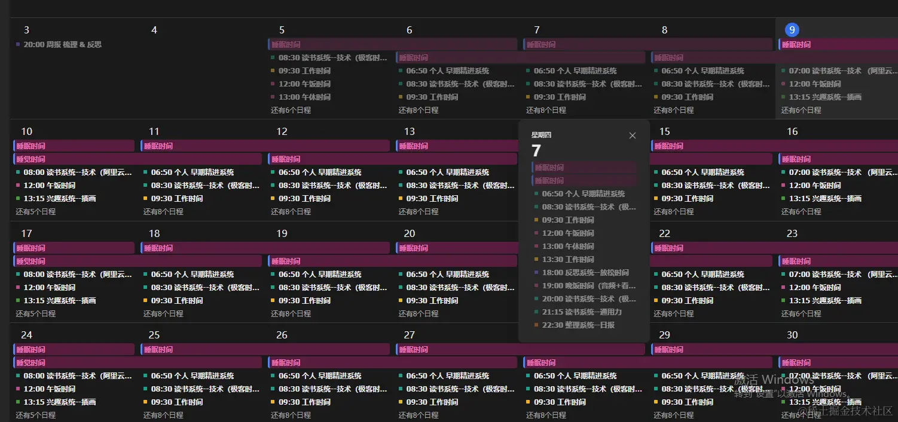
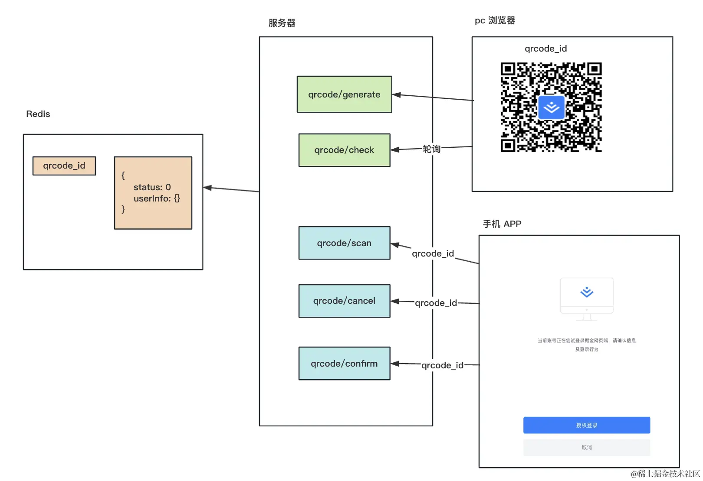

# 0913 今日总结


## 今日工作
> 问题，原因，解决方式，优化，巧妙实现，新知识

### 问题1: ts 类型匹配问题

前两天做 ts 类型优化，遇到个类型不匹配问题，参考在线链接：[typescript-playground](https://www.typescriptlang.org/play?#code/FAFwngDgpgBA0lMBnGBeGByAhhmAfTAIw2FElgEEAFAJwHsIV0BvYGdmLLALhiRBoBLAHYBzANzAAvmWgwAQrQZMYrDjEKFe-IWMkzZsBMgCyWCGlVsOPGNXqNJ6rQqWPppcHIBigqABsAE0s1DgBrRF5jJCcOCAckKMQkMwgAbWiAXQ9gAGM6YX4YADM-IN5fAOCWa3YIsF5sDAAaWph45V5mKRgAel6YAHcsYRAYEWKoGjs3JGkgA)

代码很简单，目的就是为了让 `type` 和 `props` 绑定；不能使用泛型；

```ts
type Keys = 'a' | 'b'

type AProps = {
    aa: string;
}
type BProps = {
    bb: string;
}

type KeysMap = {
    a: AProps;
    b: BProps;
}

type Field = {
    key: Keys;
    props: KeysMap[Keys]
}

const field: Field = {
    key: 'a',
    props: {} // want infer AProps
    // Error: Type '{}' is not assignable to type 'AProps | BProps'.
}

```

我把这个问题抛在了群里，有大佬给出了答案，如下：



针对我需要的使用方式，我优化了下，如下：[优化后大概使用方式](https://www.typescriptlang.org/play?#code/FAFwngDgpgBA0lMBnGBeGByAhhmAfTAIw2FElgEEAFAJwHsIV0BvYGdmLLALhiRBoBLAHYBzANzAAvmWgwAQrQZMYrDjEKFe-IWMkzZlAGKCoAGwAmaVWw4BrRL2wYANLfYR6jXtS9JppOBy8ibmVizuMA5gTsRu6p7KvIp+AYYwoZbWFJlWBCGmloHkGYUWAOqCIAAWAPI1UDQquTAAZDbqDCCCdMJIvABKUADGdDQWADw6IqIunMJgAHyS6t0gZlDaAjMrHBZYIFgAksIWUAAeW7oSacCjfSAwAGZl-aVhlTX11Y1IANoAXWsf0ianU9kcmBw8XBHj8vDBsPUXCcJCRMCkMNhaw2qKx4P2hxOZ0umFckU6EG6vTezB4MAAjBj3JiYO5EeDorFyejEt4OuiOJpURSOJjRewcZsyfj1ITjqcLniJTAuj0+gj6UyZGK3ACgA)


::: tip 感想
真正做组件开发和优化的时候，才知道自己的 ts 能力有多薄弱，还得多练练 [类型体操](https://github.com/type-challenges/type-challenges) 啊
:::

### 问题2 git 不切换分支合并代码

我们知道，git 操作中，如果要合并当前分支到目标分支，需要先切换分支到目标分支，再把当前分支合并进去；

同时昨天问我：有没有什么命令或者方式，不需要切换分支，就能合并到目标分支？

我搜了下 Stack Overflow，发现有类似答案；同事实践后可行

参考 [Git checkout and merge without touching working tree](https://stackoverflow.com/questions/1402993/git-checkout-and-merge-without-touching-working-tree)

代码：

```bash
git fetch . feature1:master
```

答案有解释：




## 好文推荐
> 有感好文，专题好文

### TOP3



- [优秀的时间管理和人生管理系统 | 如何过完有效率的一周](https://juejin.cn/post/7276675247597305867) 

::: tip :heart: 感受

- 很优秀的时间管理和人生管理系统，确实是，要让一件事情有意义，需要记录下来；
- 确定目标，持续输出，持之以恒；类似一个每日反思整理，不断提升自己；

:::


::: danger :palms_up_together: 如何做到和作者一样优秀呢？


- 规划自己的人生系统（目标）：读书、整理、兴趣、工作、英语、反思等；
  - 确定目标的标准：如 读完一本书，学会一项技能，输出几篇文章等；
  - 类似于目标管理，需要对上述目标做拆解；类似 [smart 原则](https://baike.baidu.com/item/SMART%E5%8E%9F%E5%88%99/8575850)
  - 确定好任务的状态：任务详情、状态（待规划、进行中、已完成等）、执行时间和周期、关联目标等；
- 强制规划自己的时间
  - 有了目标和拆解任务，接下来就是合理安排时间去执行；
  - 通常的时间选择：早晨、上下午、周末等；一般是自己效率最高，时间率用率最佳的时间段；
  - 填写自己的日程表；
- 记录：对于自己的任务执行细节打卡记录；留下时间的痕迹；
  - 每日记录：可以使用模板，快速记录；
  - 周、月记录：
- 其他：合理利用工具，如 app，飞书文档，语雀文档等 方便管理和记录；

:::

- [Bun 1.0 正式发布，爆火的前端运行时，速度遥遥领先！ - 掘金](https://juejin.cn/post/7277387014046335010) 通篇读下来，如果 Bun.js 没有什么缺点，那么确实很强！
- [Monorepo从构建到自动化发布 - 掘金](https://juejin.cn/post/7221073443935649853) 关于 Monrepo 介绍的比较细致


### 扫码登录方案



- [业务: 前后端实现二维码扫码登录-深度剖析](https://juejin.cn/post/7276808079142961189)
- [Nest 实现扫码登录](https://juejin.cn/post/7276266802824511540)


::: tip 总结几个技术要点：

- 二维码
  - 需要临时生成，具备有效期，一般时间比较短；
  - 会有几个状态：已扫描，已确认，已取消；
  - 轮训状态：可以使用轮训方案，websocket 方案，还有 sse 方案；关于 sse 可以参考 [详解 Server Sent Event(SSE)](https://zhuanlan.zhihu.com/p/515921898)
  - 二维码轮训状态已确认后，拿到 token 给到页面刷新页面；
- 后端：生成二维码，设置有效期，设置 有效 token；
:::


### 如何封装 axios

- [vue中Axios的封装和API接口的管理 - 掘金](https://juejin.cn/post/6844903652881072141)
- [改变axios的用法后，我的工作效率提升了3倍 - 掘金](https://juejin.cn/post/7277029942298329125)
- [在项目中用ts封装axios，一次封装整个团队受益😁 - 掘金](https://juejin.cn/post/7071518211392405541#heading-12)
- [前端架构带你 封装axios，一次封装终身受益「美团后端连连点赞」 - 掘金](https://juejin.cn/post/7124573626161954823)
- [十分钟封装一个好用的axios，省时又省力他不香吗 - 掘金](https://juejin.cn/post/7090889657721815076)

::: warning 个人感受

基础封装：

- 基础请求：get | post | 文件上传等
- 错误拦截
- loading 处理
- 参数统一
- token 带参；

高阶封装：

- 请求取消
- 请求重试
- 结合 双 token 无感刷新
- 并发队列，避免中断 loading

:::

不过这些东西，很多开源的库已经做的很好了，比如

- [vlovta](https://link.juejin.cn/?target=https%3A%2F%2Falova.js.org%2F)
- [useRequest-ahooks](https://ahooks.gitee.io/zh-CN/hooks/use-request/index)


### Typescript 类型体操，高阶知识

- [TS挑战通关技巧总结，助你打通TS奇经八脉 - 掘金](https://juejin.cn/post/7000560464786620423)
- [TypeScript 类型体操姿势合集<通关总结>--刷完 - 掘金](https://juejin.cn/post/6999280101556748295)
- [Ts高手篇：22个示例深入讲解Ts最晦涩难懂的高级类型工具 - 掘金](https://juejin.cn/post/6994102811218673700?utm_source=gold_browser_extension#heading-8)


## 项目/博客推荐
> 值得学习 作者/项目/工具等

### 博客

看了几个优秀的 vitepress 主题博客：

- [一个简约风的VitePress博客主题 - 掘金](https://juejin.cn/post/7196517835380293693)
- [优秀vitepress-博客主题-粥里有勺糖 | 粥里有勺糖](https://sugarat.top/)
- [@sugarat/theme | @sugarat/theme](https://theme.sugarat.top/)


### 工具

- [比 nvm 更好用的 node 版本管理工具 - 掘金](https://juejin.cn/post/7275608678828916755) 介绍 Volta 的使用，之前的每日笔记中提到过；这篇文章介绍的比较完整；
- [美化：让 VSCode 高亮显示当前缩进线 - 哔哩哔哩](https://www.bilibili.com/read/cv18949301/?from=readlist) Vs Code 优化配置；