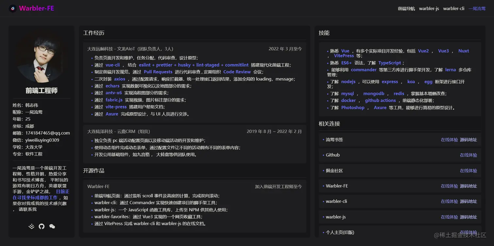
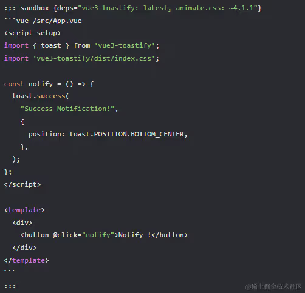
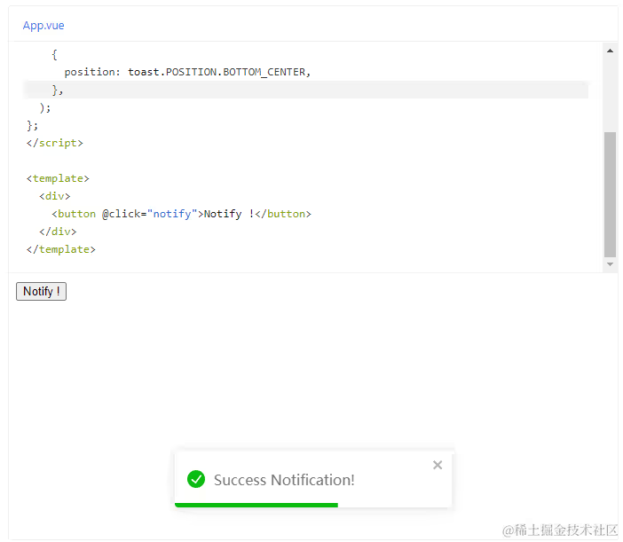

# 0916 今日总结


## 今日工作
> 问题，原因，解决方式，优化，巧妙实现，新知识

周末快乐 :smile: ，现在梳理下这几天的工作；

### 问题1 多项目并行如何快速切换项目和分支

同事最近比较忙，遇到这样的情形：做迭代 A 的时候，上一个迭代 B 有 bug，或者 其他 C 有问题需要修复，因此需要快速切换项目；

可能是同一个项目不同分支，也可能是不同项目不同分支；他有个烦恼的点：

> 对于同一个项目不同分支；因为项目是 基于 webpack 的，每次切换分支需要（可能需要安装依赖）重新 启动 webpack，但是 启动速度又不是很快，等待时间很繁琐；

对于这种情况，我的想法是：

- 最简单：建一个新的文件夹，下载这个仓库的代码，并切换分支；开一个新的 VS Code 窗口；
- 优化 webpack 启动速度: webpack 启动速度还是慢的，只有 热更新才会快；但是他切换项目需要重启项目，自然也就只能慢了；可以考虑 开发环境使用 Vite，打包使用 rollup 或者 webpack；

同事研究的方法是，看 git 的自带一些特性能否支持；

**拓展资料：**

- [VSCode插件：简单增强 VSCode 的 Control + R - 掘金](https://juejin.cn/post/7276260308515274792)
- [git-版本控制](https://git-scm.com/book/zh/v2/%E8%B5%B7%E6%AD%A5-%E5%85%B3%E4%BA%8E%E7%89%88%E6%9C%AC%E6%8E%A7%E5%88%B6)


## 好文推荐
> 有感好文，专题好文

### TOP3
- [‍​⁡The Document is All You Need！零基础入门大语言模型（Large Language Model, LLM)底层技术原理](https://s3tlxskbq3.feishu.cn/docx/NyPqdCKraoXz9gxNVCfcIFdnnAc) 文章细致而全面，需要深入学习，了解下 AI 知识；<Badge text="todo" />
- [对不起 localStorage，现在我爱上 localForage了！ - 掘金](https://juejin.cn/post/7275943591410483258) 介绍 localForage 的使用；第一次知道这个东西；
- [前端必学的桌面开发：Electron教程（1W多字超详细） - 掘金](https://juejin.cn/post/7277799192961925172)
- [搭建sentry监控平台，实现前后端异常监控。——从零开始搭建一个高颜值后台管理系统全栈框架(十六) - 掘金](https://juejin.cn/post/7275980024262443068)  试着搭建一套自己玩玩看 <Badge text="todo" />

### 英文推荐

- [5 Best JavaScript Unit Testing Courses for Beginners and Experienced Developers in 2023 | by javinpaul | Sep, 2023 | Medium](https://javinpaul.medium.com/5-best-javascript-unit-testing-courses-for-beginners-and-experienced-developers-in-2023-e98fd117c34f) 一些前端测试的课程介绍；看了下，对比国内一些老师的单测课程便宜一点，虽然是美元，但是单课程 70 刀（500 RMB）左右；就是不知道课程内容如何；
- [10 essential VS Code tips & tricks for greater productivity | by Coding Beauty | Aug, 2023 | Dev Genius](https://blog.devgenius.io/vscode-tips-tricks-98c6e2258626) 10个提升 VS Code 生产力的小技巧； 
- [javascript - 提高生产力的10个必备VS Code技巧和窍门 - 终身学习者 - SegmentFault 思否](https://segmentfault.com/a/1190000044154394#item-6)
 对比下翻译；

### 其他好文


- [运维 - shell 脚本如何编写-致初学者 - sanri1993 - SegmentFault 思否](https://segmentfault.com/a/1190000044214953)
- [记录gt、ge、lt、le、eq、ne的含义_ge lt_Java菜勾的博客-CSDN博客](https://blog.csdn.net/weixin_54345825/article/details/126331345)

**解释如下：**

- `gt`: 符号 `>` 意思：greater than
- `ge`: 符号 `>=` 意思：greater than or equals to
- `lt`: 符号 `<` 意思：less than
- `le`: 符号 `<=` 意思：less than or equals to
- `eq`: 符号 `=` 意思：equals
- `nq`: 符号 `!=` 意思：not equals


### 好文-项目搭建-Vite | React | Git

- [做了几年前端，别跟我说没配置过webpack - 掘金](https://juejin.cn/post/7277490138518159379) 一篇配置 webpack 常用 loader 和插件的文章，价值点在评论区一个问题：

```
有个疑问，plugin和loader是谁先过呢？

loader是在编译模块时发挥作用，而plugins可在整个构建过程中发生作用，因此可认为loader在plugin之前执行
```


- [2023盛夏版：轻松搞定基于Vite4的React项目全家桶 - 掘金](https://juejin.cn/post/7240838046789812282) 价值点在评论区一位大佬的留言，vite 优化项目还有很多事情可以做；

```
1. 本地开发模式支持https（可通过env进行配置）
2. 支持路由keeplive功能（forward/backward/always）
3. 增加commitlint/husky
4. 将反锁的redux-toolkit换成valtio或者zustand
5. morkjs对于生成各种动态数据很好，但是可以增加mork服务，并随着npm run dev一起启动，共享同一个端口
6. 基于node的mork服务调试不友好，可以尝试改成msw，它基于webservice，可以天然的直接的使用浏览器debug，而且支持prod构建，vitest/jest
7. 支持vscode保存时，自动执行eslint规则进行代码规范的修复
8. @vite/plugin-legacy启用后，打包会被拖的很慢，特别是巨石项目，如何替代
9. 如果第三方包中存在require，打包怎么兼容？

其实还有很多优化，暂时就不说太多了

这位大佬的 博客主页：https://juejin.cn/user/2823201591402990/posts
```

- [一个 git 仓库下拥有多个项目的 git hooks 配置方案_git 仓库 多个项目_谭光志的博客-CSDN博客](https://blog.csdn.net/q411020382/article/details/132042265) 多个子项目情况下，使用 bash 脚本配置 git hooks 搭配 husky 做工程化配置；


## 项目/博客推荐
> 值得学习 作者/项目/工具等

### 博客

- [warblerfe](http://www.warblerfe.top/warblerCenter) 值得学习的 个人主页

建议阅读作者的这篇 [【年中总结】一个人也要快乐哦 | 2023 年中总结](https://juejin.cn/post/7254855511305601080)


### 项目/库



- [vitepress-sandbox-plugin](https://vitepress-sandbox.js-bridge.com/get-started/introduction.html) 一个 vitepress 插件；效果如上；来源 [前端团队终于有了自己的开发文档](https://juejin.cn/post/7243520456979398693#heading-6) 评论区

- [panyushan-jade/react-template-admin: A lightweight React18 backend management template](https://github.com/panyushan-jade/react-template-admin) 一个 React 项目模板；使用了如下技术栈：

```
react18
react-router6
zustand4
vite4
axios
fakerjs
dayjs
```

### 工具-UI 模板

一些优秀的 UI 设计案例作为参考，在写个人项目的时候可以作为参考；以下链接示例包括 PC / H5 端；示例丰富；

- [84 Best Software Landing Page Design Inspiration & Examples | Landingfolio](https://www.landingfolio.com/inspiration/landing-page/software)
- [UI Notes - 真实产品 UI 设计灵感库](https://uinotes.com/)
- [Beautiful web app screenshots | Webframe](https://webframe.xyz/) 总共有 800+ 设计参考
- [Browse Android Apps | Mobbin](https://mobbin.com/browse/android/apps) 同样-很多设计案例参考

### 工具-提效

- [VsCode前端调试速速上手指南 - 掘金](https://juejin.cn/post/7247897453915045949)
- [详解前端规范工具链落地实战【别让你定的规范只停在口头上】 - 掘金](https://juejin.cn/post/6862341107859062791)
- [VSCode 开发提效指南（前端开发版） - 掘金](https://juejin.cn/post/7276628114981388349#heading-9) 介绍一些 快捷键、插件的使用
