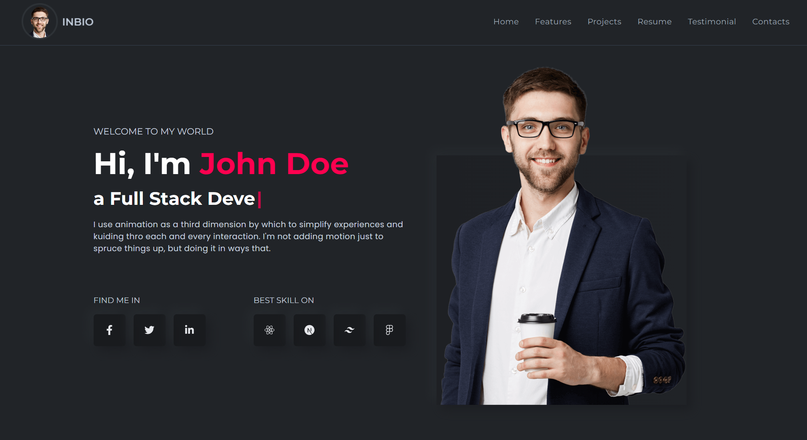
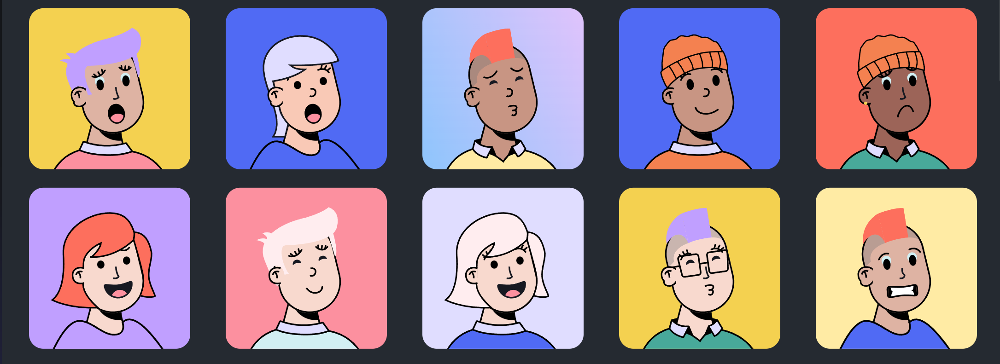

# 0919 今日总结


## 今日工作
> 问题，原因，解决方式，优化，巧妙实现，新知识

### 问题1 Flex 布局中使用 gap 属性

最近工作中，使用 `AntD` ui 时，用到了 `Space` 组件，基于需求，无意间发现其样式组合中，竟然有 `gap` 属性用于控制边距；

印象中，这个 属性貌似是 `grid` 布局有的，现在竟然可以用在 `flex` 布局中了，真是不错；

查资料发现，`gap` 属性其实 2 年前就开始支持了，只是个人用的比较少；

参考资料：

- [CSS gap属性进化史 « 张鑫旭-鑫空间-鑫生活](https://www.zhangxinxu.com/wordpress/2020/06/css-gap-history/)
- [在 Flex 布局中使用 gap 属性 | blog [ YOG WANG ]](https://yogwang.site/2021/CSS-use-gap-in-flex-layout/)


## 好文推荐
> 有感好文，专题好文

### TOP3

- [free-for.dev](https://free-for.dev/) 顶级的程序员开源资源列表，搜集了程序员需要的各种领域的免费 Sass 服务并且配有简介：类型，永久免费或者试用免费的额度。 最厉害的是这个列表数量之多之广真的令人叹为观止，由于是开源的，资源还在不停的添加
- [记录一下27岁的前端，从二本到澳洲🦘的故事](https://juejin.cn/post/7278929122302132279) 作者非常勇敢果断，同时运气很好；通过 whv 签证去到 澳洲 找到 IT 工作，外企工作非常舒服；**远程，下午4点半下班；一个月去一次公司；** 羡慕斯了~~
### 英文推荐

- [Node.js: A Guide to Native .env Support and local development - DEV Community](https://dev.to/usulpro/nodejs-a-guide-to-native-env-support-and-local-development-300g) nodejs v20.6.0 原生支持 `.env` 配置文件的方式；使用 原生的 env 配置方式有如下优点：

::: tip 优点

- 简化配置：您不再需要使用 dotenv 等外部包来管理环境变量。

- 增强的性能：由于 Node.js 内置了本机 .env 支持，因此它可能提供比第三方库有更好的性能。

- 提高安全性：减少依赖性可以降低安全漏洞的风险。

- 简化应用开发：借助本机 .env 支持，配置环境变量成为 Node.js 运行时的无缝部分，使应用程序开发变得更轻松、更高效。

:::
- [Day 51: Recursive Types - DEV Community](https://dev.to/dhrn/day-51-recursive-types-365b) 作者介绍了 ts 的高阶用法，递归类型推断，如：

```ts
// demo 1
type FileNode = {
  name: string;
  isFile: boolean;
  children?: FileNode[];
};

// demo 2
type Uppercase<S extends string> = S extends `${infer L}` ? Uppercase<L> : S;

type UppercasedGreeting = Uppercase<"hello">; // UppercasedGreeting = "HELLO"


// demo 3
type Replace<S extends string, From extends string, To extends string> = S extends `${infer Prefix}${From}${infer Suffix}`
  ? `${Prefix}${To}${Replace<Suffix, From, To>}`
  : S;

type ReplacedText = Replace<"hello world", "world", "universe">; // ReplacedText = "hello universe"
```

关注这位作者的主页，有一个系列的文章更新，都是关于 ts 的进阶知识：https://dev.to/dhrn

### 其他好文

- [面试官：纯前端如何实现录屏并保存视频到本地？👊👊👊 - 掘金](https://juejin.cn/post/7280057907055869992) 前端实现录屏保存视频的方式；主要用到 `navigator` 和 `MediaRecorder` 相关 API；
- [都2023年了, 你还不会使用nodejs对项目压力测试? - 掘金](https://juejin.cn/post/7224341322612621369) 借助工具 `autocannon ` 进行接口压力测试；


## 项目/博客推荐
> 值得学习 作者/项目/工具等

### 项目-项目模板

- [xun082/create-neat: 🚀🚀🚀 基于 pnpm+monorepo 开发的前端脚手架,旨在为用户快速初始化项目](https://github.com/xun082/create-neat) 优秀的前端开发脚手架
- [lanzhsh/react-vue-koa: Vue，React，微信小程序，快应用，TS , Koa, JS一把梭](https://github.com/lanzhsh/react-vue-koa/tree/master) 优秀的项目模板集合，包含主流的 js 框架的项目模板；
### 项目-portfolio



开发好看的个人作品展示页，预览：[Jone Doe](https://noorportfolio1.netlify.app/)，以下是教程和代码；

- [Dynamic Portfolio Website : Website Built with ReactJS || Part One - YouTube](https://www.youtube.com/watch?v=lJ2EBYN0C70)
- [noorjsdivs/youtubeportfolio](https://github.com/noorjsdivs/youtubeportfolio/tree/master)


### 工具-在线头像生成网站




- https://vue-color-avatar.vercel.app/ 推荐
- https://getavataaars.com/
- https://notion-avatar.vercel.app/zh
- https://personas.draftbit.com/