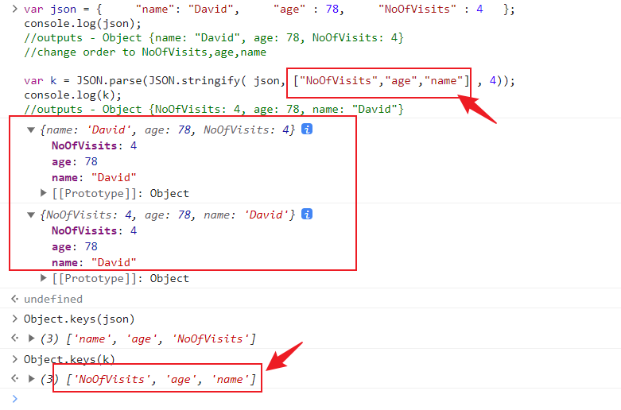

# 0921 今日总结


## 今日工作
> 问题，原因，解决方式，优化，巧妙实现，新知识

### 问题1-AI 编程

（搞笑图 :smile: ）


今天了解了一下 AI 编程的知识，对于我的开发场景，主要是 VS Code 的 AI 插件；我了解了如下插件：

- github copilot 付费
- Codeium 个人免费
- Amazon CodeWhisperer 个人免费
- Tabnine 基础版免费

尝试安装了 2 个免费的：

- [Codeium](https://codeium.com/): VS Code 插件，需要登录联网；AI 问答，代码分析，解释，生成 注释 体验不错；
- Tabnine: VS Code 插件，需要登录联网；智能分析本地代码，生成你想要的代码；基本上 CRUD 的代码应该都是可以生成的，非常智能；

以上 2 种工具结合，确实可以非常大的提升开发效率，省下更多时间~~学习~~摸鱼


相关资料：

- [三款Github Copilot的免费替代 - 费弗里 - 博客园](https://www.cnblogs.com/feffery/p/17428388.html)
- [Copilot使用体验以及和tabnine对比 - 知乎](https://zhuanlan.zhihu.com/p/569496874)
- [Codeium、Tabnine等代码辅助工具调研报告_mb649ed1fe7f8ce的技术博客_51CTO博客](https://blog.51cto.com/u_16175868/6782927)
- [TabNine代码补全工具使用体验_tabnine使用_今天一定的博客-CSDN博客](https://blog.csdn.net/weixin_41852068/article/details/119806481)
- [有大佬分析下 Tabnine 与 GitHub Copilot 差别吗？对于付费获得更高"生产力"工具的疑惑。 - V2EX](https://www.v2ex.com/t/861808)
- [杀手级AI补代码工具问世，支持23种语言及5种主流编辑器，程序员沸腾了 - 知乎](https://zhuanlan.zhihu.com/p/73811872)
- [免费的 Github Copilot 替代，你心动了吗？ - YouTube](https://www.youtube.com/watch?v=99Ke2S-l49c)
- [发现了个 Github Copilot 的平替，能免费用 - V2EX](https://www.v2ex.com/t/891044)
- [GitHub Copilot 被告了，喜提集体诉讼 - V2EX](https://www.v2ex.com/t/892682#r_12308066)
- [GitHub Copilot 可以写帮我写中文文章了 - V2EX](https://www.v2ex.com/t/814689)
- [Kite 正在告别 - 用 Kite 提高编程速度](https://www.kite.com/blog/product/kite-is-saying-farewell/) 一款 AI 工具，遗憾的创业失败了；


### 问题2-如何给对象的 key 设置顺序

在 js 对象中，key 是默认按照一定规则进行排序的，不会按照你设置 字段的顺序进行排序；我搜了一下相关的解答，有个方式思路清奇：

```js
var json = {"name": "David","age" : 78,"NoOfVisits" : 4 };
console.log(json);

//outputs - Object {name: "David", age: 78, NoOfVisits: 4}
//change order to NoOfVisits,age,name

var k = JSON.parse(JSON.stringify( json, ["NoOfVisits","age","name"] , 4));
console.log(k);
//outputs - Object {NoOfVisits: 4, age: 78, name: "David"} 
```

上面的方式，现在在 控制台打印的结果是不行的，也就是说无法让对象的 key 按照给定的顺序进行排序；

不过，我试着用了下 `Object.keys(json)` ，发现 key 的输出顺序确实是按照给定的顺序输出；真是神奇，不知道啥原因？



参考资料：

- [sorting - How can we custom sort JavaScript object keys? - Stack Overflow](https://stackoverflow.com/questions/37056250/how-can-we-custom-sort-javascript-object-keys)


## 今日心情-职业规划思考
> 所见所想，有感而发


一直关注的前端大佬，大圣，如今 33 岁，财务自由，开始享受人生，开着房车，边旅游边写代码；

羡慕这样优秀的大佬；

之前经历过裁员的我，想法是: **没有稳定的公司，没有养老的岗位，只有具备核心价值具备核心竞争力在市场中处于竞争优势的人才**；

现在又会想，33 岁的我，职业生涯会是什么样的状态？

当然，与其临渊羡鱼，不如退而结网；

更多的是需要学习 大圣老师优秀的 **特质**，让他成功的关键：

::: info 特质
- 名校出身：北京交通大学；
- 坚持学习：每天早起看书学习；
- 履历丰富：先后入职百度、360、开课吧；且都是高级岗位；
- 精进技术：各种前端技术栈、源码都很深入；以及出了很多课程小册等，反响都不错；
:::

::: tip 总结：

既有过硬的本领，又有时代的机遇；当然，打铁还需自身硬，才能抓住机遇攀登高峰；

:::

## 好文推荐
> 有感好文，专题好文

### TOP3
- [被裁后的一天 - 掘金](https://juejin.cn/post/7270831230069243961) 近期被迫毕业的开发同学很多啊，看着别人的故事也是非常感伤，自己也是被裁后重新入职
- [我终于会用Docker了(nest+prisma+psotgresql+nginx+https) - 掘金](https://juejin.cn/post/7222840421542936634)


## 项目/博客推荐
> 值得学习 作者/项目/工具等


### 工具-李跳跳 拦截开屏广告

- [李跳跳·派大星APP v2.2.0 安卓无需ROOT自动跳过弹窗广告-李跳跳](https://www.litiaotiao.com/litiaotiao.html) 安卓端安装，立即拦截开屏广告；
- [100font.com - 免费商用字体大全 - 免费字体下载网站](https://www.100font.com/) 免费商用字体；