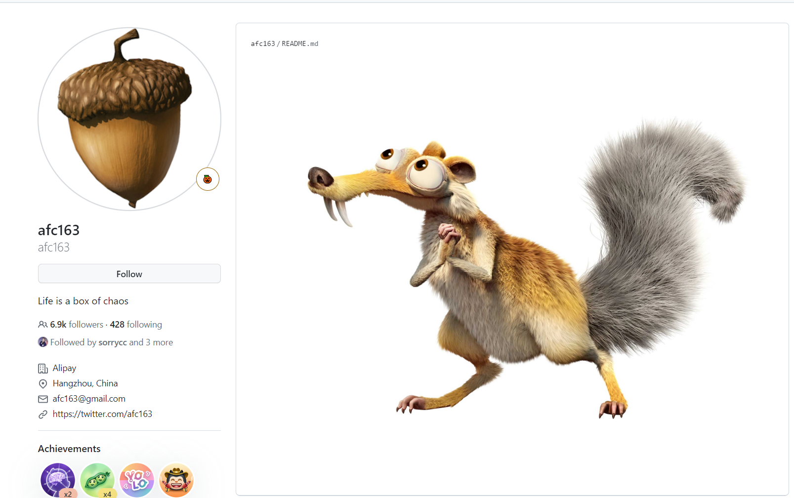

# 0926 今日总结

**关键字：** 前端无障碍、hooks和ref、code review、前端性能优化、计算机网络、README 模板、github 炫酷主页、烟花项目

## 好文推荐
> 有感好文，专题好文

### TOP3
- [聊聊前端无障碍实践 - 知乎](https://zhuanlan.zhihu.com/p/600128699) 了解一下前端无障碍；起因是看到某个文章的评论，使用虚拟列表的缺点，不利于无障碍；原因是前端无障碍主要依靠真实的 DOM 进行语音和文字提示；虚拟列表实际展示的 DOM 并不是真实的 DOM；
- [为什么别人的 hooks 里面有那么多的 ref - 掘金](https://juejin.cn/post/7271643757640007680) 学习为什么 使用 ref，什么场景使用；主要是涉及到 `setTimeout` 和 state 没更新的时候，需要使用到 ref；以助于获取到最新的 fn or state;
- [腾讯 13 年，我所总结的 Code Review 终极大法](https://mp.weixin.qq.com/s/HoFSNCd1U3eoUqYaQiEgwQ)

### 其他好文

- [百万PV商城实践系列 - 前端长列表渲染优化实战 - 掘金](https://juejin.cn/post/6995334008603148295)
- [5000字总结面试常问前端项目优化究竟怎么来做？ - 掘金](https://juejin.cn/post/7214880895093735479)
- [一文让你彻底掌握 TS 枚举 - 掘金](https://juejin.cn/post/6844904112669065224#heading-3)

### Web3 专题

- [基于这些资料可以整理一个 web3 专题--web3-examples/docs/awesome.md at main · luzhenqian/web3-examples](https://github.com/luzhenqian/web3-examples/blob/main/docs/awesome.md)
- [luzhenqian/web3-examples: 欢迎来到 Web3 世界，这里汇集了大量 Web3 示例项目和高质量学习资源。加入我们，和一百万开发者通行，一起探索并塑造未来世界的繁荣景象。立刻行动，开启您的 Web3 之旅！](https://github.com/luzhenqian/web3-examples/tree/main)

## 项目/博客推荐
> 值得学习 作者/项目/工具等

### 博客

- [小林coding](https://xiaolincoding.com/) 优秀的计算机网络知识汇总；
- [开发者客栈-帮助开发者面试的平台-顽强网络](https://www.developers.pub/) 不错的网站，包含简历模板、todo项目、wiki 各种面经文档等

（有趣的 github 主页，这位作者也是大佬：[afc163](https://github.com/afc163)）

### 项目

- [一起看烟花，在线放烟花2.0版本-w3h5-Web前端开发资源网](https://w3h5.com/post/718.html) 中秋快到了，一起看个烟花；

- [Impressive Profile READMEs](https://roypriyanshu02.github.io/impressive-profile-readmes/) 有趣的 github 主页列表，参考学习学习；
- [roypriyanshu02/impressive-profile-readmes: Get inspired to make your GitHub Profile stand out! Check out our gallery of Impressive Profile READMEs and take your profile to the next level.](https://github.com/roypriyanshu02/impressive-profile-readmes) 上面项目的主页；

**有趣的 readme 模板**

- [awesome-readme-template · GitHub Topics](https://github.com/topics/awesome-readme-template)
- [README-TEMPLATE3](https://github.com/eartho-group/top-readme-templates/blob/main/README-TEMPLATE3.MD) 
- [elangosundar/awesome-README-templates: A collection of awesome readme templates to display on your github profile.](https://github.com/elangosundar/awesome-README-templates)

### 工具

- [前端导航 - 内容最全的前端开发网址导航](https://webjike.com/web.html)

