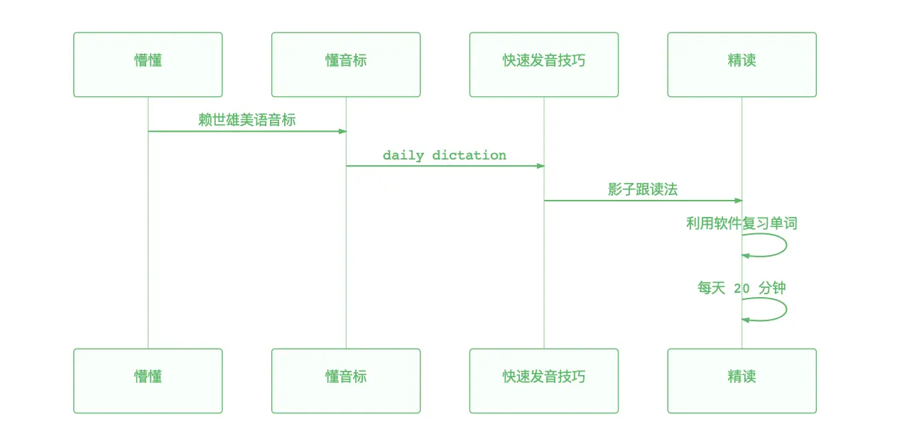

# 1009 今日总结


**关键词：** Chrome下载PDF、React类型@types、组建系统、项目重构、英语听力练习、中年失业、双拼打字


## 今日工作
> 问题，原因，解决方式，优化，巧妙实现，新知识

### 问题1 Chrome 默认打开 pdf 文件而非下载 问题

**需求：** 请求接口，后端返回一个 url，通过 url 下载 pdf；

**问题：** Chrome 的设置问题，对于 pdf 文件，默认处理方式是打开文件；

**处理方式：**

- 需求协商：默认新 tab 页打开预览，如需下载，用户自己可以下载；
- 使用 url 下载：需要修改 后端返回的内容为 **流**，而非 一个 url；同时前端需要接受流的方式处理；

**拓展：**

一般而言，对于下载文件的情况，是 2 种方式：

- `window.open`
- `<a href="url" />`

参考资料：

- [使用javascript下载pdf,浏览器打开预览pdf格式 - 简书](https://www.jianshu.com/p/03889f351718)


### 问题2 不同版本 React types 类型和依赖的 类型不匹配问题

下班前，查看项目代码的时候，发现之前修改的代码类型报错了；原因是：

- 组件代码中 React 使用版本是 `^16.x.x`，但是实际安装的 `@types/react` 版本是最新的 `^18.0.2`；
- 组件引入了 antd 组件，组件的 `key` 属性中，类型定义是用的 `@types/react: ^16.x.x`；
- 即：对于 `React.Key` 这个类型，在 低版本的 `React` 类型和 高版本的 `React` 类型不对应：

```ts
// React -> v16.x.x
React.Key = string | number | null | undefined;

// React -> v18.0.2
React.Key = string | number | null | undefined | bigint;
```

搜索资料，AntD 也遇到了这个问题，可以看这个更新 [修复 @types/react@18.2.22 React.Key 定义更新引发的问题。#44938](https://github.com/ant-design/ant-design/pull/44938)，它 的处理方式是替换 `React.Key`， 使用其他类型：`InternalNamePath | string | string[]` 等


搜索资料过程中，发现一个类型自动安装的工具：[jeffijoe/typesync](https://github.com/jeffijoe/typesync) 可以自动安装所有 `@types/xxx`

::: warning 补充

React 不同版本的类型差异，不仅仅会有这个 `React.Key` 不一致问题，其他的，之前整理组件时，遇到 `react-router-dom` 不同版本类型中对于 `React.Element` 类型也存在一定差异；

:::

相关资料：

- [reactjs 如果@types/react和react有不同的版本会有问题吗？ _大数据知识库](https://www.saoniuhuo.com/question/detail-2433652.html)
- [jeffijoe/typesync: Install missing TypeScript typings for dependencies in your package.json.](https://github.com/jeffijoe/typesync)


## 好文推荐
> 有感好文，专题好文

### TOP3

- [从0到1教你搭建前端团队的组件系统（高级进阶必备） - 掘金](https://juejin.cn/post/6844904068431740936) 使用father 工具搭建 ui 组件库，系统全面，千赞好文；
- [七年前端，四年远程/上海搬家12次/在微软和硅谷远程 Offer 面前，我选择了后者 - 掘金](https://juejin.cn/post/7282951856513843241) 电鸭社区分享的一位远程工作的开发经历和心得；
- [基于 qiankun 的微前端最佳实践（万字长文）](https://github.com/a1029563229/blogs/blob/master/BestPractices/qiankun/Start.md) 微前端好文！

### 英文


- [程序员练英语听力的那些日子 - 掘金](https://juejin.cn/post/6844903860692058126) 作者详细介绍了自己是如何练习英语听力的：听懂发音-精听-泛听

### 其他好文

- [前端项目重构的一些思考和复盘 - 掘金](https://juejin.cn/post/7204471695544369207)
- [结合 father 搭建项目，文档使用 Docz](https://www.docz.site/) 前面有文章介绍了 ui 组件库搭建，这里学习 docz 文档工具的使用；
- [【23-07】最新从0-1搭建 react 18 + antd 5 + vite 4.4 + typescript 5 + husky 企业级项目详细流程 - 掘金](https://juejin.cn/post/7260526125847838757#heading-21)

### 失业专题

今年的寒气，上半年我就已经亲身感受到了，现在社区文章、B 站、小红书、抖音 越来越多类似的推送了；不禁感慨，人到中年，没有工作，背负着房贷、车贷、娃和家庭；步履维艰！

人到中年，到底该何去何从？看到社区大部分失业开发人员的几个去向：

- 外卖、滴滴、货拉拉；
- 摆摊、开店（餐饮居多）；
- 创业（外包软件）；
- 远程开发：Web3 领域等新兴岗位；

::: tip 感想

看了这么多中年失业的案例，不禁愈发焦虑。

转眼间，我也马上 30 岁了，站在这个职业转折点上，与其担心，不如 提前规划布局，居安思危，想好退路。
:::

**文章**：

- [失业半年了 - V2EX](https://www.v2ex.com/t/980089#reply32)
- [失业 | 第三弹：从外卖转到代驾 - V2EX](https://www.v2ex.com/t/956789)
- [也谈一下 30+ 程序员的出路 - 掘金](https://juejin.cn/post/7287020579831267362)

## 项目/博客推荐
> 值得学习 作者/项目/工具等

### 博客

- [基于语雀的数据表格 | 2023 个人核心 OKR](https://www.yuque.com/ideal-20/thought/bqw6gkidwzdr3tzd) 优秀的后端开发，这个个人 OKR 值得参考；下文可以进一步了解这位博主，勤奋且优秀；
- [二十三岁的小行迹，愿与理想同行（2022年终总结）](https://www.yuque.com/ideal-20/thought/gglg96vg1krzwuo4)
### 项目

- [vite-react-fulllint-template: vite4.4 + react 18 + ts5 template： pnpm、husky、eslint、stylelint、 commitizen、lint-staged、staged、prettier](https://github.com/Pursue-LLL/vite-react-fulllint-template) 如题，一个 基于 vite 的 react + antd 开发模板；
- [易采集EasySpider：无代码可视化爬虫软件](https://www.easyspider.cn/) 很优秀的爬虫软件，不用写代码，可以认为是爬虫界的低代码工具，更关键的是，居然免费！！！

### 工具

工作几年了，使用的还是拼音打字，准确率和效率其实一般般；

想学五笔打字，但是背词根之类的很头大；

折中方案：双拼，比拼音打字快，比五笔打字记忆少；可以快速学习起来；

- [我做了一个双拼练习平台，想让高效的双拼输入法不再小众 - 知乎](https://zhuanlan.zhihu.com/p/32977956)
- [双拼练习 @ BlueSky](https://api.ihint.me/shuang/)