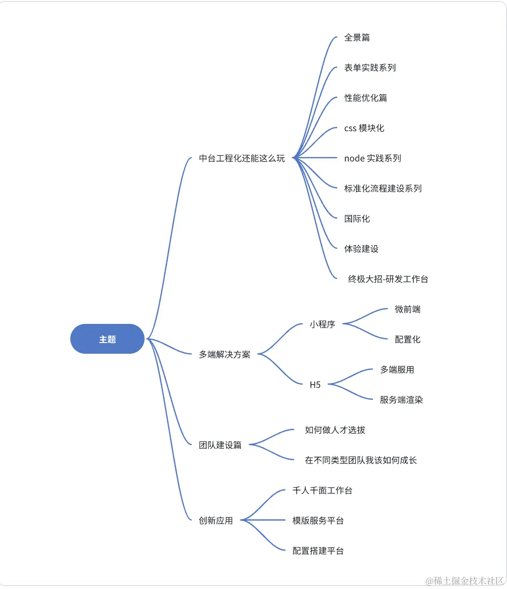

# 0422 今日总结


## 今日心情
> 所见所想，有感而发


## 好文推荐
> 有感好文，专题好文


- [How to work with loadable atoms in custom hook? · pmndrs/jotai · Discussion #1082](https://github.com/pmndrs/jotai/discussions/1082) 项目中开始使用 Atom 这个状态管理库了，这个 issue 是关于日常开发中对于 Atom 的封装 hook 的讨论；
- [js-bullshit-blog/TypeScript/TypeScript中令人迷惑的三个对象类型.md at master · deepfunc/js-bullshit-blog](https://github.com/deepfunc/js-bullshit-blog/blob/master/TypeScript/TypeScript%E4%B8%AD%E4%BB%A4%E4%BA%BA%E8%BF%B7%E6%83%91%E7%9A%84%E4%B8%89%E4%B8%AA%E5%AF%B9%E8%B1%A1%E7%B1%BB%E5%9E%8B.md) 在 ts 开发中，表示一个对象类型可以使用以下方式 `interface, {}, object`，这篇文章解释了它们的区别，结论是，使用 `object` 表示一个对象
- [GitRoll](https://gitroll.io) 这是一个用于扫描 github 项目质量打分的工具，输入 github 账号即可判断代码的质量；价值：可以用于面试候选人哈哈


---


- [Skyline 渲染引擎 / 概览 / 介绍](https://developers.weixin.qq.com/miniprogram/dev/framework/runtime/skyline/introduction.html) skyline 引擎可以用于提升微信小程序开发的性能，不过也有一些坑点，参考 [Skyline渲染引擎](https://developers.weixin.qq.com/community/minihome/mixflow/3081976366428028932)
- [Node 内存溢出问题修复：FATAL ERROR: Ineffective mark-compacts near heap limit Allocation failed - J-CSDN博客](https://blog.csdn.net/zhengzhaoyang122/article/details/136310453) 近期开发经常遇到这个node 内存移出的问题，这是作者的解决方案；by the way，我在研究 antd 源码的时候也看到类似的，比如 [antd/package.json](https://github.com/ant-design/ant-design/blob/470e8a8e0a269bbe28b139df346bf1081873e0d5/package.json#L49C4-L49C89)

```
"build": "npm run compile && NODE_OPTIONS='--max-old-space-size=4096' npm run dist",
```

- [字节三年，谈谈一线团队如何搞工程化一（全景篇） - 掘金](https://juejin.cn/post/7311596602249134106) 关于前端工程化的大体介绍



- [市面老多微前端框架了，它们的隔离实现方案、实战、优缺点？](https://mp.weixin.qq.com/s?__biz=MzI3NTM5NDgzOA==&mid=2247515627&idx=1&sn=abae36e88e49ccf944025382e9464c37&chksm=eb078592dc700c840578c7a119699ae70a2659f064f16dea3778ea3ab8c7392e2c8b5186113e#rd)
- [前端 - 怎样去掉最后一个元素的：after伪元素呢？ - SegmentFault 思否](https://segmentfault.com/q/1010000004174948) 复习css 知识

```css
ul>li:last-child>a::after{
  display:none;
}
```

- [VSCode 新项目作为选项卡（Tab）而不是窗口（Windows） - 掘金](https://juejin.cn/post/7309158186925178917) 很遗憾，不支持 windows
- [Node.js Corepack - 掘金](https://juejin.cn/post/7111998050184200199) 复习 nodejs 知识，安装了 Nodejs 就等于安装了 Yarn 和 pnpm；启用即可；


### Next.js

- [saasfly/saasfly: Your Next SaaS Template or Boilerplate ! A magic trip start with `bun create saasfly` . The more stars, the more surprises](https://github.com/saasfly/saasfly) 基于 Next.js 的开源 SaaS 开发模板，可以通过此项目学习学习 Next.js 开发
- [999 | 有实战项目 | Learn Next.js 中文教程](https://qufei1993.github.io/nextjs-learn-cn)
- [一个开源的轻量级论坛，追求界面简洁和使用方便，后端使用 Java，前端使用 Next.js | dafengzhen/youdeyiwu: youdeyiwu is an open-source lightweight forum.](https://github.com/dafengzhen/youdeyiwu)


