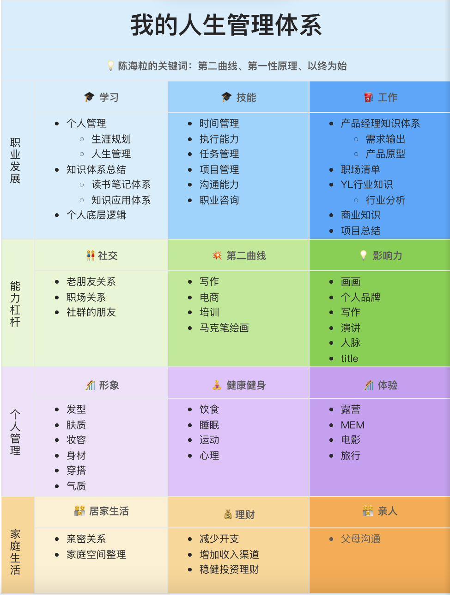

# 0525 今日总结

### TOP3

- [1000UserGuide](https://1000userguide.com/#/) 对于独立开发者，需要自己负责推广营销，如何快速获得自己的 1000 个用户，这个站点总结了各种方式；
- [javascript-questions/zh-CN/README-zh_CN.md at master · lydiahallie/javascript-questions](https://github.com/lydiahallie/javascript-questions/blob/master/zh-CN/README-zh_CN.md) 类似【你不了解的 js】，用于测试你对 js 知识的掌握程度
- [如何搭建一套个人管理体系](https://www.yuque.com/chl_hahaley/eye878/tfmmkz)

### 其他好文

- [只写后台管理的前端要怎么提升自己 - 掘金](https://juejin.cn/post/7360528073631318027) 这个确实是自己需要思考的问题；
  - 提升代码质量
  - 学会封装：利用 AI 帮助自己的 review 和封装；
  - 关注业务：需求背景，业务结果，是否需要优化（虚拟表格，数据量大小）？
  - 关注源码：我做了这么多年的 react，对于 react 各种原理需要烂熟于心才行；
  - 前端基建：如何做技术选型，开发规范，监控，CI、CD...
  - 知识前沿的新技术和方向；

此外，我补充一条，需要补齐自己的国际化 engineer 能力，对标 油管的 技术前沿知识；

- [揭秘：如何考察前端的 Node.js 及工程能力 - 掘金](https://juejin.cn/post/6959477438757896205) 通过一道面试题，由浅入深考察面试者的技术能力，如 如何合并 100 个本地 json 文件；
  - case-1: for 循环和 require，空间换时间，但是有缓存的问题
  - case-2: fs.writeFileSync 读写
  - case-3: 利用 stream， readable 方式；参考 [Nodejs流学习系列之一: Readable Stream](https://zhuanlan.zhihu.com/p/91541043)
- [两个有趣的AI项目 - 咖啡机（K.F.J） - 博客园](https://www.cnblogs.com/strick/p/18184025)
- [我终于对禅道14年的代码下手了 - 敏捷开发 - 禅道开源项目管理软件](https://www.zentao.net/blog/zentao-code-refactoring-82495.html/?from=upvg)
- [30 岁男，自己买试纸自测了幽门螺杆菌，阳性 - V2EX](https://www.v2ex.com/t/1043142#reply38)

## 项目/博客推荐
> 值得学习 作者/项目/工具等

### 博客

> 直接利用 github issue 记录博客，通过加 label 即可同步到自己的博客上

- [HanochMa/vitepress-markdown-timeline: it is a vitepress markdown timeline plugin](https://github.com/HanochMa/vitepress-markdown-timeline)
- [VitePress搭建个人导航 | VitePress](https://vitepress.yiov.top/nav/#%E8%8C%82%E8%8C%82%E5%AF%BC%E8%88%AA)
- [这个博客开源了 · Issue #177 · yihong0618/gitblog](https://github.com/yihong0618/gitblog/issues/177)
- [ 新博客关注 | Issues · yihong0618/gitblog](https://github.com/yihong0618/gitblog/issues)
- [我的跑步感悟 · Issue #30 · superleeyom/blog](https://github.com/superleeyom/blog/issues/30)
- [通过issue 转换成 blog 的博客值得学习 | yihong0618/gitblog: People Die, but Long Live GitHub](https://github.com/yihong0618/gitblog)

### 后端

- [后端程序员必备：书写高质量SQL的30条建议 - 知乎](https://zhuanlan.zhihu.com/p/115331631)
- [后端必备的 SQL 语句大全-CSDN博客](https://blog.csdn.net/dongbeiou/article/details/108735506)
- [Go 后端想学习 Web3，该如何入手？ - V2EX](https://www.v2ex.com/t/1043164#reply3)
- [使用typeORM怎么把现有的表生成实体？ - 知乎](https://www.zhihu.com/question/590486120)
- [我开源的 H5 商城 2.0 版本发布了，大家点点 star 冲 1000！ - V2EX](https://www.v2ex.com/t/1042276#reply5) 用于项目学习

### Nest.js

- [nestjs学习：nestjs实现简单RBAC权限控制 - 掘金](https://juejin.cn/post/7266463919141060623) 来自神光的小册笔记，学习学习
- [这个就是我要的 nest 项目 | buqiyuan/nest-admin: NestJS CRUD for RESTful API 使用 NestJS + Mysql + Typeorm + Redis + JWT + Swagger 企业中后台管理系统项目RBAC权限管理(细粒度到按钮)、实现单点登录等...](https://github.com/buqiyuan/nest-admin)
- [ischenliang/quickly-picture-bed: 轻快图床](https://github.com/ischenliang/quickly-picture-bed) 使用nestjs+vue3.x+ts+vite开发的在线图床系统，内置功能包括图片上传、图片管理、存储桶管理、相册管理、插件市场、知识库管理、数据统计等功能，插件分为上传插件、主题插件、工具箱插件，目前内置数十种插件，支持腾讯云COS、又拍云Upyun、阿里云OSS、github图床、gitee图床、七牛云 KODO等常用对象存储插件以及vscode暗黑主题、Monokai主题等。
- [didi/xiaoju-survey: 「快速」打造「专属」问卷系统, 让调研「更轻松」](https://github.com/didi/xiaoju-survey) 特点-后端 nestjs

### 项目

- [这种小的软件可以自己写一写 作为个人项目 | react + BaaS 整了个个人图床 - V2EX](https://www.v2ex.com/t/1042124#reply5)
- [cool-team-official/cool-admin-midway: 🔥 cool-admin(midway版)一个很酷的后台权限管理框架，模块化、插件化、CRUD极速开发，永久开源免费，基于midway.js 3.x、typescript、typeorm、mysql、jwt、vue3、vite、element-ui等构建](https://github.com/cool-team-official/cool-admin-midway) 用于学习后台开发的项目
- [crimx/ext-saladict: 🥗 All-in-one professional pop-up dictionary and page translator which supports multiple search modes, page translations, new word notebook and PDF selection searching.](https://github.com/crimx/ext-saladict) 这是一直使用的 浏览器插件 沙拉查词，可以看看其源代码怎么写的，学习学习；

### 工具

- [IMaker](https://img-maker.vercel.app/) 一款用于制作封面图的工具
- [ambiphone. ambient music + sounds for work, study and relaxation.](https://ambiph.one/) 这个网站可以播放环境音和白噪声，适合当作背景音乐。 
- [PlayPhrase.me: Site for cinema archaeologists.](https://www.playphrase.me/#/search?language=en) 搜索一个英语短语，这个网站会展示包含这个短语的电影片段。
- [功能说明 | VSpace](https://vspace.cyhuajuan.site/guides/4-intro/) 一个在浏览器侧边栏上实现的垂直式的书签和标签页管理器扩展，灵感来源于 Arc 浏览器，目的是在非 Arc 浏览器上（主要是 Chrome）做到更好的的侧边栏体验