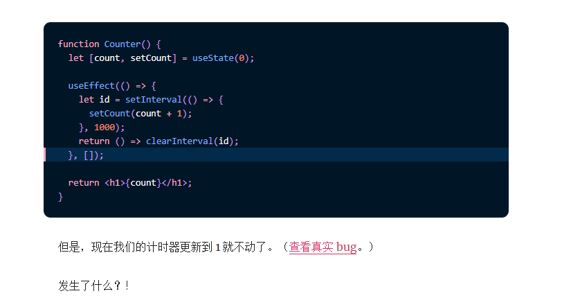

# 0611

## 工作

- 问题：在 react hook 中使用 setInterval 。需求是实现一个发送短信后倒计时的情况，需要每秒钟更新一次时间，带来的问题就是会不断 render，同时，时间不更新
- 解决方法：
  - 一方面，要了解 hook 的本质原理：定义的是函数，每次 render 都创建新的函数，因此每次都有数据变化，不相关的组件也会重复 render，而我只需要更新显示时间的那个组件
  - 相关资料：[making-setinterval-declarative-with-react-hooks](https://overreacted.io/zh-hans/making-setinterval-declarative-with-react-hooks/) 中文翻译的也很好，深入阅读必然有收获。
- 拓展学习：既然都用上了 [umijs](https://umijs.org/)，那么肯定也少不了学习使用 [ahooks](https://ahooks.js.org/zh-CN/docs/getting-started/)
- 同时，有时间，了解下 [umijs](https://umijs.org/) 背后的原理，各方面的功能是如何做到的。

## 好文推荐

- [开发基于 gRPC 协议的 Node 服务](https://mp.weixin.qq.com/s/2EfnLu7xYi-MD4pcT1fklg)
- [萌新必看—10种前端存储哪家强，一文读尽！](https://mp.weixin.qq.com/s/5cugh-Oxe1kFCJPJgurUqg)

## 阅读

- [互联网产品经理的必读书目有哪些？](https://www.zhihu.com/question/19568240) 程序员也需要一定的产品思维。这段时间对接的是个新手产品经理，她遇到的一些开发，业务，相关的问题，以及一些产品思维，我觉得还蛮有意思，可以学一学了解了解。包括业务流程，用户体验和交互习惯，设计规范等。

## 好用的工具：

- [awesome-tools](https://github.com/sorrycc/awesome-tools) 各种好用的开发工具推荐

## 反思

- 今天 1v1 谈了 PDP，及个人在公司内的成长目标，总体而言，个人因为仅仅2年经验，还有很多需要提升的地方
  - **技术能力：**公司技术栈的背后，怎么实现的，原理，底层。如 bff，监控，权限控制；以及个人的代码能力，哪些不规范需要提升的地方，多让同事 review 一下自己的代码找出问题纠正和互相成长。
  - **协同能力：**及和产品，测试，后端的配合能力。
    - 产品对接方面：体现在于需求评审会议（需求确认阶段需要质疑和确认，减少后期的变更；同时变更能有规范的通知方式，避免需求遗漏）
    - 测试对接方面：体现在自测阶段，需要对照测试点详细测试，尽量做到少 bug 和 0 bug。涉及需求变更，代码修改，影响点分析要到位，让测试能及时跟进。
    - 后端对接方面：开发前定好契约，接口字段，哪些功能由后端实现，哪些由前端实现。开发过程中都要充分自测，保证没问题后联调尽可能高效。
  - **程序设计开发能力：**即对于一个产品或者某个需求，能够从全方位的给出开发设计方案。对于一般的迭代需求来说，难度都不大；倘若碰到对一个产品重构，或者复杂需求时候，则需要尽可能的给出详细的设计放方案，**目的是调研清楚这个需求能不能做，同时尽早暴露风险**。
- 领导问我的目标是什么，我说，作为一个技术开发，目标在3年左右成为一名高级开发工程师。领导说，他的个人成长来看，**他从入行到成为高级工程师，用了5年时间，他说他很努力的，所以我这个 3 年内实现这种目标，压力还是很大的，让我加油~！**
- 最后，领导问我还有什么问题，我说，这半年来看，我在工作中的表现，从 技术能力，团队协作沟通等方面，有哪些可以提升的地方和成长建议？领导首先肯定我这半年做的还ok，但是技术能力肯定是还需要更进一步提升的吧啦吧啦。
- 总结来说：这一次我还是有准备的，大概拟写了一个自己的【工作成果，成长收获，诉求，和他人反馈】这几个方面，从而在交谈的时候不会出现尬聊或者说不知道该说啥的情况。**所以，提前准备很重要**。**同时，和同事沟通或者说，和上级沟通，类似就是一个阶段性自审过程，对我这种处于初级开发阶段的来说，还是有很大的收获的。**
- 往后的计划，就是明确目标，加油干~~！！

## 总结

- 工作上：
  - 把事情做好，建立信任！
  - 多做多发现问题，记录问题和解决问题！
  - 和同事组长多沟通多交流，工作之外对自己的知识盲点多深入多总结！
- 个人成长：
  - 有明确的目标，多努力！
- 另外：不能忘了锻炼身体！

## TODOS

- ahooks 了解常见的使用
- umijs 背后原理探究
- hooks 背后原理实现，总结常见的容易踩的坑。