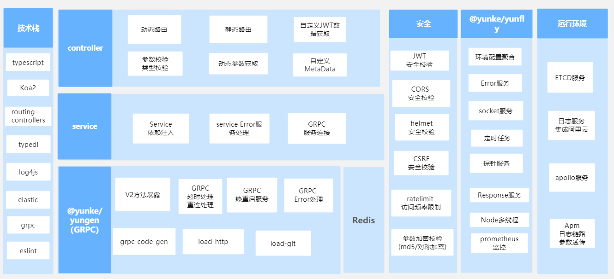

# 0701

## 工作

- BFF 升级：[文档](https://yued.myscrm.cn/bff-doc/#/docs/new)

  - 旧版 bff 的很多库都是装在仓库内的，新版的 bff 将公共依赖抽离出来统一到公司的公共库中， 统一维护和升级。
  - 因此这是一个删改依赖，删改代码的过程，当然，还得自测。
  - 通过文档，bff 确实做了很多事情，一张图概括：

  

- [AntD+Umi教程](https://www.yuque.com/ant-design/course/lsoh4c) 感觉这个教程可以作为我们公司团队的新人学习教程

## 任务

- Vue 源码文档整理
- 算法题：[排序链表](https://leetcode-cn.com/problems/sort-list/) 中等难度，对链表数组排序，要求时间复杂度为 O(nlogn)，自己不太擅长链表类型的题目诶。

## 

## 好文推荐

- [Jenkins 基础使用实现自动化CI](https://juejin.cn/post/6976976826249773086#heading-2)
- [jenkins+docker+github webhook+multibranch pipeline从0到1实现自动化构建](https://juejin.cn/post/6979884706607136805)
- [四年老前端的2021半年回顾｜2021 年中总结](https://juejin.cn/post/6976164103156924429) 发现优秀的人都是喜欢折腾的，基本都有以下特质
  - 有着明确的目标，知道自己要做什么
  - 有自己的独立博客，服务器，自己全栈开发，运维等
  - 总和能力很强，能够推动团队进步
  - 善于归类总结，善于做笔记
- [如何实现一个轻量的断点续传个人网盘系统](https://juejin.cn/post/6972727914030858248) 只要知识点——断点续传
- [字节跳动面试官，我也实现了大文件上传和断点续传](https://juejin.cn/post/6844904055819468808) 大圣老师关于断点续传的详细介绍，还有视频，好好学习下怎么做到的。
- [这可能是最通俗的 React Fiber(时间分片) 打开方式](https://juejin.cn/post/6844903975112671239) 上文推荐的，React Fiber 介绍
- [rollup - 构建原理及简易实现](https://mp.weixin.qq.com/s/-bCCUBnEjjRkeOcLhXjS4Q)
- [Vue 业务系统落地单元测试](https://mp.weixin.qq.com/s/69_wBUmGttyPEjil-IO7GA)

## 项目推荐

- [Vite + Vue3开发一个自定义浏览器起始页网站](https://juejin.cn/post/6967588280070045733) vite 开发的导航项目，支持多种模式，体验下来不错。
- [github/howdyjs](https://github.com/leon-kfd/howdyjs) 右键打开菜单，也是上面的这位作者自己写的。
- [vue3.0-template-admin | 一款基于vite的开箱即用的后台管理模版](https://mp.weixin.qq.com/s/ELOqJtM-gNLLyrj0w379yA) 开箱即用的 Vue3 + vite 后台模板，[地址](https://github.com/GeekQiaQia/vue3.0-template-admin)

## 好用的工具

## TODOS

- [Bash 编程学习](https://wangdoc.com/bash/intro.html)
- 学习资料利用起来：掘金小册，极客时间，拉勾教育
- 女朋友的模拟面试准备

